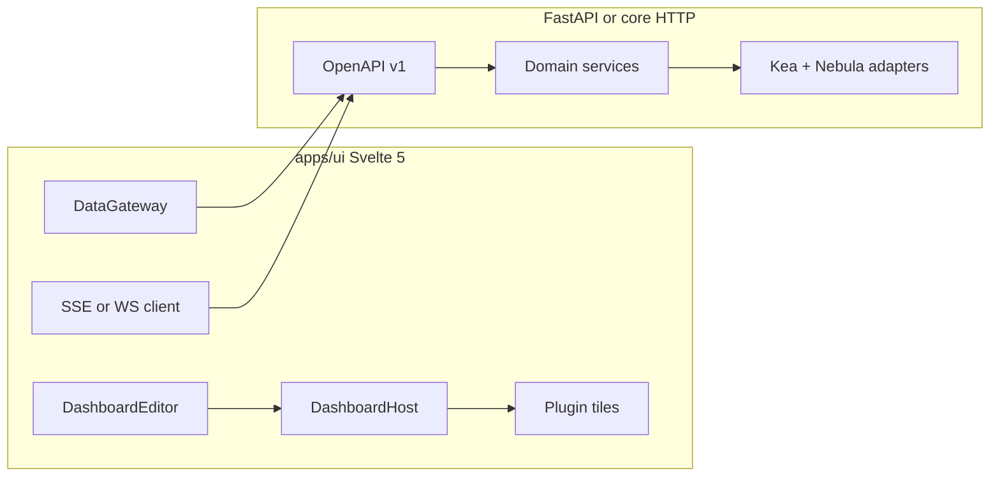

# Custom drag-and-drop dashboard and plugins (Flowbite v2, OpenAPI, events)

## Status

**Source of truth for remaining work:** the YAML `todos` in this file’s frontmatter (keep statuses updated whenever scope lands or changes — do not mark `completed` until acceptance criteria in the todo text are met).

**Phase A (UI-first on mocks) — merged to `main`.** OpenAPI, Vite mock API + SSE, dashboard editor/host, DHCP/discovery/perf plugins, Vitest + Playwright. **Slice 7:** Zod on mock fixtures, editor tile testids, layout-order e2e (full DnD reorder e2e deferred).

**Open / in progress:** **`data-gateway`** (prod base URL + auth wiring), **`admin-page`** (no API **authZ** yet; stubs only). **`phase-b-*` pending items:** mock Kea/Nebula adapters, production runtime (SSE + persistence), API authZ, docs/scripts realignment — see todo ids above. **`phase-b-bootstrap`** is the only Phase B slice marked **completed** today.

**Phase B (bootstrap) — merged to `main`:** FastAPI **`/api/v1`** stub + **`kea-fabric-api`**; **`npm run dev:proxy`** + **`KEA_FABRIC_UI_PROXY_API=1`** for local UI → backend.

**Sequencing (non-negotiable):** Finish **full Phase B** first — mock adapters, durable layout + production SSE, API authZ, DataGateway env, docs/scripts, expanded tests — per [phase_b_and_c_roadmap.plan.md](phase_b_and_c_roadmap.plan.md). **Do not start Phase C implementation** until those B items are **completed and merged**. A branch named `feat/phase-c-dashboard-grid` may exist early; keep it **idle** (or delete locally) until the gate is met. Phase C depends on **durable `PUT` layout** from B.

**Phase C (after B):** 12-column grid, per-tile live options, snap-to-slot drag — **pending** until the gate above; **do not merge** Phase C to `main` until the interaction model is stable.

**Ready for review** against [docs/architecture/dashboard-plugin-blueprint.md](docs/architecture/dashboard-plugin-blueprint.md), [contracts.md](docs/architecture/contracts.md), [api.md](docs/architecture/api.md), [events.md](docs/architecture/events.md), [discovery.md](docs/architecture/discovery.md), [ui.md](docs/architecture/ui.md), and [ui-fonts.md](docs/architecture/ui-fonts.md). Product choices: **Flowbite-svelte v2** + **Lucide**; **CPU total vs per-core**; **network total vs per-adapter**; **RAM** aggregate; **disk** by volume; Kea-agnostic DTOs.

**Build order (imperative):** **UI and UX quality first.** Implement against **mocked data** on the public API contract (static JSON, MSW, or a thin mock server) so dnd, tiles, empty/error/loading states, and a11y are proven **before** investing in real Kea/Nebula integration. The **OpenAPI spec is the source of truth** for mocks and generated/ hand types—**fail fast** on contract mismatch in CI and in dev (e.g. Zod or openapi-typescript validation on responses). **Real backend** production of data is a **follow-on phase**; it must not block shell or plugin work.

## Git workflow (general)

For this workstream (and similarly scoped efforts):

1. **Create a branch** off `main` (or the current integration branch), named for the slice or phase (e.g. `dashboard-phase-a`, `feat/ui-flowbite-bootstrap`).
2. **Implement in logical chunks** — vertical slices (e.g. bootstrap → OpenAPI/mocks → gateway → one plugin) rather than one giant diff.
3. **Commit in chunks** — one commit per coherent chunk; prefer [conventional commit](https://www.conventionalcommits.org/) subjects. Run applicable checks before each commit when the full repo is available (see [.cursor/rules/commits.mdc](.cursor/rules/commits.mdc) **Phase delivery workflow**).
4. **Push** the branch regularly so remote backup and review stay current.
5. **When complete** — open a PR or merge per team practice; integrate only after acceptance criteria for the slice/phase are met.

**Repo policy (non-optional):** every commit must use **DCO sign-off** (`git commit -s`) and the **repo-local** author identity in [.cursor/rules/commits.mdc](.cursor/rules/commits.mdc). Prefer a **linear branch**: rebase onto `main` to update (`git fetch origin && git rebase origin/main`), avoid repeated `git merge main` into the feature branch, and do not force-push rewritten history without explicit agreement. Stacked slices can live on one branch in history order, with `commit --fixup` + `rebase -i --autosquash` when tightening the story before push.

## Architecture verification (obligations checklist)

| Source | What must be true for acceptance |
|--------|-----------------------------------|
| [dashboard-plugin-blueprint.md](docs/architecture/dashboard-plugin-blueprint.md) | `DashboardEditor` + `DashboardHost`; host controls (`single-panel`, `tab-control`, `vertical-stack`, `split-grid`); **Compact** and **Full** on every plugin; drag from palette, validate drops, **reactive resize**; `ui_dashboard` manifest fields; **versioned** saved layout with **forward migration**; **owner** vs **admin** edit; **last-write-wins** on save conflicts; **fault isolation** + placeholder tiles. Machine artefacts: `specs/dashboard/layout.schema.json`, `specs/contracts/ui_dashboard_plugin.py`. |
| [contracts.md](docs/architecture/contracts.md) / [api.md](docs/architecture/api.md) | Canonical `specs/api/openapi.yaml` for `/api/v1`; keep drift tooling green ([check_openapi_drift.py](.github/workflows/python.yml)). |
| [events.md](docs/architecture/events.md) | **Event-driven** UI: subscribe via planned stream contract (`event_stream` / envelope specs); not polling-only. |
| [plugins.md](docs/architecture/plugins.md) | Plugin manifest, lifecycle, and `GET /api/v1/plugins` with `ui_dashboard` for **palette** (per blueprint implementation snapshot). |
| [ui.md](docs/architecture/ui.md) + [testing.md](docs/architecture/testing.md) | **Vitest** + **Playwright**; trust boundaries for any iframe/embed if used. |
| [ui-fonts.md](docs/architecture/ui-fonts.md) | Self-hosted **Inter** + **JetBrains Mono** (preload) in `apps/ui` entry. |
| [ADR-0016](docs/adr/README.md) | Semantic icon IDs + **Lucide** via `specs/contracts/registry.json` + `KfIcon` (not ad-hoc icon packs at runtime). |
| [discovery.md](docs/architecture/discovery.md) | `GET /api/v1/discovery/records`; additional scan/control paths as needed for the discovery toolbar, documented in OpenAPI. |
| [nebula-sync.md](docs/architecture/nebula-sync.md) / [kea-integration.md](docs/architecture/kea-integration.md) | **No Kea types in public DTOs**; Nebula as adapter; **observe-only** / deferred depth per ADR-0011 — UI shows health/sync when contracts exist, no invented control. |

**Repo note:** Some clones may not list `specs/**` in the file tree. Architecture still requires those contract files; this work **creates or completes** them in-repo.

## Review: what to build (playback)

**Phase A — UI-first on mocks (do this before real Kea work)**

1. **Specs & OpenAPI** — `specs/api/openapi.yaml`: Kea-agnostic resources (pools, clients, reservations, perf, discovery + mutating actions as needed, dashboard layout save if not already defined). **Event** and **envelope** stubs per [events.md](docs/architecture/events.md) and blueprint cross-refs. **Layout** JSON: `specs/dashboard/layout.schema.json` including per-tile **options** (CPU total, network by adapter, disk by volume, display style). **ui_dashboard** Python protocol stub: `specs/contracts/ui_dashboard_plugin.py`.
2. **Mock API surface** — Implement **fixtures** (and optional **MSW** or Vite-middleware / minimal server) that return JSON **matching OpenAPI** for every route the UI needs, including `GET /api/v1/plugins` (palette). Mock **SSE** (or **timer-driven** fake events) for “live” behaviour until a real stream exists. **No Kea** required in this phase.
3. **Shell `apps/ui`** — Svelte 5: bootstrap **Flowbite-svelte v2** per [introduction](https://flowbite-svelte-v2.vercel.app/docs/pages/introduction) (`flowbite-svelte` + `flowbite`, Tailwind v4, theme CSS, plugins, `@source`); then `DataGateway` to **mock base URL**; full **DnD** editor + **host** controls; **ADR note** for third-party layer. No themesberg admin template.
4. **Plugins (all on mocks)** — **DHCP pools** (table, **card** if one pool); **DHCP clients**; **static reservations**; **discovery** header; **performance** row with **semicircle gauge** + **percent-only** style. Exercise **empty**, **error**, and **skeleton** states using mock toggles.
5. **Admin (mocked or local-only auth)** — Sectioned route; wire to mock endpoints; authZ as stub until API is real.
6. **Tests (fail fast)** — Vitest + Playwright on **mocks**; assert layout + core flows. Contract checks: **OpenAPI drift**, optional response validation in tests so UI breaks loudly when the spec changes.
7. **Event client in UI** — `DataGateway` merge path against **mock SSE** or polling; same code path for real server later.

**Phase B — Backend (later)**

8. **Real backend services** — Replace mock layer with handlers that match the **same** OpenAPI; map **Kea** and **Nebula** only in adapters. Discovery per [discovery.md](docs/architecture/discovery.md). **Wire env** in `DataGateway` to switch mock vs production.
9. **Real event stream** — Replace mock SSE with production broker path when available.

## Authority and alignment

- **Layout / DnD / Compact vs Full** — Follow [docs/architecture/dashboard-plugin-blueprint.md](docs/architecture/dashboard-plugin-blueprint.md): `DashboardEditor` + `DashboardHost`, host controls (`single-panel`, `tab-control`, `vertical-stack`, `split-grid`), `Compact`/`Full` for each plugin, saved layout in `specs/dashboard/layout.schema.json` (and migrations). Your screenshots map to this model; Flowbite is the *component* layer inside host surfaces.
- **Icons / fonts** — [docs/architecture/ui-fonts.md](docs/architecture/ui-fonts.md): Inter (UI) + JetBrains Mono (numeric/technical), self-hosted. Icon policy: [ADR-0016](docs/adr/README.md) semantic registry (`KfIcon` / `specs/contracts/registry.json`) with Lucide as the pack — use **lucide-svelte** in implementation while resolving logical ids through the registry where the shell already does.
- **API** — [docs/architecture/api.md](docs/architecture/api.md): canonical `specs/api/openapi.yaml`, `/api/v1` versioned, RFC 7807 errors.
- **Live updates** — [docs/architecture/events.md](docs/architecture/events.md): event envelope + plan for `event_stream` (SSE/WS) contract; UI subscribes to namespaces for DHCP/discovery/perf rather than only polling.
- **Discovery** — [docs/architecture/discovery.md](docs/architecture/discovery.md): `GET /api/v1/discovery/records` and discovery event contracts; n/w plugin header (pause, status, settings) is a view over that API + control endpoints.
- **Nebula / Kea** — [docs/architecture/nebula-sync.md](docs/architecture/nebula-sync.md) and [docs/architecture/kea-integration.md](docs/architecture/kea-integration.md): **do not** leak Kea types in API DTOs; use stable resource names (`Pool`, `Lease`, `Reservation`, `DiscoveryScan`, `PerformanceSample`) and map from Kea/Nebula in the service layer. Replication topology can appear on admin/health later.
- **Kea reference documentation** — ISC publishes authoritative material on the **Kea management API** (control sockets, direct HTTP listeners in Kea 3.0+, Control Agent, HA listeners, security): [Kea API and Control Sockets](https://kb.isc.org/docs/kea-api-sockets). Command-level detail: [Kea ARM — API reference](https://kea.readthedocs.io/en/stable/api.html). Use these when designing **adapters** and **realistic mocks** (Phase A); Kea Fabric’s public [specs/api/openapi.yaml](specs/api/openapi.yaml) remains the operator contract. Track surfacing these links in-repo via todo `kea-reference-docs`.
- **Pi-hole API (later, optional)** — [Pi-hole API documentation](https://docs.pi-hole.net/api/#accessing-the-api-documentation) describes REST + JSON conventions, auth, and structured errors (`key` / `message` / `hint`). **Live OpenAPI-style docs** for the installed version are served at [http://pi.hole/api/docs/](http://pi.hole/api/docs/) on a Pi-hole host (hostname may vary). Useful for **adjacent DNS/blocklist operator flows** or lab mocks—not a substitute for Kea Fabric’s `/api/v1` contract. Track in-repo links via todo `pihole-reference-docs` when that scope opens.

**Flowbite-svelte v2** is not yet named in Tier B/C UI ADRs; adding it implies **Tailwind** (v4 per Flowbite v2 docs) in `apps/ui`, theme tokens aligned with [docs/architecture/ui-themes.md](docs/architecture/ui-themes.md). Record a small **ADR or Tier C design note** when you introduce a third-party component stack so the “shell-owned primitives” rule in `ui-design-system.md` stays honest (wrapper layer + token bridge).

**Implementation locus (per docs/CI):** [`.github/workflows/ui.yml`](.github/workflows/ui.yml) expects [apps/ui](docs/operator-demo.md) — if the directory is missing locally, clone/sync the full tree before coding.

### Flowbite Svelte v2 — required setup (normative)

Implementation **must** follow the official **Getting started** for v2, not ad-hoc Tailwind wiring:

- **Authoritative doc:** [Flowbite Svelte — Introduction / Getting started](https://flowbite-svelte-v2.vercel.app/docs/pages/introduction) (install `flowbite-svelte` and `flowbite`, Tailwind CSS v4, main CSS entry with Tailwind `@import`, Flowbite default theme CSS from `flowbite-svelte/dist/theme-selector/themes/…`, `@plugin "flowbite/plugin"` and optional `@plugin "flowbite-typography"`, **`@source`** directives so Tailwind scans `flowbite-svelte` and optional `flowbite-svelte-icons` under `node_modules` — paths depend on whether the app uses SvelteKit `+layout.css` vs Vite `app.css` per the doc).
- **Optional:** `flowbite-svelte-icons` only if needed for examples or Flowbite’s icon set; **product icons** remain **Lucide** + [ADR-0016](docs/adr/README.md) registry (do not replace semantic shell icons with Flowbite-only icons in plugin chrome).
- **Fonts:** The introduction page shows **Google Fonts** for Inter; **this project** uses **self-hosted** Inter + JetBrains Mono per [ui-fonts.md](docs/architecture/ui-fonts.md) / **ADR-0017** — keep Flowbite’s CSS structure but **do not** adopt the Google `@import` as the only font path.
- **MCP:** Flowbite documents **MCP** for the v2 site; use it in Cursor for component API details during implementation.

### Inspiration only (not a template or dependency)

- **[themesberg/flowbite-admin-dashboard](https://github.com/themesberg/flowbite-admin-dashboard)** is listed by the product owner as **layout/interaction inspiration** for a **working** admin-style dashboard. It is **not** on the Flowbite Svelte **v2** track (older stack / different Flowbite-Svelte generation).
- **Do not** vendor that repo, copy-paste its build config, or treat it as the implementation baseline. Reuse at most **ideas** (e.g. sidebar density, table rhythm). **Kea Fabric** dashboard behaviour remains defined by [dashboard-plugin-blueprint.md](docs/architecture/dashboard-plugin-blueprint.md) (DnD, host controls, plugin tiles).

## Architecture (data flow)

- **DataGateway** (shell): typed fetch to OpenAPI-generated or hand-maintained client, shared auth headers, 401/403 handling, and merge of **initial HTTP snapshot + event deltas** for “live and near-real-time” UIs. In Phase A, the HTTP + stream endpoints are **mocks**; the same `DataGateway` code switches to the real service via configuration in Phase B.
- **Events**: Prefer **SSE** for browser simplicity (`text/event-stream`) for `fabric.dhcp.*`, `fabric.discovery.*`, `fabric.perf.*` (exact paths in `specs/contracts/event_stream.py`). Fallback polling with short interval for degraded mode. **Mock SSE** (or interval-driven fake events) in Phase A preserves the same subscription shape.

## OpenAPI surface (abstraction from Kea)

Add or extend **resource** groups under `/api/v1` (names illustrative — fold into a single `openapi.yaml` with tags):

| Area | Read endpoints | Notes |
|------|----------------|-------|
| DHCP pools | `GET /dhcp/pools` | Pool range, subnet CIDR, domain; compact = single card when `count==1` |
| DHCP clients | `GET /dhcp/clients` | Active leases: type, IP, hostname, MAC, vendor, scan status, services, lease times |
| Static reservations | `GET /dhcp/reservations` | Category badge, IP, MAC, vendor, scan, services, subnet |
| Discovery | `GET /discovery/records` (exists per discovery.md) + `GET /discovery/scan` + `POST /discovery/scan:pause` / `settings` | Powers header: last update, pause, status badge, settings |
| Performance | `GET /perf/snapshot` or split `.../cpu`, `.../ram`, `.../network`, `.../disk` | Flat DTOs for %, bytes, and optional breakdown arrays |

**Query params** for list endpoints: `limit`, `cursor`, `sort`, `filter` to keep tables server-driven and suitable for large LANs.

**Write/admin** (for Settings buttons and future config): under `/api/v1/...` with policy checks; admin page sections call these.

Regenerate or sync OpenAPI; keep [scripts/check_openapi_drift.py](.github/workflows/python.yml) green if the repo already enforces it.

### Kea official documentation (for adapters and mock realism)

ISC’s Kea documentation helps implementers understand **what Kea exposes** (HTTP POST + JSON command bodies, direct API vs Control Agent, security expectations) and **which commands exist** — without copying Kea’s wire format into the operator UI.

| Resource | URL | Use in Kea Fabric |
| --- | --- | --- |
| Kea API and Control Sockets (KB) | [kb.isc.org/docs/kea-api-sockets](https://kb.isc.org/docs/kea-api-sockets) | Architecture of control sockets, Kea 3.0 **direct API** listeners, KCA deprecation path, HA dedicated listeners, hardening checklist. |
| Kea ARM — API reference | [kea.readthedocs.io/en/stable/api.html](https://kea.readthedocs.io/en/stable/api.html) | Command catalogue and semantics for **adapter** mapping and for **informed mocks** (e.g. lease-like fields abstracted into Kea-agnostic DTOs). |

**Boundary:** Phase B **service layer** translates between `specs/api/openapi.yaml` and Kea’s API; Phase A **mocks** may echo plausible shapes informed by the ARM, but **must still validate against OpenAPI**, not against Kea JSON verbatim.

### Pi-hole API (optional, for later scope)

Pi-hole exposes a **resource-oriented REST API** with predictable JSON success and error envelopes (see [Pi-hole API — overview](https://docs.pi-hole.net/api/#accessing-the-api-documentation)). Operators typically read **version-accurate** interactive docs from their own install at **`http://pi.hole/api/docs/`** (or the host’s configured name).

| Resource | URL | Use in Kea Fabric |
| --- | --- | --- |
| Pi-hole API (published docs) | [docs.pi-hole.net/api](https://docs.pi-hole.net/api/#accessing-the-api-documentation) | Reference for HTTP verbs, JSON patterns, auth (`401` without key), and error shape when building **separate** integrations or homelab tooling alongside DHCP. |
| Pi-hole API docs (local instance) | [http://pi.hole/api/docs/](http://pi.hole/api/docs/) | Matches the running Pi-hole version; preferred when prototyping clients against a real install. |

**Boundary:** Kea Fabric’s canonical operator HTTP contract remains **`/api/v1`** in [specs/api/openapi.yaml](specs/api/openapi.yaml). Any Pi-hole client is an **additional** surface (adapter, sidecar UI, or future doc-linked workflow), not a merge into the Kea-agnostic public API.

### Where these references must live (repo)

- **Kea:** Tier B [docs/architecture/kea-integration.md](docs/architecture/kea-integration.md) (and root [architecture/kea-integration.md](architecture/kea-integration.md) mirror) — todo `kea-reference-docs`.
- **Pi-hole:** Tier C / roadmap context [docs/architecture/future-considerations.md](docs/architecture/future-considerations.md) (and mirror) — todo `pihole-reference-docs`; alternatively co-list in [docs/architecture/discovery.md](docs/architecture/discovery.md) if DNS adjacency is the primary story.
- **This plan file** remains a narrative index until those todos are closed; after that, architecture docs are the **source of truth** for bookmarks (plans can link to them).

## UI: stack and global shell

- **Flowbite Svelte v2 install and CSS** follow the [official introduction / getting started](https://flowbite-svelte-v2.vercel.app/docs/pages/introduction) (see **Flowbite Svelte v2 — required setup** above). **Not** the [themesberg/flowbite-admin-dashboard](https://github.com/themesberg/flowbite-admin-dashboard) build path.
- **New / updated deps in `apps/ui`:** per doc: `flowbite-svelte`, `flowbite`, `tailwindcss` (v4), `lucide-svelte`, ensure **Svelte 5** and existing Vite/Playwright/Vitest setup stay compatible.
- **Fonts:** Keep ADR-0017 pattern: `@fontface` in [apps/ui/src/main.ts](docs/architecture/ui-fonts.md) (Inter + JetBrains Mono Latin subsets, preload).
- **Drag-and-drop:** Use a Svelte-5–compatible DnD approach (e.g. **svelte-dnd-action** or equivalent) for palette → host drop targets, reordering, and split-grid cells, matching the blueprint’s host controls. Persist layout to backend `PUT /api/v1/dashboards/{id}/layout` (or local draft first) with schema from `layout.schema.json`.
- **Theming:** Map Flowbite’s dark mode + custom accent (copper from references) to CSS variables / `tailwind.config` so plugin tables/cards match the reference screenshots.

## Per-plugin behavior (UI)

1. **DHCP Pools** — [Flowbite `Table`](https://flowbite-svelte-v2.vercel.app/docs/components/table) default. **If `pools.length === 1`:** render a **stacked `Card`** (pool range, subnet, DNS domain) instead of a one-row table.
2. **DHCP clients** — Wide sortable table: TYPE (Lucide by category id from registry), IP, hostname, MAC, vendor, scan status, services (chips/inline list with protocol icons), lease start, expiry, duration. Horizontal scroll on small tiles.
3. **Static leases** — Like clients + **CATÉGORIE** column (e.g. “STATIC” badge) and **SUBNET**; reuse column components.
4. **Network discovery** — Toolbar: “Last update” timestamp, pause `Button` (outlined), `Badge` for scan state, gradient **Settings** `Button`. Binds to discovery scan API + events for refresh.
5. **Performance** — Base: **Flowbite `Card`** row of gauges. Shared **semicircle SVG gauge** (track + arc by %) + JetBrains for `%` and raw numbers.
   - **CPU:** `cpuTotal: boolean` — **true:** single CPU gauge (aggregated %); **false:** one gauge per core (horizontal wrap/scroll as in ref). Style toggle: `gauge` vs `percentOnly` (text with `%` in brackets).
   - **RAM:** Aggregate only; same gauge/percent style toggle; sub-label for used/total.
   - **Network:** **Default:** aggregate upload/download under one gauge. `networkByAdapter: boolean` — **false:** total; **true:** one small gauge (or value row) per adapter. Up/down with Lucide arrows.
   - **Disk:** Like RAM; `diskByVolume: boolean` to split by logical drive/mount. (Your earlier “n/w” wording is treated as **disk space**, not network throughput.)

**Plugin options** (CPU total, network aggregate vs adapter, disk volume split, display style) — store in **per-tile `options` in the saved layout JSON** so the dashboard host passes them as props; no need for separate backend table for v1 unless you want server-side defaults.

## Admin page

- New route, e.g. `#/admin` or SvelteKit-style path, with **sectioned layout** (Flowbite `Tabs` or left nav + `Card` sections): e.g. **Discovery**, **API / health**, **Dashboard defaults**, **Nebula / replication** (read-only or stub until `ADR-0011` scope), **Identity** (link to existing auth if any). Reuse the same `DataGateway` and permission gates from [docs/architecture/security.md](docs/architecture/security.md).

## Testing

- **Coverage policy:** [docs/architecture/testing.md](docs/architecture/testing.md) — **100%** line coverage as the target; **99%** as the CI floor (`pytest` `fail_under` and Vitest thresholds). Dashboard work should narrow the gap toward **100%** as surfaces land.
- **Primary target:** Mocks/MSW (or a pinned mock server) so e2e is **stable and fast**; real API tests come in Phase B.
- **Vitest:** Presentational components (gauge math, table vs compact switch for pools, option toggles) + any response parsing against OpenAPI types or Zod.
- **Playwright:** Extend [apps/ui/tests/](docs/architecture/dashboard-plugin-blueprint.md) (drag-drop, layout persist) against **mocked** `GET /api/v1/*`; optional SSE in e2e or polling flag for CI.
- **Contract (fail fast):** OpenAPI diff in CI; optional runtime validation of mock/real responses against the spec in tests.

## Sequencing (mandated: UI before real backend)

Steps map to todos where names match (e.g. `flowbite-v2-bootstrap`, `openapi-v1`, `mock-api`).

1. **`flowbite-v2-bootstrap`** — First code in `apps/ui`: follow [Flowbite Svelte v2 introduction / getting started](https://flowbite-svelte-v2.vercel.app/docs/pages/introduction) (Tailwind v4, `flowbite-svelte` + `flowbite`, theme CSS, `@plugin`, `@source`, dark). Wire **self-hosted** Inter + JetBrains Mono per ADR-0017 (replace any Google Fonts snippet from the doc). Confirms the shell builds before any feature work.
2. **OpenAPI + mocks** — `openapi-v1` + `specs-contracts` as needed; **mock layer** (`mock-api`): fixture JSON + dev/test server or MSW implementing `/api/v1` end-to-end.
3. **Types + fail-fast validation** — Generated or Zod types from OpenAPI; optional runtime validation of mock responses in tests/ dev.
4. **`data-gateway`** — HTTP client + **mock** base URL; event client + **mock SSE** or polling fallback (same shape as production).
5. **`dashboard-host`** — Editor + host + layout persistence (local or `PUT` to mock).
6. **Plugins + admin** — `plugins-dhcp`, `plugin-discovery`, `plugins-perf`, `admin-page` (all against mocks).
7. **`tests`** — Vitest + Playwright on stable mocks; OpenAPI contract checks.
8. **`align-docs`** — ADR/Tier C note for Flowbite + Tailwind bridge (can land after bootstrap or with it; do not block coding).
9. **Phase B only:** real API handlers + Kea/Nebula adapters behind the **unchanged** OpenAPI; flip `DataGateway` env; replace mock SSE with real stream.

## Risks

- **Backend-before-UI:** Building Kea integration before the shell is validated wastes rework. **Mitigation:** Phase A (mocks + UI) is a **hard gate** before Phase B (real data).
- **Scope:** Full DnD + all plugins + live events + admin is multiple PRs; still use **vertical slices** (e.g. layout + one plugin + mock stream) within Phase A.
- **Nebula:** Surface only **status** in UI until `ADR-0011` / `nebula-sync.md` re-opens implementation depth.
- **“Split by core”** wording resolved: your clarification applies — **CPU total vs per-core**; **network total vs per-adapter**; **RAM** aggregate; **disk** total vs per-volume.
