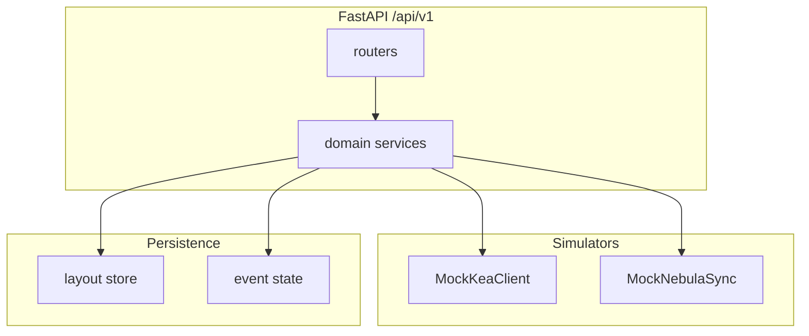

# Phase B (backend + production behavior) and Phase C (dashboard UX)

> **Status:** Phase B and Phase C roadmap items in this file are **completed** (merge `feat/phase-c-dashboard-grid` when ready). Grid schema, editor/host 12-col layout, inline tile settings with debounced `PUT`, blueprint semantics, and tests are shipped. Future work (free-form snap-to-cell, richer collision rules) is out of this roadmap slice. Sync `~/.cursor/plans/phase_b_and_c_roadmap_*.plan.md` YAML when this file changes.

## AuthN / AuthZ — what is actually protected?

**The dashboard UI (`#/admin` vs home) is not a security boundary.** Today both are plain client routes; anyone who can load the SPA can hash-navigate to admin. **Real enforcement belongs on the HTTP API** per [docs/architecture/api.md](docs/architecture/api.md) (auth at route boundaries).

| Surface | Role |
| --- | --- |
| **`/api/v1/**` mutating** (`PUT /dashboards/{id}/layout`, `POST /discovery/scan/pause`, future admin writes) | **Must** require authenticated identity + permission checks (403 when wrong role). |
| **`/api/v1/**` sensitive reads** (DHCP lists, reservations, discovery records — operational data) | Typically **authenticated** in production; exact policy (viewer vs operator) should be explicit in OpenAPI extensions or a small `permissions` map doc. |
| **Health/meta/plugins** | Often **less** restricted (e.g. liveness for load balancers); still may be **unauthenticated only on trusted networks** — decide per deployment. |
| **SSE `GET /api/v1/events/stream`** | Same class as the data it carries; if perf/DHCP events are sensitive, **same auth** as reads (e.g. bearer on EventSource or cookie session — note browser limits). |
| **Admin page in Svelte** | **UX only**: hide nav or show read-only messaging when the session lacks claims; **never** rely on hiding `#/admin` for security. |

**Summary:** It is **not** “dashboard vs admin” at the trust layer; it is **which API routes** require which **scopes/roles**. The admin **page** is just one client that calls **privileged** endpoints once they exist.

---

## Phase B — workstream (constraint: no live Kea/Nebula)

### B1 — Adapter-shaped mocks (“mock Kea” + “mock Nebula sync”)

- Introduce **narrow adapter interfaces** in Python (e.g. `KeaDhcpAdapter`, `NebulaReplicationReader`) under something like [`src/kea_fabric/adapters/`](src/kea_fabric/) (exact package name to match repo conventions).
- **Implementations** use **deterministic fixtures** + **config toggles** (env or query `mock=` parity) to simulate: empty lists, errors, slow responses, stale data — without a real Kea TCP/HTTP socket.
- **Nebula sync:** align behavior with [docs/architecture/nebula-sync.md](docs/architecture/nebula-sync.md) — e.g. canned **sync status** transitions (healthy / lagging / disconnected) driven by a small in-memory state machine or time-based ticks, surfaced on existing or new **read-only** `/api/v1` fields (only where OpenAPI already allows or after a spec bump).
- Refactor [`src/kea_fabric/api/v1_router.py`](src/kea_fabric/api/v1_router.py) so handlers call **services** that depend on these adapters (routers stay thin).

### B2 — Production-grade runtime behavior (still stub data)

- **SSE:** Replace the single-yield stub in [`_sse_stream`](src/kea_fabric/api/v1_router.py) with a **long-lived** generator: periodic **heartbeat** comments or events, **structured** `fabric.*` events, **cancel on disconnect** (avoid task leaks), and documented **reconnect** expectations for [`DataGateway`](apps/ui/src/lib/dataGateway.ts) (today: `EventSource` behavior).
- **Persistence:** Move saved layout (and any future operator state) from pure in-memory [`state.py`](src/kea_fabric/api/state.py) to a **durable** store for single-node dev/prod MVP — e.g. **SQLite** or a JSON file under a configurable `KEA_FABRIC_DATA_DIR` (explicitly documented). Keep `reset`/`clear` hooks for tests.
- **Ops:** Structured logging, uvicorn lifecycle hooks as needed, clear **config surface** (host/port already in [`main.py`](src/kea_fabric/api/main.py); extend for data dir + auth secret).

### B3 — AuthN / AuthZ (minimal, shippable)

- Add **FastAPI dependencies** for “require bearer/API key” and optional “require scope X” — start with **one shared secret or JWT-lite** acceptable for lab; document **production** upgrade path (OIDC) without implementing full IdP in this slice.
- Annotate routes in code + cross-check [specs/api/openapi.yaml](specs/api/openapi.yaml) (`securitySchemes`, per-route `security`) so drift tooling stays honest.
- **UI:** extend [`DataGateway`](apps/ui/src/lib/dataGateway.ts) to attach `Authorization` (or session cookie) from **`import.meta.env`** / build-time public config — **no secrets in client**; only **public** OIDC client id if you go browser flow later.

### B4 — DataGateway configuration (you confirmed)

- Single **mode switch**: e.g. `VITE_API_BASE_URL` + optional `VITE_API_AUTH_TOKEN` for dev proxy scenarios; production build points at real origin.
- Ensure **Playwright/e2e** keep using **default** (mock middleware) unless a dedicated job starts API + uses `dev:proxy`.

### B5 — Re-align docs and dev scripts

- Update [`docs/operator-demo.md`](docs/operator-demo.md) and [`scripts/dev_serve_with_examples.sh`](scripts/dev_serve_with_examples.sh) to run **`uv run kea-fabric-api`** (or `uvicorn …`) and describe **`npm run dev:proxy`** — remove the stale “not implemented” exit.
- Short **README** subsection: two-terminal flow + env vars (data dir, auth).

### B6 — Tests

- **Unit:** adapter simulators (error paths, list shaping), layout persistence, SSE stream **bounded** tests (read first N chunks, cancel).
- **Integration:** `TestClient` + temp data dir; auth **401/403** matrix on mutating routes.
- **Contract:** keep OpenAPI drift + optional Zod parity on fixtures; add Python-side response shape checks where high value.

---

## Phase C — UI refinement (new branch; **12-column grid** model — your choice)

**Goal:** In **dashboard edit mode**, operators get **live** per-tile option editing (CPU total, compact/full, gauge style, etc. — already partially modeled as `options` in [specs/dashboard/layout.schema.json](specs/dashboard/layout.schema.json)), plus **2D grid** placement with **snap-to-cell** and **push/reflow** of other tiles (not only vertical list reorder).

### C1 — Schema and types

- Evolve `layout.schema.json` for **grid12**: e.g. per-tile `grid: { col, row, colSpan, rowSpan }` (exact field names TBD), validation rules (min span 1, bounds), and **version bump** / migration note for saved layouts.
- Sync TS types, Zod in [`apps/ui/src/lib/api/openapiZod.ts`](apps/ui/src/lib/api/openapiZod.ts) if layout is validated there, and Python [`layout_validate.py`](src/kea_fabric/api/layout_validate.py).

### C2 — Edit mode UX

- **Plugin edit mode:** inline panel or inspector bound to `tile.options` + `displayMode` / `hostControl`; changes update **local state** immediately and debounce **`PUT` layout** (same contract as today).
- Distinguish **layout edit** (move/resize tiles) vs **tile config edit** (options) — can be one “Edit” mode with sub-focus.

### C3 — Drag / snap / reflow

- Replace or **substantially extend** current list-based DnD ([`svelte-dnd-action`](apps/ui/package.json)) with a **grid-aware** interaction model:
  - Drag moves a tile across a **12-column** virtual grid; on drop, **snap** to valid cells.
  - **Collision resolution:** pushing other tiles (simple **pack left-to-right / top-to-bottom** or explicit **swap** policy — document the chosen rule in the blueprint).
- Update [docs/architecture/dashboard-plugin-blueprint.md](docs/architecture/dashboard-plugin-blueprint.md) to describe grid edit semantics (authoritative for Phase C).

### C4 — Backend + tests

- API unchanged in spirit (**same layout PUT**), but payloads grow; extend **fixture tests** and Playwright flows for “edit options + persist + reload”.

---

## Suggested sequencing

1. **Phase B** — landed on `main` (adapters, durable layout + SSE, auth, docs/scripts, tests).
2. **Phase C** — acceptance criteria met on branch; merge **`feat/phase-c-dashboard-grid`** to `main` when you want the dashboard grid + edit-mode in the default line. Keep the global Cursor plan copy’s YAML aligned with this file.
