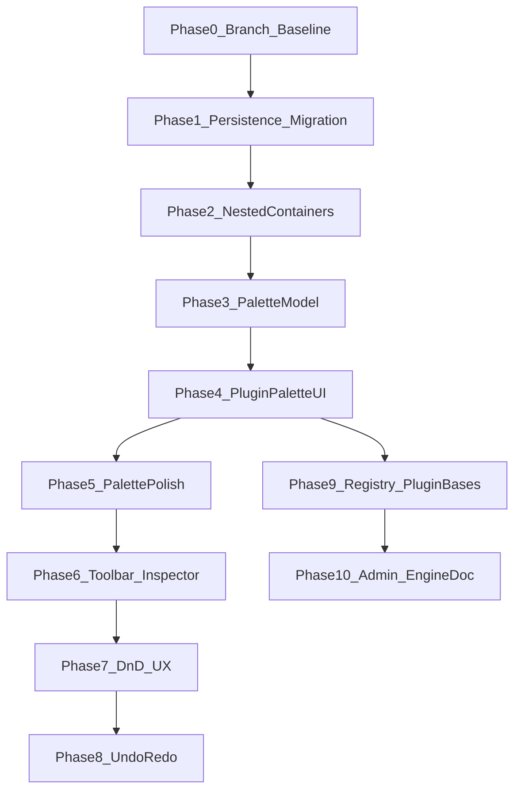

# Dashboard engine & UI v2 — `plugin` branch plan

## Git workflow

- **All implementation happens on branch `plugin`** (branch name only; create from up-to-date `main`: `git fetch origin && git checkout -b plugin origin/main` — exact commands when executing).
- Integrate to `main` only when phase acceptance criteria are met and review passes (rebase policy per [.cursor/rules/commits.mdc](../../.cursor/rules/commits.mdc)).

### Current priority — Phase 2 (nested containers / v3)

Phases **3–10** were implemented on the **v2** tree (single-level groups) to ship palette, editor shell, registry, and admin seams. **Deferring v3 any further increases rework**: recursive layout touches `types`, Zod/normalise, `migration/` + golden fixtures, `gridPlacement` / `layoutTree`, `DashboardHost` + `svelte-dnd-action` zones, undo invariants, persistence round-trip, and **server** parity ([`specs/dashboard/layout.schema.json`](../../specs/dashboard/layout.schema.json), [`specs/api/openapi.yaml`](../../specs/api/openapi.yaml), [`src/kea_fabric/api/layout_validate.py`](../../src/kea_fabric/api/layout_validate.py)).

**Rule for new work:** features that change **structure** of the layout document or host drop targets should land **in or after** the Phase 2 slice (or be explicitly scoped to v2-only with a removal plan). Phase **7** host-level polish (ghost, snap, drop highlight) should assume the **v3** drop matrix where it applies to groups—either ship Phase 2 first or implement Phase 7 against the recursive model in the same series of commits.

---

## Mandatory progress documentation

Single **living** tracker in the repo (name can be adjusted slightly if docs lint requires it):

- **[`docs/planning/UI_PLUGIN_BRANCH_PROGRESS.md`](../../docs/planning/UI_PLUGIN_BRANCH_PROGRESS.md)** (new file on `plugin`)

It **must** contain:

1. **Before (frozen snapshot @ branch cut)** — bullets describing behaviour and limits *as shipped on `main` before `plugin`*: palette shape, DnD pain points, where layout load/save/migrate live, single-level groups, plugin-only drag sources, **layout version gate** (`layoutJsonUnsupportedVersionMessage` in [`layoutStorage.ts`](../../apps/ui/src/lib/dashboard/layoutStorage.ts) — today versions **1–2** only), etc. Link to key files: [`DashboardHost.svelte`](../../apps/ui/src/lib/dashboard/DashboardHost.svelte), [`layoutStore.ts`](../../apps/ui/src/lib/dashboard/layoutStore.ts), [`types.ts`](../../apps/ui/src/lib/dashboard/types.ts), [`appMount.ts`](../../apps/ui/src/lib/appMount.ts), [`dashboardBootstrap.ts`](../../apps/ui/src/lib/dashboard/dashboardBootstrap.ts) (server GET → parse → grid → `acceptServerLayout`), [`layoutStorage.ts`](../../apps/ui/src/lib/dashboard/layoutStorage.ts), [`layoutTree.ts`](../../apps/ui/src/lib/dashboard/layoutTree.ts) (`migrateV1ToV2` / `ensureLayoutV2`), [`layoutZod.ts`](../../apps/ui/src/lib/dashboard/layoutZod.ts), [`layoutNormalize.ts`](../../apps/ui/src/lib/dashboard/layoutNormalize.ts), [`appDashboardShell.ts`](../../apps/ui/src/lib/appDashboardShell.ts), [`ShellHeader.svelte`](../../apps/ui/src/lib/dashboard/ShellHeader.svelte). **Phase 0 audit:** list every entrypoint that reads/writes layout JSON, runs migration/normalisation, or toggles editor/persist — include the files above so Phase 1 inventory is not incomplete.

2. **Target (end state)** — short bullet list aligned with [Architectural targets](#architectural-targets-non-negotiable-direction) below.

3. **Per-phase section** (repeat for each phase below):

   - **Status:** `not started` | `in progress` | `done`
   - **Done:** checkbox list of concrete deliverables (must be checkable)
   - **Remaining:** explicit backlog for that phase (empty when done)
   - **Verification:** commands run (`bash scripts/check_app.sh`, targeted Vitest/Playwright), fixtures added
   - **Notes / risks:** e.g. migration edge cases, perf

4. **After (when `plugin` merges)** — update once: summary of new modules and public “engine” surface.

Optional: screenshots or short screen recording for palette and DnD milestones — linked from the progress doc.

**Rule:** No phase is marked **done** in the progress doc until acceptance criteria and tests are satisfied *on `plugin`*.

---

## Architectural targets (non-negotiable direction)

These refine the original ALL-IN-ONE ideas with your constraints.

| Target | Meaning |
| --- | --- |
| **Independent plugins** | Tiles do not import layout engine internals; register via registry/context; **shared behaviour** via small **bases** (typed props helpers, optional abstract patterns, shared presentational wrappers) — composition over deep class hierarchies unless TS/Svelte clearly benefits. |
| **World-class DnD** | Explicit drag intents, ghost/snap, valid/invalid feedback, keyboard parity, reduced motion, rAF/throttle — replace “evolved/clunky” feel incrementally after layout/persistence foundations are testable. |
| **Dashboard = engine** | Clear separation: **data + migration + persistence + placement math** vs **view** (`DashboardHost`). Container chrome and drop zones are engine-level concepts applied at every nesting level. |
| **Nested containers** | Layout tree where a **group’s children can include tiles and groups** (discriminated union). Root remains a versioned `items[]` tree. Requires **schema version bump**, **migration**, and **cycle/depth policy**. Today [`DashboardGroup.children`](../../apps/ui/src/lib/dashboard/types.ts) is `DashboardTile[]` only — that is the explicit **before** state. |
| **Re-use in another project** | Documented **public surface** of the engine (types, migration, persistence, placement helpers); optionally a future `packages/dashboard-engine` split — **Phase 10** defines the minimal export set without forcing a monorepo extract in early phases. |
| **Palette / drop taxonomy** | Draggable **palette items** are not only plugins: **`PluginRef | CoreLayoutRef`** (e.g. container, future spacer) with one host-validated payload; discoverability (search/category) applies to **both**. |
| **Clean data structure** | One canonical serialisable layout JSON per version; validation at boundaries (Zod or existing validators); no parallel ad-hoc shapes. |
| **Migration = first-class** | [`lib/dashboard/migration/`](../../apps/ui/src/lib/dashboard/migration/) — version detect, upgrade steps, golden fixtures, no silent data loss; callable from persistence hydrate path only. |
| **Persistence = first-class** | [`lib/dashboard/persistence/`](../../apps/ui/src/lib/dashboard/persistence/) — hydrate, save, flush, dirty baseline vs server, errors — **explicit module API**; [`appMount`](../../apps/ui/src/lib/appMount.ts) / page become thin orchestrators. |

---

## Architectural layers, ownership, and further considerations

Use this as a **review checklist** during design and in [`UI_PLUGIN_BRANCH_PROGRESS.md`](../../docs/planning/UI_PLUGIN_BRANCH_PROGRESS.md) (add a “Decisions / open questions” subsection when needed).

### Layer stack (who may know what)

Rough top-to-bottom responsibility; **lower layers must not import higher layers**.

| Layer | Owns | Must not own |
| --- | --- | --- |
| **Shell / app** ([`App.svelte`](../../apps/ui/src/App.svelte), [`appMount`](../../apps/ui/src/lib/appMount.ts), [`ShellHeader.svelte`](../../apps/ui/src/lib/dashboard/ShellHeader.svelte)) | Routing, global lifecycle, wiring gateways into context; today **Edit / Save / Reset / flush-on-nav** live here + [`layoutStore`](../../apps/ui/src/lib/dashboard/layoutStore.ts) | Layout placement math, tile registry contents |
| **Page orchestrator** ([`DashboardPage`](../../apps/ui/src/lib/dashboard/DashboardPage.svelte)) | Composes host + palette + inspector + overlays; binds errors/CTA to user | Inner DnD coordinate math; migration implementation |
| **Engine — document** (`types`, **migration**, **persistence**) | Canonical JSON shape per version; upgrade/downgrade rules; I/O contract | Svelte components; drag ghost state |
| **Engine — layout mutation** ([`layoutStore`](../../apps/ui/src/lib/dashboard/layoutStore.ts) or successor) | **Single authority** for mutating in-memory layout tree; invariants (depth, ids) | HTTP details (delegates to persistence) |
| **Engine — placement** ([`gridPlacement`](../../apps/ui/src/lib/dashboard/gridPlacement.ts), [`layoutTree`](../../apps/ui/src/lib/dashboard/layoutTree.ts)) | Pure/reusable placement and hit-testing | Plugin-specific option shapes |
| **Interaction / ephemeral** (`interactions/*`, drag intent state) | Pointer feedback, previews, **proposed** drop indices | Committing layout; persisting |
| **View** ([`DashboardHost`](../../apps/ui/src/lib/dashboard/DashboardHost.svelte), palette components) | DOM, zones, delegating user intent → store/persistence | Parallel “shadow” layout truth |
| **Extensions** (tiles, registry) | Tile UI, options, settings forms | `layoutStore` direct mutation |

**Design rule:** only **one** code path applies a structural layout change from user intent (usually store action), so DnD “success” is a thin command, not a second layout copy.

### Server vs client ownership

- **Source of truth after save:** server layout wins on successful load/rehydrate unless product policy says otherwise — document the policy in persistence module (e.g. “remote apply replaces present + clears dirty baseline”).
- **Version skew:** UI layout `version` must align with **API expectations**; if the backend stores layout JSON, plan **the same slice** to update: [`specs/dashboard/layout.schema.json`](../../specs/dashboard/layout.schema.json), [`specs/api/openapi.yaml`](../../specs/api/openapi.yaml) (per repo OpenAPI drift rules), and [`src/kea_fabric/api/layout_validate.py`](../../src/kea_fabric/api/layout_validate.py) (docstring: mirrors UI + schema). **`layoutStorage.ts`** must extend `layoutJsonUnsupportedVersionMessage` (and related UX) when introducing **v3** so clients do not treat newer JSON as “unsupported stored layout” by accident.
- **Concurrency:** two tabs, or save in flight + continued editing — persistence façade should define behaviour (reject, queue, last-write-wins, or optimistic with revision token) even if v1 is “minimal safe behaviour + documented limitation”.

### Editor vs document state

- **Persisted:** `DashboardLayout` tree + tile options.
- **Ephemeral:** selection, inspector tab, drag ghost, hover highlight, palette scroll — must never be required to reconstruct layout from JSON alone. Keep types split so this cannot regress silently.

### Conflict with undo/redo and remote refresh

- Phase 8 must state explicitly: **server-driven layout replace** either (a) clears undo stacks, (b) pushes a single history boundary, or (c) stores server revision — pick one and test it. Same for “Reset layout”.

### Extension boundary (plugins + core)

- **Core palette items** are still **host extensions**, not third-party plugins — implement as registered handlers in engine code, same validation path as plugin drops, to avoid two security/validation stories.
- **DataGateway façade** (optional follow-up after Phase 9): narrows what tiles may call; pairs with future permission model — note in progress doc if deferred.

### Observability and failure isolation

- Optional **structured hooks** (callbacks or small event interface): migration failed, save failed, drag drop rejected — keeps shell testable and avoids `console.log` archaeology. Do not block Phase 1–4 on a full telemetry pipeline.

### Security and trust boundaries

- **Drag payloads:** treat as untrusted; parse + validate in one host function (Phase 3 codec); reject unknown kinds and oversized strings.
- **Tile options:** continue validating with Zod (or existing) at mount boundary; nested groups increase blast radius — keep validation at **hydrate** and at **settings commit**.

### Accessibility beyond the palette

- Engine-level: live region or documented pattern when **structure** changes (add/remove container, failed drop) for screen readers, not only palette chips.

### Testing ownership by layer

| Layer | Primary tests |
| --- | --- |
| migration / placement pure | Unit + golden JSON |
| persistence façade | Unit + mocked gateway |
| layoutStore | Unit + state invariants |
| DashboardHost / DnD | Component + targeted Playwright under [`apps/ui/tests/e2e/`](../../apps/ui/tests/e2e/) |
| full journeys | Playwright (`apps/ui/tests/e2e/`) |

### Reuse / extraction (Phase 10+)

- **Public API** list should name **stability tier** (`stable` / `experimental` / `internal`) so another repo does not depend on accidental exports.
- **Kea coupling:** anything importing [`api/types`](../../apps/ui/src/lib/api/types.ts) or gateway shapes is **adapter** layer — engine README should say which types are host-generic vs Kea-specific.

### Governance

- Layer or ownership changes that contradict **Accepted** ADRs require ADR update or supersession first ([.cursor/rules/plan-mode.mdc](../../.cursor/rules/plan-mode.mdc)).
- **Nested layout / host boundaries (Phase 2+):** cross-check [`docs/architecture/dashboard-plugin-blueprint.md`](../../docs/architecture/dashboard-plugin-blueprint.md) (Accepted) so engine changes stay aligned; promote or extend planning docs ([`UI_ENGINE_SPEC.md`](../../docs/planning/UI_ENGINE_SPEC.md)) where the blueprint is silent, without contradicting it.

---

## Phase 0 — Branch, baseline, progress skeleton

**Before:** no `plugin` branch; no single progress source; baseline implicit.

**After:** `plugin` exists; [`UI_PLUGIN_BRANCH_PROGRESS.md`](../../docs/planning/UI_PLUGIN_BRANCH_PROGRESS.md) filled with **Before** snapshot + empty phase tables; reproducible baseline checklist (and optional Playwright).

**Deliverables**

1. Create branch **`plugin`** from `origin/main`.
2. Add [`docs/planning/UI_PLUGIN_BRANCH_PROGRESS.md`](../../docs/planning/UI_PLUGIN_BRANCH_PROGRESS.md) with template + **Before** section (audit: list every entrypoint that reads/writes layout or runs migration).
3. **Baseline checklist** (manual or automated): app boot, dashboard render, edit mode, add tile click/drag, add/move container, move tile root/group, tile/group settings overlays, save/reset, flush on nav, disabled/unknown/invalid-option tile fallbacks. Optional automation: extend Playwright specs under [`apps/ui/tests/e2e/`](../../apps/ui/tests/e2e/).
4. Optional: add [`apps/ui/src/lib/platform/featureFlags.ts`](../../apps/ui/src/lib/platform/featureFlags.ts) (create the `platform/` directory if adopting this pattern) or env-based flag for `ui.palette.v2` — no behaviour change until later phases wire flags.
5. In the progress doc, add a short **“Layer ownership”** subsection: either copy the table from [Architectural layers](#architectural-layers-ownership-and-further-considerations) or link to this plan — plus placeholders for **server vs client layout policy** and **undo vs remote refresh** to be resolved by end of Phases 1 and 8 respectively.

**Acceptance:** progress doc committed; baseline checklist passes on `plugin` at Phase 0 tag (commit hash noted in doc).

---

## Phase 1 — Persistence and migration modules (no user-visible change)

**Before:** load/save/migrate/v1→v2 and normalisation are spread across [`appMount`](../../apps/ui/src/lib/appMount.ts), [`dashboardBootstrap.ts`](../../apps/ui/src/lib/dashboard/dashboardBootstrap.ts), [`layoutStore`](../../apps/ui/src/lib/dashboard/layoutStore.ts), [`layoutStorage.ts`](../../apps/ui/src/lib/dashboard/layoutStorage.ts), [`layoutTree.ts`](../../apps/ui/src/lib/dashboard/layoutTree.ts), [`layoutZod.ts`](../../apps/ui/src/lib/dashboard/layoutZod.ts), [`layoutNormalize.ts`](../../apps/ui/src/lib/dashboard/layoutNormalize.ts), and gateway usage — not only `appMount` + `layoutStore`.

**After:** **`apps/ui/src/lib/dashboard/migration/`** — pure functions + tests + golden JSON per layout version. **`apps/ui/src/lib/dashboard/persistence/`** — façade implementing hydrate / save / flush / error channel / dirty baseline coordination, **including layout export/import helpers** currently centred on [`layoutStorage.ts`](../../apps/ui/src/lib/dashboard/layoutStorage.ts) (exact method names in implementation); [`appMount`](../../apps/ui/src/lib/appMount.ts), [`dashboardBootstrap`](../../apps/ui/src/lib/dashboard/dashboardBootstrap.ts), and [`layoutStore`](../../apps/ui/src/lib/dashboard/layoutStore.ts) become thin orchestrators.

**Deliverables**

1. **Inventory table** in progress doc: file → responsibility → moved to which module (Phase 1 **Done** when table is complete).
2. **Migration:** extract existing v1→v2 (and any in-store normalisation) into versioned functions; add **golden JSON** under e.g. [`apps/ui/src/lib/dashboard/migration/__fixtures__/`](../../apps/ui/src/lib/dashboard/migration/__fixtures__/) (path illustrative — pick one convention under `apps/ui` and stick to it; Vitest lives under [`apps/ui/src/**/*.{test,spec}.ts`](../../apps/ui/vite.config.ts)); tests for each upgrade path and idempotency where required. **Committed fixtures:** prefer minimal hand-written JSON; real-world shapes from [`.fabric-data/`](../../.fabric-data/) may be used only if **sanitised and committed** (or copied into `__fixtures__`); do not rely on local-only `.fabric-data/` for CI.
3. **Persistence:** single module boundary so `DashboardPage`, bootstrap, and mount code do not duplicate save/flush / server-replace logic; document **dirty baseline** rules (what counts as “clean” vs server).
4. **Regression:** Phase 0 checklist still green; no intentional UX change.

**Acceptance:** `bash scripts/check_app.sh` green; progress doc Phase 1 **Done** checkboxes filled; **Remaining** empty.

---

## Phase 2 — Nested containers (layout engine + schema)

**Before:** [`DashboardGroup.children: DashboardTile[]`](../../apps/ui/src/lib/dashboard/types.ts) — one level of nesting only.

**After:** Versioned layout (e.g. **v3** or negotiated version) where **group children may be tiles or groups**; [`layoutTree`](../../apps/ui/src/lib/dashboard/layoutTree.ts) / [`gridPlacement`](../../apps/ui/src/lib/dashboard/gridPlacement.ts) / [`DashboardHost`](../../apps/ui/src/lib/dashboard/DashboardHost.svelte) support **recursive** structure; **migration v2→v3**; **max depth** (and optional max children) enforced; cycle prevention.

**Deliverables**

1. **ADR + type changes** in [`types.ts`](../../apps/ui/src/lib/dashboard/types.ts); align **Accepted** [`dashboard-plugin-blueprint.md`](../../docs/architecture/dashboard-plugin-blueprint.md) or add a superseding ADR if host contracts change. Update **all** wire/validation surfaces in one slice: [`specs/dashboard/layout.schema.json`](../../specs/dashboard/layout.schema.json), [`specs/api/openapi.yaml`](../../specs/api/openapi.yaml), [`src/kea_fabric/api/layout_validate.py`](../../src/kea_fabric/api/layout_validate.py), plus UI Zod/normalise paths. Bump [`layoutJsonUnsupportedVersionMessage`](../../apps/ui/src/lib/dashboard/layoutStorage.ts) (and user-facing copy) to accept **v3** once shipped.
2. **Recursive rendering** and DnD targets for nested groups; container chrome at each level (edit mode).
3. **Migration module** extends with v2→v3 + fixtures (including “messy” exports only when **sanitised and committed** per Phase 1 fixture rule; local `.fabric-data/` alone is not CI-safe).
4. **Progress doc:** document depth policy and any known limitations.

**Acceptance:** nested container E2E or Playwright scenario under [`apps/ui/tests/e2e/`](../../apps/ui/tests/e2e/); unit tests on tree walk, migration, placement invariants; checklist updated.

---

## Phase 3 — Palette model: plugins + core items

**Before:** drag sources effectively assume `pluginId` string only.

**After:** **`PaletteItem`** discriminated union (`plugin` | `core` with stable ids); **catalog** merges `PluginEntry[]` + static **core** definitions; **drag payload codec** (versioned string or structured JSON + MIME) validated in one host function.

**Deliverables**

1. `apps/ui/src/lib/palette/types.ts`, `paletteCatalog.ts`, `paletteDragCodec.ts` (names illustrative; all under `apps/ui/src/lib/palette/`).
2. Host-side single entry: `parsePaletteDrop(dt) -> PaletteDrop | null` used by existing drop handlers.
3. Tests: codec round-trip, unknown payload rejected safely, catalog deterministic sort.
4. **Catalog inputs:** where possible, derive labels/categories from existing [`PluginRegistration`](../../apps/ui/src/lib/plugins/registry.ts) / manifest data so palette metadata does not drift from the tile registry (pairs naturally with Phase 9 if metadata moves there).

**Acceptance:** `DashboardHost` can accept core drops in principle (even if UI only adds “container” in Phase 4); tests green; progress doc updated.

---

## Phase 4 — PluginPalette UI (replace inline palette)

**Before:** flat buttons inside [`DashboardHost`](../../apps/ui/src/lib/dashboard/DashboardHost.svelte) edit palette.

**After:** `lib/palette/PluginPalette.svelte` (+ subcomponents); **only** palette **markup** replaced in host; canvas DnD, `onAddTile` / `onAddGroup` / group drag semantics preserved; palette lists **plugins + core** chips from Phase 3 catalog.

**Deliverables**

1. Search, category tabs, grouped sections, **Add container** as **core** chip (not fake plugin id).
2. Vitest on chips: click fires correct intent; drag sets payload per codec.
3. Feature flag `ui.palette.v2` if agreed — default on on `plugin` branch during development optional.

**Acceptance:** Phase 0 add/drag scenarios pass with new UI; progress doc Phase 4 complete.

---

## Phase 5 — Palette polish

**Before:** functional palette without production polish.

**After:** pinned/recent (localStorage, recent only on successful add), icons, focus/hover/disabled, empty states, duplicate name disambiguation, keyboard path, aria labels per earlier spec.

**Deliverables**

1. `paletteStorage.ts` + tests (cap, dedupe, unknown ids).
2. Accessibility pass documented in progress doc.

**Acceptance:** keyboard-only add path works; progress doc updated.

---

## Phase 6 — Toolbar and inspector

**Before:** edit/save/dirty indicators and editor entry live primarily in [`ShellHeader.svelte`](../../apps/ui/src/lib/dashboard/ShellHeader.svelte) + [`App.svelte`](../../apps/ui/src/App.svelte) wiring to [`layoutStore`](../../apps/ui/src/lib/dashboard/layoutStore.ts) / [`overlayActions`](../../apps/ui/src/lib/dashboard/overlayActions.ts), not yet a dedicated editor column.

**After:** **New** modules under `apps/ui/src/lib/dashboard/editor/` (none exist on `main` today): e.g. [`DashboardToolbar.svelte`](../../apps/ui/src/lib/dashboard/editor/DashboardToolbar.svelte), [`InspectorPanel.svelte`](../../apps/ui/src/lib/dashboard/editor/InspectorPanel.svelte), [`editorState.ts`](../../apps/ui/src/lib/dashboard/editor/editorState.ts); three-column layout on wide screens; overlays remain for advanced settings until deliberately retired. **Migrate** chrome from `ShellHeader` into the toolbar as the single place for Edit/Done/Save/Reset/dirty (or keep a thin shell strip — document the split in the progress doc).

**Deliverables**

1. Toolbar: Edit/Done, Save, Reset, dirty/saving/error indicators wired through **persistence** façade from Phase 1.
2. Inspector: selection from host; summary + link to overlay; no layout math inside inspector.
3. Undo/redo controls **disabled or hidden** until Phase 8.

**Acceptance:** tests for toolbar/inspector wiring; progress doc updated.

---

## Phase 7 — World-class DnD UX

**Before:** OK but clunky DnD; limited feedback.

**After:** `lib/dashboard/interactions/` — `dragIntent`, `dragGhost`, `dropTargets`, `snapPreview` (as needed); rAF/throttle; valid/invalid visuals; reduced-motion path; minimal layout thrash.

**Deliverables**

1. Document **drag intents** (palette-plugin, palette-core, existing-tile, existing-group) and target matrix in progress doc.
2. Wire into [`DashboardHost`](../../apps/ui/src/lib/dashboard/DashboardHost.svelte) without changing placement semantics unless explicitly specified + tested.
3. Playwright under [`apps/ui/tests/e2e/`](../../apps/ui/tests/e2e/) or heavy Vitest where stable.

**Acceptance:** no significant perf regression; subjective “clunky” items from **Before** list addressed or ticketed with owner; progress doc lists resolved vs deferred items.

---

## Phase 8 — Undo / redo

**Before:** no edit history.

**After:** `editorHistory.ts` + integration with layout mutations; **exclude** persistence hydrate and successful remote apply from undo stack per documented rules; keyboard shortcuts in edit mode.

**Deliverables**

1. History invariants tested (new edit clears future; undo/redo round-trip for scoped operations).
2. Toolbar enables undo/redo.

**Acceptance:** Phase 0 + nested scenarios still pass; progress doc **Phase 8** section **Done** / **Remaining** filled and accurate (not “entire progress doc finished” unless all phases are done).

---

## Phase 9 — Platform tile registry and plugin bases

**Before:** [`lib/plugins/registry.ts`](../../apps/ui/src/lib/plugins/registry.ts) is the monolithic resolver.

**After:** `lib/platform/extensions/dashboardTileRegistry.ts` + compat registration; `registry.ts` delegates; **plugin authoring guide** section in `docs/` (short) describing allowed imports, **base patterns** (shared props, optional wrapper), and registry registration.

**Deliverables**

1. Lint or eslint boundaries (recommended) preventing `lib/plugins/*` tiles from importing `layoutStore` / `gridPlacement` / `DashboardHost`.
2. Optional: migrate palette metadata source into registry entries.

**Acceptance:** built-ins unchanged from user perspective; progress doc updated. **Coverage:** new or changed `*.svelte` under Vitest [`coverage.include`](../../apps/ui/vite.config.ts) paths needs tests to preserve **100% line** on enforced UI paths; registry-only `.ts` refactors follow existing `src/lib/**/*.test.ts` patterns.

---

## Phase 10 — Admin route registry and engine extract boundary

**Before:** admin subpages ad hoc in [`AdminPage`](../../apps/ui/src/lib/admin/AdminPage.svelte); engine not documented for reuse.

**After:** `adminRouteRegistry.ts`; `AdminPage` uses registry; **Dashboard engine README** (e.g. `docs/planning/DASHBOARD_ENGINE_PUBLIC_API.md`) listing supported imports and stability tier for extraction to another repo.

**Deliverables**

1. Unknown admin path fallback.
2. Document **minimal** public API: `types`, `migration`, `persistence`, placement helpers, host props contract — **no promise** of full package split until agreed.

**Acceptance:** one sample registered admin extension **without** growing the ad-hoc `adminSubpath` conditionals in [`App.svelte`](../../apps/ui/src/App.svelte) / [`AdminPage.svelte`](../../apps/ui/src/lib/admin/AdminPage.svelte) (hash stays `#/admin/...`; registry resolves tail → panel); progress doc **Target** and **After** sections filled.

---

## Cross-cutting rules

- **Tests:** new/changed behaviour under [`apps/ui`](../../apps/ui) and shared modules follow [.cursor/rules/testing.mdc](../../.cursor/rules/testing.mdc) (Vitest coverage on included paths; Playwright where appropriate).
- **Governance:** schema or public API changes may require ADR / [`docs/planning/UI_ENGINE_SPEC.md`](../../docs/planning/UI_ENGINE_SPEC.md) updates in the same slice; **Accepted** [`dashboard-plugin-blueprint.md`](../../docs/architecture/dashboard-plugin-blueprint.md) remains the normative host/plugin contract unless explicitly superseded.
- **Rollback:** each phase should remain revertible via flag or small revert series (documented in progress doc **Notes**).

---

## Dependency overview

**Original dependency (design-time):** P1 → P2 → P3 → … — types and placement should understand nesting before palette/DnD assume a final tree.

**Actual order on `plugin` (historical):** P1, then **P3–P10 on v2**, with **P2 deferred** — acceptable for delivery, but **P2 is now the forward gate** for structural correctness and to avoid a second pass through host/placement/migration.

**Note:** Phase 9 can start after Phase 4 if you want registry-driven metadata earlier; keep **delegating** `resolvePluginTileMount` until palette is stable to avoid thrash. If Phase 3 **paletteCatalog** reads registry/manifest fields, keep types stable so Phase 4–5 UI work does not thrash against Phase 9 refactors.

---

## What changed vs the earlier light plan

- **Branch `plugin`** and **mandatory in-repo progress doc** with before/after and per-phase Done vs Remaining.
- **Phase 1** now explicitly **persistence + migration** extraction (first-class modules).
- **Phase 2** is the **nested container / layout tree** engine work (major schema + migration).
- **Phase 3** introduces **plugin + core** palette/drop taxonomy before heavy UI.
- **DnD polish** moved after toolbar/inspector baseline (Phase 7) so feedback layers sit on stable selection and layout; adjust if you prefer DnD immediately after Phase 5.
- **Phase 10** adds **admin registry** plus **documented engine public API** for reuse.

**Execute Phase 2** on branch `plugin` as one reviewable slice: ADR or blueprint alignment, types + v2→v3 migration + fixtures, UI host recursion, server schema/OpenAPI/Python validator, then extend Phase 0 checklist + Playwright for nested moves. Track status in [`UI_PLUGIN_BRANCH_PROGRESS.md`](../../docs/planning/UI_PLUGIN_BRANCH_PROGRESS.md).
