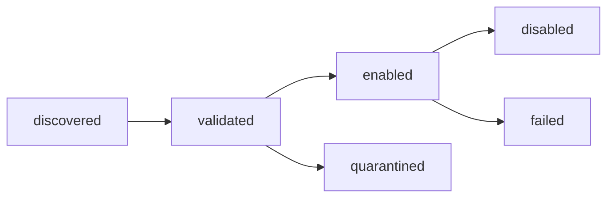

# Documentation Standards

> **Tier A — Gate 1.** The Documentation Quality Bar. Every architecture doc,
> every ADR, every governance note cites this file (explicitly or by default).
> Changes here ripple across the whole `docs/` tree.

## Scope

This document defines the non-negotiable shape of every doc under
`docs/architecture/` and `docs/adr/`: frontmatter, section order, diagram
requirements, invariant form, cross-reference rules, Change Log format, the
self- and peer-review checklists, the CI bar, and the `REF_ONLY/` citation
rule. If a doc violates any rule here, it fails review.

It does **not** cover:

- Doc content itself — that belongs in the individual architecture docs.
- The peer-reviewer roster or escalation path — see
  [`../_governance/REVIEWERS.md`](../_governance/REVIEWERS.md).
- Canonical product names — see
  [`../_governance/NAMING.md`](../_governance/NAMING.md).

## 1. Doc tiers

Every file under `docs/architecture/` is tier A, B, or C, and MUST declare
its tier in frontmatter. Tier determines gate, skeleton, and review weight.

| Tier | Gate | Examples | Skeleton |
|---|---|---|---|
| A | Gate 1 | `README`, `glossary`, `principles`, `overview`, `invariants`, `threat-model`, this file | [`../_templates/TIER_A_TEMPLATE.md`](../_templates/TIER_A_TEMPLATE.md) |
| B | Gate 1 or 2 | Subsystem docs (`core-runtime`, `plugins`, `contracts`, …) | [`../_templates/TIER_B_TEMPLATE.md`](../_templates/TIER_B_TEMPLATE.md) |
| C | Rolling | Cross-cutting + UI polish + packaging/CI/release (closes alongside the phase that uses each) | [`../_templates/TIER_C_TEMPLATE.md`](../_templates/TIER_C_TEMPLATE.md) |

Tier semantics, gate assignments, and status lifecycle are codified in
[`../../.cursor/rules/doc-tier.mdc`](../../.cursor/rules/doc-tier.mdc). Do not
invent new tiers.

## 2. Frontmatter (mandatory)

Every architecture doc MUST begin with YAML frontmatter containing all of:

```yaml
title:           # string; matches the first-heading text
tier:            # A | B | C
gate:            # 1 | 2 | Rolling  (Tier A = 1; Tier B = 1 or 2; Tier C = Rolling)
owner:           # assignee name (set before Proposed → Accepted)
peer_reviewer:   # assignee name; SHOULD differ from owner unless solo self-review per REVIEWERS.md
status:          # Proposed | Accepted | Deferred | Superseded-by
last_review:     # YYYY-MM-DD
adrs:            # [ADR-NNNN, ...] — ADRs cited in the doc body
invariants:      # [INV-AREA-NAME, ...] — invariants declared or cited
```

ADRs use a separate frontmatter shape defined in
[`../../.cursor/rules/adr.mdc`](../../.cursor/rules/adr.mdc).

Rules:

- `title` MUST match the `# …` first heading exactly (minus markdown syntax).
- `status: Accepted` is forbidden while unassigned placeholder markers remain
  in the narrative body (Change Log excepted).
- `invariants:` MUST list every `INV-*` referenced anywhere in the body. Every
  entry MUST be indexed in `invariants.md` before the doc flips to `Accepted`.
- `adrs:` SHOULD list every ADR cited in-body by ID. The advisory **lychee**
  pass helps surface broken relative links to ADR files; the list is still for
  humans and review.

## 3. Canonical section order

Section order is fixed per tier. Authors may add subsections within a section
but MUST NOT reorder or remove top-level sections.

### Tier A

1. `# <Title>`
2. `## Scope`
3. `## <Body sections specific to this Tier A doc>` (one or more)
4. `## Invariants` (even if the list is empty — explicitly state "none declared here")
5. `## Contracts` (or "none" if this doc declares no contracts)
6. `## Cross-refs`
7. `## Change Log`

### Tier B

1. `# <Title>`
2. `## Scope`
3. `## Responsibilities`
4. `## Contracts consumed`
5. `## Contracts published`
6. `## Invariants`
7. `## Failure modes`
8. `## Cross-refs`
9. `## Change Log`

### Tier C

1. `# <Title>`
2. `## Scope`
3. `## Acceptance criteria for Rolling close`
4. `## <Body sections>` (one or more; intent-specific)
5. `## Cross-refs`
6. `## Change Log`

ADRs follow the MADR shape from the ADR template; see `adr.mdc`.

## 4. Diagrams (Mermaid-mandatory)

**Every Tier A and Tier B doc MUST contain at least one Mermaid diagram** that
renders in a mkdocs-material build. Diagrams encode non-obvious structure
(flow, state, sequence, component relationships) — decorative diagrams do not
count.

- Use Mermaid syntax only. No PlantUML, no PNG screenshots of diagrams, no
  external renderer. This keeps diagrams text-reviewable and CI-verifiable.
- Prefer `flowchart`, `sequenceDiagram`, `stateDiagram-v2`, `classDiagram`,
  `erDiagram`, and `C4Context` (for `overview.md`).
- A Mermaid block that fails to parse fails CI.
- Accessibility: use `accTitle:` / `accDescr:` blocks on every diagram.

Example (copy-adapt, don't copy-paste as decoration):



Tier C docs MAY contain diagrams but are not required to.

## 5. Invariants

All invariants use the block format in
[`../_templates/INVARIANT_BLOCK_TEMPLATE.md`](../_templates/INVARIANT_BLOCK_TEMPLATE.md)
and the `INV-<AREA>-<NAME>` ID shape enforced by
[`../../.cursor/rules/invariants.mdc`](../../.cursor/rules/invariants.mdc).

Additional rules specific to this document:

- Invariants are **numbered implicitly by their ID**. Do not prefix them with
  arbitrary numbers ("1.", "2.") in section headings — the ID is the number.
- Every invariant needs a falsifiable `Statement`, a named `Test hook`, and
  at least one `Back-link`.
- An invariant declared in doc X and cited in doc Y is owned by X. Y links;
  it does not redeclare.
- A doc that *cites* an invariant but does not declare any MUST still include
  a `## Invariants` section stating "none declared here; see: …".

## 6. Cross-references

- Use **relative** markdown links within the repo (`../_governance/NAMING.md`,
  not absolute URLs).
- Link ADRs by ID and path: `[ADR-0031](../adr/ADR-0031-platform-support-matrix.md)`
  — the advisory **lychee** pass checks that relative targets exist; it does not
  fail CI.
- Contracts cited in prose MUST link to their `specs/` artefact by relative
  path. Broken relative links are reported in CI (advisory) and MUST be fixed
  even when the workflow stays green; peer review is the backstop.
- Inline code, file names, directory names, function names, and class names
  go in backticks.

## 7. Change Log

Every doc ends with a `## Change Log` section. The format is:

| Date | Status | Reviewer | Notes |
|---|---|---|---|
| YYYY-MM-DD | `<status>` | `<name or (no-op)>` | one-line summary |

- Every status flip writes a row.
- Typo-only or formatting-only revisions write a row with `reviewer: (no-op)`
  and MUST state "no content change" in the notes.
- Rows are append-only; never rewrite history, even for typos, without a new
  row documenting the rewrite.

See [`../_governance/REVIEWERS.md`](../_governance/REVIEWERS.md) for the
prose form of the Change Log convention.

## 8. Self-review checklist (owner, before requesting peer review)

The owner walks this list before flipping status from draft to `Proposed` and
again before requesting peer-review sign-off. A doc that fails any item is
not ready for review.

1. All frontmatter fields present with assignee names (or an explicit
   pre-assignment policy for `owner` / `peer_reviewer` per `REVIEWERS.md`).
2. `title` matches the first `# …` heading.
3. Canonical section order for this tier is intact.
4. Tier A / B: at least one Mermaid diagram that actually renders.
5. All invariants use the block template, use the `INV-<AREA>-<NAME>` ID
   shape, and are listed in `invariants:` frontmatter.
6. Every invariant declared here is indexed (or will be in the same PR) in
   `invariants.md`.
7. Every ADR cited in prose is listed in the `adrs:` frontmatter.
8. Every contract cited in prose links to its `specs/` artefact (or a TODO
   issue exists if the artefact is scheduled for the next PR).
9. No unassigned placeholder markers in the narrative body (Change Log
   excepted).
10. Every `REF_ONLY/` citation carries a `Delta:` field (see §11).
11. `markdownlint`, `cspell`, and `mkdocs build --strict` pass locally.
12. Mermaid diagrams parse (`mkdocs build --strict` catches this).
13. All relative links resolve (verify locally; `npm run check:links` if lychee
    is installed — CI lychee is advisory).
14. Product naming is consistent with
    [`../_governance/NAMING.md`](../_governance/NAMING.md): *Kea Fabric* in
    prose, `kea-fabric` slug, `kea_fabric` Python import. No forbidden
    variants (`KeaFabric`, `keafabric`, `Kea-Fabric`).

## 9. Peer review checklist

The peer reviewer works the 12-item checklist defined in
[`../_governance/REVIEWERS.md`](../_governance/REVIEWERS.md) §"Review checklist
(12 items)". That checklist is normative; this document does not duplicate it.

Approval = peer reviewer writes a Change Log row with:

```
YYYY-MM-DD  status: Accepted  reviewer: <name>  notes: <one line>
```

## 10. CI quality bar

**Documentation workflow** (`.github/workflows/docs.yml`):

| Step | What it checks | Failure mode |
|---|---|---|
| `bash scripts/check_markdownlint.sh` | Markdown / `.mdc` style (markdownlint-cli2; `REF_ONLY/` excluded) | Non-zero exit fails CI |
| `bash scripts/check_cspell.sh` | English spell-check on docs and rules (`REF_ONLY/` excluded) | Non-zero exit fails CI |
| `bash scripts/check_python_compile.sh` | Byte-compile `scripts/` + `specs/contracts/` (not `REF_ONLY/`) | Non-zero exit fails CI |
| `python scripts/validate_specs.py` | JSON Schemas, OpenAPI, broker stubs | Non-zero exit fails CI |
| `mkdocs build --strict` | Doc tree builds; nav resolves; Mermaid parses | Any warning fails the build |
| `lychee` (same corpus as markdown/cspell) | HTTP(S) / file links in tracked docs | **Advisory** — issues are logged; workflow does not fail |
| `bash scripts/check_git_archive_excludes_ref_only.sh` | Release `git archive` must not ship `REF_ONLY/` paths | Script failure fails CI |

**Security workflow** (`.github/workflows/security.yml`) — **blocking**:

| Step | What it checks | Failure mode |
|---|---|---|
| `gitleaks detect` (`.gitleaks.toml`) | Hardcoded secrets in git history / tree | Non-zero exit fails CI |
| `syft scan` → CycloneDX JSON | SBOM for the repo tree (excludes `REF_ONLY/`, `site/`, `node_modules/`, `.venv/`) | Non-zero exit fails CI |
| `grype sbom:` | Vulnerabilities in SBOM packages | Non-zero exit fails CI at **high** or **critical** (not medium/low) |

SBOM is uploaded as a workflow artifact (`sbom-cyclonedx`) for review and supply-chain use.
The same pipeline can be run locally with `npm run check:security` when **gitleaks**,
**syft**, and **grype** are installed (see [`AGENTS.md`](../../AGENTS.md)).

**Roadmap** (named in [`AGENTS.md`](../../AGENTS.md)): broader **test matrices** (implementation-era).

**Implementation-era CI** (Phase 2+) adds `ruff`, `mypy --strict`, `pytest`,
conformance tests, and related gates per ADRs and `plan-mode.mdc`.

## 11. `REF_ONLY/` citations

Per [`../../.cursor/rules/reference-material.mdc`](../../.cursor/rules/reference-material.mdc):

- Docs MAY cite material under `REF_ONLY/` for historical context.
- Every citation MUST be accompanied by a `Delta:` line (1–3 sentences)
  explaining what changed in Kea Fabric versus the reference, or the explicit
  form `Delta: copied verbatim, rationale: <one sentence>.`
- The doc `reference-ledger.md` records every such port; it is a Gate 1
  deliverable, not Rolling.

## 12. Language and locale

- All documentation is **English only** per ADR-0024. No translated doc
  variants in the baseline corpus unless an ADR extends scope.
- Use British English **or** American English consistently within a given
  doc; do not mix within one file. The project has no house preference in
  the initial baseline; pick one and stay with it. (The `cspell` dictionary
  contains both variants when enabled.)
- Product strings referenced in prose follow `NAMING.md` exactly — those are
  not subject to en-GB / en-US style.

## 13. Rule hierarchy

When these rules conflict with another source, resolve by precedence:

1. An ADR with `status: Accepted`.
2. `AGENTS.md` at repo root.
3. This document.
4. The individual `.cursor/rules/*.mdc` (they implement parts of this document).
5. The doc templates under `../_templates/`.

If you encounter a genuine conflict between items 1–3, open an ADR — don't
paper over it.

## Invariants

None declared here. This document defines the *process* by which other docs
declare invariants; it does not itself make claims about the running system.

## Contracts

None. This is a process document.

## Cross-refs

- [`AGENTS.md`](../../AGENTS.md) — agent operating rules (post documentation gates).
- [`../_governance/REVIEWERS.md`](../_governance/REVIEWERS.md) — peer-reviewer
  protocol and the 12-item review checklist.
- [`../_governance/NAMING.md`](../_governance/NAMING.md) — canonical product
  names and forbidden variants.
- [`../_templates/TIER_A_TEMPLATE.md`](../_templates/TIER_A_TEMPLATE.md),
  [`TIER_B_TEMPLATE.md`](../_templates/TIER_B_TEMPLATE.md),
  [`TIER_C_TEMPLATE.md`](../_templates/TIER_C_TEMPLATE.md),
  [`ADR_TEMPLATE.md`](../_templates/ADR_TEMPLATE.md),
  [`INVARIANT_BLOCK_TEMPLATE.md`](../_templates/INVARIANT_BLOCK_TEMPLATE.md).
- `.cursor/rules/`:
  [`plan-mode.mdc`](../../.cursor/rules/plan-mode.mdc),
  [`doc-tier.mdc`](../../.cursor/rules/doc-tier.mdc),
  [`adr.mdc`](../../.cursor/rules/adr.mdc),
  [`invariants.mdc`](../../.cursor/rules/invariants.mdc),
  [`reference-material.mdc`](../../.cursor/rules/reference-material.mdc).
- Related ADR: ADR-0024 (EN-only documentation).

## Change Log

| Date | Status | Reviewer | Notes |
|---|---|---|---|
| 2026-04-19 | Proposed | GriffinAD | Initial Phase 1 Documentation Quality Bar. |
| 2026-04-19 | Accepted | GriffinAD | Self-review; Gate 1 Tier A acceptance. |
| 2026-04-19 | Accepted | GriffinAD | §10/§12: align CI table with wired workflow; roadmap wording. |
| 2026-04-19 | Accepted | GriffinAD | §10: document markdownlint-cli2 + cspell in CI bar; trim roadmap. |
| 2026-04-19 | Accepted | GriffinAD | §10: document advisory lychee link check; trim roadmap (link-check shipped). |
| 2026-04-19 | Accepted | GriffinAD | §2/§6: wording matches advisory lychee (does not fail CI). |
| 2026-04-19 | Accepted | GriffinAD | §8 item 13: self-review aligns with advisory lychee + `check:links`. |
| 2026-04-19 | Accepted | GriffinAD | §10: document blocking `security.yml` (gitleaks, syft, grype `--fail-on high`). |
| 2026-04-19 | Accepted | GriffinAD | §10: note local `npm run check:security` parity; CI caches Grype DB. |
| 2026-04-19 | Accepted | GriffinAD | §10: `compileall` gate for `scripts/` + `specs/contracts/`; Dependabot; EditorConfig; workflow concurrency. |
| 2026-04-19 | Accepted | GriffinAD | Cross-ref: Phase 1 documentation programme closed (`architecture/README.md`). |
