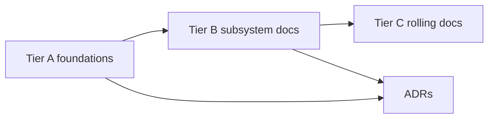

# Architecture Documentation Index

> **Tier A** — foundational navigation and orientation for the architecture
> set. This file defines reading order, doc ownership by tier, the diagram
> index, the invariant index, and the ten onboarding questions every new
> engineer should be able to answer using Gate-1 docs only.

## Scope

This document is the primary map of `docs/architecture/`:

- It explains what each Tier A/B/C doc is for.
- It gives a canonical reading order.
- It provides a diagram index and a placeholder invariant index.
- It defines ten onboarding questions used to validate Gate-1 readability.

It does not replace subsystem docs; it points to them.

## Document map by tier

### Tier A (Gate 1 foundations)

- `DOC_STANDARDS.md` — documentation quality bar and process rules.
- `README.md` (this file) — navigation and onboarding.
- `glossary.md` — locked terms and precise definitions.
- `principles.md` — design principles that all other docs cite.
- `overview.md` — C4 and runtime topology across components.
- `invariants.md` — master index of all `INV-*` identifiers.
- `threat-model.md` — STRIDE, trust boundaries, threats and mitigations.

### Tier B (implementation-shaping architecture)

Gate 1 core set:

- `core-runtime.md`, `plugins.md`, `contracts.md`, `events.md`, `api.md`,
  `ui.md`, `security.md`, `kea-integration.md`, `data.md`, `config.md`,
  `brokers.md`.

Gate 2 set:

- `observability.md`, `marketplace.md`, `nebula-sync.md`, `scheduler.md`,
  `discovery.md`.

### Tier C (Rolling)

Cross-cutting and release/operate docs that close alongside implementation
phases: versioning, error taxonomy, concurrency model, testing, packaging,
CI/CD, deployment, release process, i18n, performance, data governance,
platform support, **product roadmap** (`product-roadmap.md`, Operational
Readiness v1 hand-off to `ADR-0045`), **dashboard plugin blueprint**
(`dashboard-plugin-blueprint.md`), future considerations, and UI polish docs.

## Recommended reading order

1. `../../AGENTS.md`.
2. `DOC_STANDARDS.md`.
3. `glossary.md`.
4. `principles.md`.
5. `overview.md`.
6. `invariants.md`.
7. `threat-model.md`.
8. Tier B docs by workstream (start with `core-runtime.md`, `contracts.md`,
   and `security.md`).
9. Relevant ADRs under `../adr/` as cited by each doc.
10. Tier C docs only when the paired implementation phase starts.

## Diagram index

| Diagram ID | Document | Purpose | Status |
|---|---|---|---|
| DIA-ARCH-README-01 | `README.md` | Navigation relationship between tiers and gates | Accepted |
| DIA-ARCH-OVERVIEW-01 | `overview.md` | System context (C4 context) | Accepted |
| DIA-ARCH-OVERVIEW-02 | `overview.md` | Container/runtime topology | Accepted |
| DIA-ARCH-THREAT-01 | `threat-model.md` | Trust boundaries | Accepted |
| DIA-ARCH-CORE-01 | `core-runtime.md` | Lifecycle state machine | Accepted |
| DIA-ARCH-PLUGIN-01 | `plugins.md` | Plugin lifecycle and ingestion | Accepted |
| DIA-ARCH-EVENTS-01 | `events.md` | Event flow and durability routing | Accepted |

## Invariant index

Canonical source is `invariants.md`. Quick index:

| Invariant ID | Owning doc | One-line statement |
|---|---|---|
| `INV-DATA-ORM-BOUNDARY` | `data.md` | Plugin contracts never accept or return ORM objects; DTOs only. |

## Phase 1 documentation programme — **complete**

The Phase 1 deliverable was the **accepted architecture set**, **ADR baseline**,
**specs** stubs, **REF_ONLY** snapshots with ledger, and **CI quality bars** (docs +
security). That programme is **closed** as of 2026-04-19.

**Satisfied exit themes** (see `ADR-0001` and `DOC_STANDARDS.md` §10):

- Tier A/B/C architecture docs and ADRs through Gates 1–2 + Rolling baseline, per
  `docs/README.md`.
- Machine-readable contracts validated in CI (`validate_specs.py`).
- Documentation Quality Bar: markdownlint, cspell, MkDocs strict, advisory
  lychee, `git archive` guard; blocking gitleaks / Syft / Grype in `security.yml`.
- Reference material policy: `reference-ledger.md` complete for `REF_ONLY/`;
  export-ignore enforced.

## Phase 2 application skeleton — **complete**

Phase 2 (installable package, HTTP API, config, plugin discovery, core lifecycle,
Kea stub seam, CI gates) is **closed** — see **`ADR-0033`**.

## Phase 3 core plugin platform — **complete**

Phase 3 adds auditable broker wrappers, richer plugin discovery and lifecycle
(including `PluginHost` and manifest v2), observability snapshot and metrics
hooks, configurable HTTP route policy, and the unit-test/coverage quality bar.
It is **closed** — see **`ADR-0034`**. Further work follows Tier B/C
architecture and later phase boundaries (live Kea integration, durable stores,
marketplace operations beyond local drop, full UI delivery).

## Phase 4 reference plugins — **complete**

Phase 4 ships the **`plugins/examples/`** tree (admin, audit sink, automation,
home assistant, kea_core, kea_ha, nebula_sync, live, prometheus), HTTP Kea
Control Agent wiring, `kea.fabric.plugins.ready`, shared metrics on
`PluginContext`, and **`GET /api/v1/metrics/prometheus`**. It is **closed** —
see **`ADR-0035`**. Packaging release work continues under Phase 5.

## Phase 5 packaging + durable events — **complete**

Phase 5 closes the release/packaging hardening baseline (tag-driven release
workflow, artifact verification/checksums, chunked phase-delivery policy), plus
durable event journal persistence and operator diagnostics (`/api/v1/events/durable`,
`/api/v1/events/durable/recent`). It is **closed** — see **`ADR-0036`**.

## Phase 6 UI testing + shell baseline — **complete**

Phase 6 closes the first UI delivery slice: Svelte shell scaffolding, Vitest
unit/component coverage gate, Playwright automation baseline, and UI CI wiring
(`ui.yml`). It is **closed** — see **`ADR-0037`**.

## Phase 7 operator UI depth — **complete**

Phase 7 closes the routed-operator-shell tranche: deep-linkable operator
destinations (Overview, Plugins, Events, System, plus later read-only routes for
Discovery, Scheduler, Observability, and expanded System diagnostics wired to
existing `/api/v1/*` endpoints — see `apps/ui/README.md`), `/api/v1/me` identity
seam with optional credential pass-through, shared shell primitives,
accessibility increment (skip-link + route title sync), and Playwright
cross-route coverage. It is **closed** — see **`ADR-0039`** (scope governed by
`ADR-0038`).

## Phase 8 verified bearer identity (HS256) — **complete**

Phase 8 adds optional HS256 JWT verification for `Authorization: Bearer` tokens
when operators configure a shared secret (plus optional `aud` / `iss` checks),
while preserving legacy `bearer-present` behaviour when verification is
disabled. It is **closed** — see **`ADR-0041`** (scope in **`ADR-0040`**).

## Phase 9a observability / scheduler / discovery spec catalog — **complete**

Phase 9a lands the **machine-readable** contracts called for by Gate 2 Tier B
docs in those domains: `specs/observability/metrics.yaml`,
`specs/observability/traces.yaml`, `specs/scheduler/job.schema.json`,
`specs/discovery/record.schema.json`, and typed event stubs under
`specs/contracts/`. Runtime implementation is intentionally **out of scope** for
this tranche and should follow in **Phase 9b** against the same files, delivered
as **three stacked PRs** per **`ADR-0043`**. Phase 9a is **closed** — see
**`ADR-0042`**.

## Phase 9b observability / scheduler / discovery runtime — **complete**

Phase 9b implements the Phase 9a catalogs end-to-end: metrics catalog alignment,
`FabricScheduler` with audited broker wiring and operator job listing,
`FabricDiscovery` with audited ingest, rate limits, core probe cycle on the shared
scheduler, and operator record listing. Delivery followed **`ADR-0043`**; closure
criteria and deferrals are recorded in **`ADR-0044`**.

## Ten new-engineer questions (Gate-1 comprehension test)

A new engineer should be able to answer these using Tier A + Gate-1 Tier B docs
without tribal knowledge:

1. What problem does Kea Fabric solve for ISC Kea operators?
2. What is the difference between a plugin, a contribution, and a contract?
3. What does "broker" mean in this project, and what does it explicitly *not*
   mean?
4. Which invariants are non-negotiable for plugin loading and contract safety?
5. How are trust levels, permissions, and policy decisions combined at runtime?
6. What event classes are ephemeral vs durable vs must-survive-failover?
7. What is the supported platform matrix and why is bundled Python required?
8. How does warm-standby work, and what state is replicated versus recomputed?
9. What is the operator workflow for config changes, approvals, and audit?
10. Which decisions are accepted now versus deferred/future-considered in ADRs?

## Invariants

None declared here. This file is an index and onboarding guide.

## Contracts

None declared here.

## Cross-refs

- `../../AGENTS.md`
- `DOC_STANDARDS.md`
- `glossary.md`
- `principles.md`
- `overview.md`
- `invariants.md`
- `threat-model.md`
- `../adr/README.md`
- `../_governance/REVIEWERS.md`
- `../_governance/NAMING.md`

## Change Log

| Date | Status | Reviewer | Notes |
|---|---|---|---|
| 2026-04-19 | Proposed | GriffinAD | Initial Tier A architecture index with reading order, diagram index, invariant index, and onboarding questions. |
| 2026-04-19 | Accepted | GriffinAD | Self-review; Gate 1 Tier A acceptance. |
| 2026-04-19 | Accepted | GriffinAD | Phase 1 programme closure note; diagram + invariant index brought current. |
| 2026-04-20 | Accepted | GriffinAD | Phase 7 pointer: scoped in ADR-0038 (`Accepted` scope decision). |
| 2026-04-20 | Accepted | GriffinAD | Phase 7 closure pointer: ADR-0039 complete. |
| 2026-04-20 | Accepted | GriffinAD | Phase 8 closure pointer: ADR-0041 complete. |
| 2026-04-20 | Accepted | GriffinAD | Phase 9a: ADR-0042 spec catalog for observability, scheduler, discovery. |
| 2026-04-20 | Accepted | GriffinAD | Phase 9b delivery: pointer to ADR-0043 stacked PR plan. |
| 2026-04-20 | Accepted | GriffinAD | Phase 9b runtime closure: ADR-0044 (observability, scheduler, discovery hosts). |
| 2026-04-20 | Accepted | GriffinAD | Tier C `product-roadmap.md`; OR-v1 definition proposed as ADR-0045. |
| 2026-04-21 | Accepted | GriffinAD | Added Tier C `dashboard-plugin-blueprint.md` index pointer and cross-tier placement note. |
