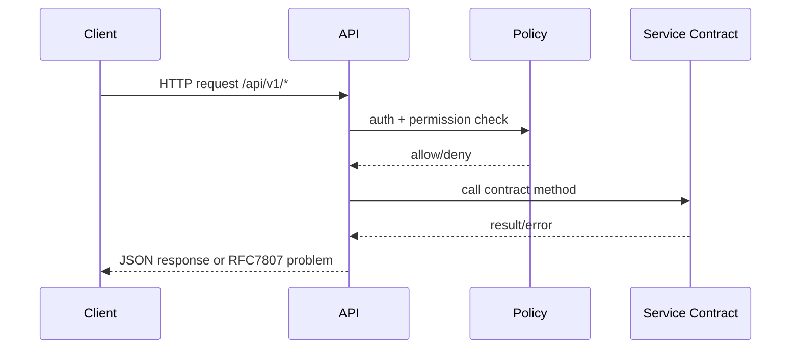

<!-- markdownlint-disable MD025 -->
# API Architecture

## Scope

Defines REST API structure, versioning, error model, auth boundaries, rate
controls, and OpenAPI publication requirements.

## Responsibilities

1. Provide stable `/api/v1` HTTP surface.
2. Map domain errors to RFC 7807 responses.
3. Enforce authN/authZ at route boundaries.
4. Expose OpenAPI artefact matching implementation.

## Contracts consumed

| Contract | From | Notes |
| --- | --- | --- |
| Auth/policy decisions | `security.md` | Route-level authorization. |
| Domain contracts | `contracts.md` | Service boundary calls. |

## Contracts published

| Contract | Artefact | Notes |
| --- | --- | --- |
| REST OpenAPI spec | `specs/api/openapi.yaml` | Canonical `/api/v1` contract (hand-maintained until export drift checks). |
| Error format contract | `specs/api/problem.schema.json` (planned) | RFC 7807 mapping. |

## Invariants

None declared yet; versioning and error-shape invariants to be indexed later.

## Failure modes

- Invalid request payload -> 400 with structured problem details.
- Unauthorized/forbidden route -> 401/403 without side effects.
- Backend timeout -> 503 + retry guidance where safe.
- Idempotency key collision misuse -> conflict response and audit note.

## Cross-refs

- `overview.md`
- `principles.md`
- `contracts.md`
- `security.md`
- `events.md`
- `versioning.md`

## Change Log

| Date | Status | Reviewer | Notes |
| --- | --- | --- | --- |
| 2026-04-19 | Proposed | GriffinAD | Initial API architecture draft. |
| 2026-04-19 | Accepted | GriffinAD | Self-review; Gate 1 Tier B (core) acceptance. |
