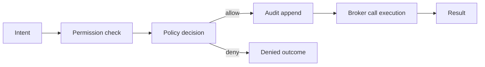

<!-- markdownlint-disable MD025 -->
# Broker Architecture

## Scope

Defines the audited broker pattern for sensitive operations (HTTP, exec,
filesystem, scheduler, secrets, Kea, audit, health) and mandatory call path.

## Responsibilities

1. Provide a single mediation layer for privileged side effects.
2. Enforce permission -> policy -> audit -> call sequence.
3. Standardize error and timeout behavior across brokers.
4. Expose typed broker contracts to runtime/plugins.

## Contracts consumed

| Contract | From | Notes |
| --- | --- | --- |
| Policy decision contract | `security.md` | Authorization outcomes. |
| Audit contract | `contracts.md` | Mandatory audit append. |

## Contracts published

| Contract | Artefact | Notes |
| --- | --- | --- |
| Http broker | `specs/contracts/http_broker.py` (planned) | External HTTP calls. |
| Exec broker | `specs/contracts/exec_broker.py` (planned) | Process execution wrapper. |
| Fs broker | `specs/contracts/fs_broker.py` (planned) | Controlled filesystem access. |
| Scheduler broker | `specs/contracts/scheduler_broker.py` (planned) | Timed action mediation. |
| Secret broker | `specs/contracts/secret_broker.py` (planned) | Secret resolution wrapper. |
| Kea broker | `specs/contracts/kea_broker.py` (planned) | Kea command mediation. |

## Invariants

None declared yet; broker-path invariants will be added and indexed before
Gate-1 acceptance.

## Failure modes

- Policy timeout -> deny by default for non-read operations.
- Audit append failure -> operation marked failed unless explicitly safe.
- Broker implementation drift -> conformance test failure.
- Unbrokered side effect path detected -> architectural defect, block merge.

## Cross-refs

- `glossary.md`
- `principles.md`
- `threat-model.md`
- `security.md`
- `contracts.md`
- `kea-integration.md`
- `config.md`

## Change Log

| Date | Status | Reviewer | Notes |
| --- | --- | --- | --- |
| 2026-04-19 | Proposed | GriffinAD | Initial broker architecture draft with audited mediation path. |
| 2026-04-19 | Accepted | GriffinAD | Self-review; Gate 1 Tier B (core) acceptance. |
