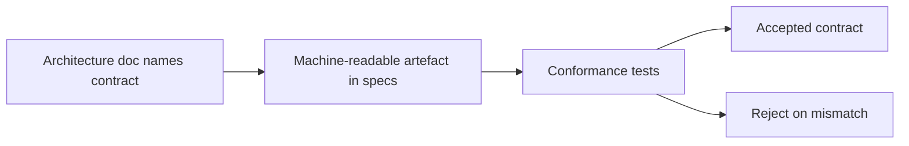

<!-- markdownlint-disable MD025 -->
# Service Contracts Architecture

## Scope

Defines contract-first boundaries, naming/versioning rules, conformance
expectations, and canonical broker/service contract families.

## Responsibilities

1. Define stable contract taxonomy and ownership.
2. Require machine-readable artefacts for each named contract.
3. Require conformance tests before contract adoption.
4. Govern backward compatibility and deprecation policy.

## Contracts consumed

| Contract | From | Notes |
| --- | --- | --- |
| ADR template and statuses | `../adr/` | Contract changes require ADR context when breaking. |
| Versioning policy | `versioning.md` | Semver across contract surfaces. |

## Contracts published

| Contract | Artefact | Notes |
| --- | --- | --- |
| Contract registry | `specs/contracts/` (planned) | Protocol stubs per contract family. |
| UI icon contract | `specs/contracts/ui-icon.md`, `specs/contracts/registry.json` | Shell-owned semantic icon IDs → Lucide (ADR-0016). |
| API contract | `specs/api/openapi.yaml` (planned) | `/api/v1` surface definition. |

## Invariants

None declared yet; invariants will codify contract implementation boundaries.

## Failure modes

- Missing machine-readable artefact for named contract -> fail review/CI.
- Silent breaking contract change -> blocked by conformance mismatch.
- Unowned contract namespace -> rejected at review.

## Cross-refs

- `README.md`
- `principles.md`
- `invariants.md`
- `api.md`
- `events.md`
- `brokers.md`
- `../_templates/ADR_TEMPLATE.md`

## Change Log

| Date | Status | Reviewer | Notes |
| --- | --- | --- | --- |
| 2026-04-19 | Proposed | GriffinAD | Initial service contracts architecture draft. |
| 2026-04-19 | Accepted | GriffinAD | Self-review; Gate 1 Tier B (core) acceptance. |
