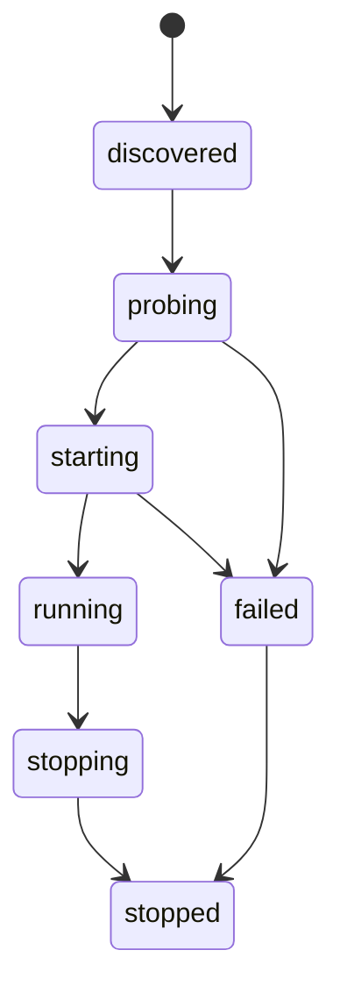

<!-- markdownlint-disable MD025 -->
# Core Runtime Architecture

## Scope

Defines the core orchestration runtime: boot sequence, lifecycle FSM,
ownership tagging, fault handling, and startup platform capability gate.

## Responsibilities

1. Bootstrap runtime context and subsystem registry.
2. Execute ordered startup/shutdown lifecycle.
3. Enforce ownership metadata for resources and tasks.
4. Coordinate fault containment and backpressure.
5. Run platform capability probe before service readiness.

## Contracts consumed

| Contract | From | Notes |
| --- | --- | --- |
| Health broker | `contracts.md` | Startup readiness and liveness checks. |
| Audit broker | `contracts.md` | Runtime lifecycle events and fault logging. |
| Scheduler broker | `contracts.md` | Internal timed operations. |

## Contracts published

| Contract | Artefact | Notes |
| --- | --- | --- |
| Runtime lifecycle service | `specs/contracts/runtime.py` (planned) | Exposes state transitions and hooks. |
| Platform capability report | `specs/contracts/platform_probe.py` (planned) | Normalized capability snapshot. |

## Invariants

None declared yet; to be indexed in `invariants.md` as Tier B hardens.

## Failure modes

- Startup probe fails on unsupported platform -> fail fast, no partial boot.
- Subsystem init timeout -> bounded retries then degraded mode or abort.
- Backpressure breach -> queue shedding + operator-visible alarm.
- Fatal core exception -> controlled shutdown and audit append.

## Cross-refs

- `README.md`
- `principles.md`
- `overview.md`
- `invariants.md`
- `contracts.md`
- `security.md`
- `data.md`

## Change Log

| Date | Status | Reviewer | Notes |
| --- | --- | --- | --- |
| 2026-04-19 | Proposed | GriffinAD | Initial core runtime architecture draft. |
| 2026-04-19 | Accepted | GriffinAD | Self-review; Gate 1 Tier B (core) acceptance. |
| 2026-04-19 | Accepted | GriffinAD | Note: `FabricRuntime` + `/readyz` align Phase 2 skeleton (`ADR-0033`). |
