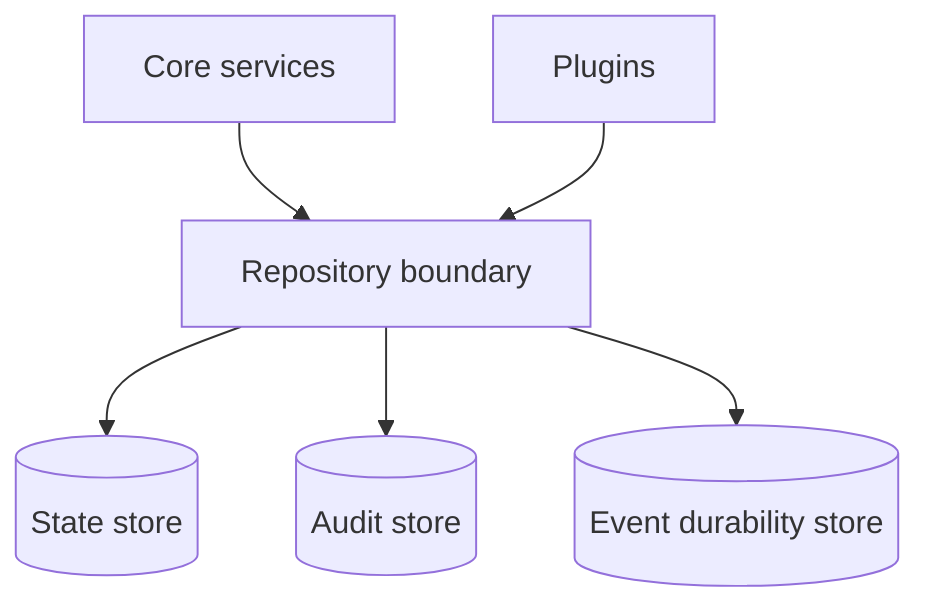

<!-- markdownlint-disable MD025 -->
# Data Architecture

## Scope

Defines persistence tiers, repository boundaries, migration strategy, backup/
restore concerns, and replication touchpoints.

## Responsibilities

1. Partition data by durability and access pattern.
2. Enforce plugin data access through repository boundary.
3. Define migration and upgrade safety constraints.
4. Provide backup/restore and retention model hooks.

## Contracts consumed

| Contract | From | Notes |
| --- | --- | --- |
| Repository contracts | `contracts.md` | Typed data access boundaries. |
| Policy/security constraints | `security.md` | Sensitive data controls. |

## Contracts published

| Contract | Artefact | Notes |
| --- | --- | --- |
| Data repository interfaces | `specs/contracts/data_repo.py` (planned) | Plugin/core data access surfaces. |
| Migration manifest | `specs/data/migration-policy.md` (planned) | Forward-only migration policy. |

## Invariants

### INV-DATA-ORM-BOUNDARY

- **Statement:** Plugin contracts never accept or return ORM objects; plugin
  boundaries exchange DTOs only.
- **Rationale:** Keeps plugins independent of the fabric’s persistence choices
  and prevents lazy-loading leaks across contract boundaries (ADR-0032).
- **Enforcement:** Contract Protocols forbid ORM types; repository classes
  translate at the boundary; a CI import-boundary check fails if `sqlalchemy`
  appears in forbidden plugin contract paths (to be wired with the Phase 2
  skeleton).
- **Test hook:** Conformance tests that assert exported plugin contract surfaces
  use DTO types only (`tests/contracts/` — Phase 2).
- **Back-links:** ADR-0032, `../plugin-dev/contracts-cookbook.md`, hybrid ORM
  model in this doc’s responsibilities.

## Failure modes

- Migration failure mid-upgrade -> stop and recover from pre-upgrade backup.
- Repository boundary violation -> blocked by CI import boundary checks.
- Store corruption -> failover/recovery flow with audit trace.
- Retention misconfiguration -> validation failure on config load.

## Cross-refs

- `principles.md`
- `overview.md`
- `invariants.md`
- `contracts.md`
- `config.md`
- `security.md`
- `deployment.md`

## Change Log

| Date | Status | Reviewer | Notes |
| --- | --- | --- | --- |
| 2026-04-19 | Proposed | GriffinAD | Initial data architecture draft. |
| 2026-04-19 | Accepted | GriffinAD | Self-review; Gate 1 Tier B (core) acceptance. |
| 2026-04-19 | Accepted | GriffinAD | Declare and index `INV-DATA-ORM-BOUNDARY`; cite ADR-0032. |
