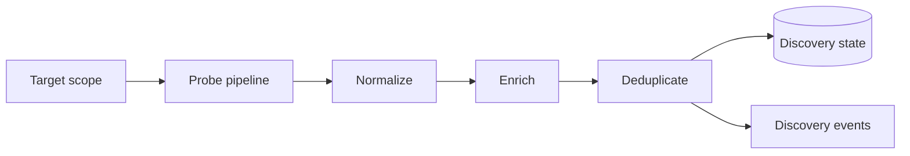

<!-- markdownlint-disable MD025 -->
# Discovery Architecture

## Scope

Defines network and service discovery model, detection pipelines, enrichment
steps (such as MAC vendor lookup), and rate/caching controls.

## Responsibilities

1. Discover candidate devices/services in configured scopes.
2. Normalize and enrich discovered records.
3. Respect operator-defined rate limits and scan boundaries.
4. Publish discovery events and persisted snapshots.

## Contracts consumed

| Contract | From | Notes |
| --- | --- | --- |
| Network/exec brokers | `contracts.md` | Controlled probing operations. |
| Data repository contract | `data.md` | Discovery state persistence. |

## Contracts published

| Contract | Artefact | Notes |
| --- | --- | --- |
| Discovery record schema | [`specs/discovery/record.schema.json`](../../specs/discovery/record.schema.json) | Canonical discovered entity model. |
| Discovery event contract | [`specs/contracts/discovery_events.py`](../../specs/contracts/discovery_events.py) | Found/updated/lost semantics. |
| Runtime discovery host | `src/kea_fabric/discovery/engine.py` | `FabricDiscovery` validates records, rate-limits ingests, emits `fabric.discovery.*`, runs a core probe cycle on the shared scheduler, exposes `GET /api/v1/discovery/records`. |

## Invariants

None declared yet; scan-safety and dedup invariants pending indexing.

## Failure modes

- Scan amplification from misconfigured target ranges.
- Duplicate entity churn due to weak identity correlation.
- Stale cache yielding false inventory certainty.
- External lookup failure degrading enrichment quality.

## Cross-refs

- `overview.md`
- `events.md`
- `data.md`
- `security.md`
- `observability.md`

## Change Log

| Date | Status | Reviewer | Notes |
| --- | --- | --- | --- |
| 2026-04-19 | Proposed | GriffinAD | Initial discovery architecture draft. |
| 2026-04-19 | Accepted | GriffinAD | Self-review; Gate 2 Tier B acceptance. |
| 2026-04-20 | Accepted | GriffinAD | Phase 9a: discovery record schema and discovery_events contract linked; ADR-0042. |
| 2026-04-20 | Accepted | GriffinAD | Phase 9b PR3: `FabricDiscovery` + audited broker + records list + core probe cycle; ADR-0043. |
| 2026-04-20 | Accepted | GriffinAD | Phase 9b runtime closure: ADR-0044. |
