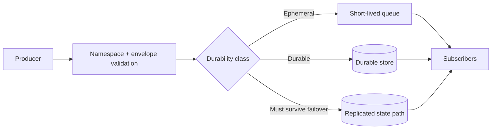

<!-- markdownlint-disable MD025 -->
# Event Architecture

## Scope

Defines event envelope, namespace semantics, ordering/delivery expectations,
and durability classes (ephemeral, durable, must-survive-failover).

## Responsibilities

1. Standardize event naming and payload envelope.
2. Classify each event into durability tier.
3. Provide subscriber-facing delivery semantics.
4. Support replay/re-derivation for failover-sensitive events.

## Contracts consumed

| Contract | From | Notes |
| --- | --- | --- |
| Event envelope schema | `specs/events/event-envelope.schema.json` (planned) | Canonical envelope. |
| Broker contracts | `contracts.md` | Publication and subscription mediation. |

## Contracts published

| Contract | Artefact | Notes |
| --- | --- | --- |
| Durable event journal | `src/kea_fabric/events/journal.py` | JSONL append log for non-ephemeral events under `data_dir/events/`. |
| Durable event diagnostics | `GET /api/v1/events/durable` | Reports journal path, count, and write errors. |
| Durable event recent view | `GET /api/v1/events/durable/recent?limit=N` | Reads bounded recent JSONL rows for operator inspection. |
| Event namespace registry | `specs/events/registry.md` (planned) | Names + durability class. |
| Stream egress contract | `specs/contracts/event_stream.py` (planned) | SSE/WS delivery semantics. |

## Invariants

None declared yet; durable routing invariants will be added as registry lands.

## Failure modes

- Producer flood -> bounded queues and backpressure.
- Durable event loss -> replay from persisted state.
- Subscriber lag -> drop policy for ephemeral classes.
- Namespace collision -> schema/registry validation failure.

## Cross-refs

- `principles.md`
- `overview.md`
- `invariants.md`
- `contracts.md`
- `data.md`
- `nebula-sync.md`

## Change Log

| Date | Status | Reviewer | Notes |
| --- | --- | --- | --- |
| 2026-04-19 | Proposed | GriffinAD | Initial event architecture draft with durability model. |
| 2026-04-19 | Accepted | GriffinAD | Self-review; Gate 1 Tier B (core) acceptance. |
| 2026-04-20 | Accepted | GriffinAD | Phase 5 update: durable event JSONL journal and API diagnostics endpoint documented. |
| 2026-04-20 | Accepted | GriffinAD | Phase 5 update: added recent durable-event read endpoint for bounded operator inspection. |
