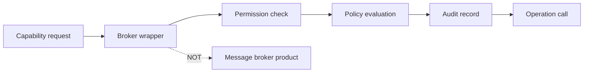

# Architecture Glossary

> **Tier A** — locked terminology for the Kea Fabric architecture set. Terms in
> this glossary are normative and must be used consistently across Tier A/B/C
> docs, ADRs, and specs.

## Scope

This glossary defines core architectural vocabulary and removes ambiguity.
Every term listed here has one canonical meaning in this repository.

Out of scope:

- Product naming conventions (`../_governance/NAMING.md`).
- Detailed subsystem behaviour (Tier B docs).
- ADR status mechanics (`../adr/README.md` + ADR files).

## Locked terms

| Term | Definition |
|---|---|
| **fabric** | The Kea Fabric platform as a whole: runtime, contracts, policy, and plugin execution surfaces around ISC Kea DHCP. |
| **node** | One running Kea Fabric deployment instance (single-node or part of warm-standby pair). |
| **fabric controller** | The core orchestrator that owns lifecycle, policy evaluation flow, and subsystem coordination. |
| **plugin** | A versioned extension unit loaded by the fabric via manifest validation and explicit enablement rules. |
| **contribution** | A declared capability/resource a plugin publishes into the platform contract space (not arbitrary side effects). |
| **contract** | A typed interface boundary with versioned behavioural expectations and conformance-test obligations. |
| **capability** | A named action or resource access intent subject to permission + policy checks. |
| **permission** | A machine-evaluable authorization atom required to invoke a capability. |
| **trust level** | The classification assigned to an actor/plugin/context that influences policy outcomes. |
| **policy** | Declarative rules that evaluate context, trust level, and permissions to allow, deny, or require approval. |
| **review** | Human verification pass over docs/config/changes using project checklists and recorded outcomes. |
| **approval** | An explicit authorization decision (human and/or policy) required before protected actions execute. |
| **lifecycle state** | A finite, documented state in a component's lifecycle machine (for example plugin discovered/validated/enabled). |
| **owner** | Named accountable person for a doc, ADR, contract, or resource lifecycle decision. |
| **invariant** | A falsifiable system property expressed as `INV-<AREA>-<NAME>` that must hold across relevant states. |
| **broker** | **Locked definition:** an **audited capability wrapper** that mediates sensitive operations through permission -> policy -> audit -> call. **Not** a message broker, queue server, or pub/sub middleware product. |

## Usage rules

- Use terms exactly as defined above; do not introduce synonyms where a locked
  term exists.
- On first use in a document, prefer linking back to this glossary.
- If a new core term is needed, add it here first, then update all dependent
  docs in the same change.
- "Broker" is reserved for the audited wrapper concept only.

## Invariants

None declared here. This file defines terminology, not runtime properties.

## Contracts

None declared here.

## Cross-refs

- `README.md`
- `DOC_STANDARDS.md`
- `../_governance/NAMING.md`
- `../_governance/REVIEWERS.md`
- `../adr/README.md`
- `principles.md`
- `contracts.md`
- `brokers.md`

## Change Log

| Date | Status | Reviewer | Notes |
|---|---|---|---|
| 2026-04-19 | Proposed | GriffinAD | Initial locked-term glossary including canonical broker definition. |
| 2026-04-19 | Accepted | GriffinAD | Self-review; Gate 1 Tier A acceptance. |
