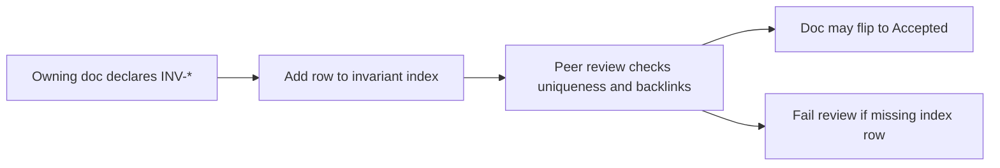

<!-- markdownlint-disable MD025 -->
# Invariant Index

> **Tier A** - master index for every `INV-<AREA>-<NAME>` identifier referenced
> in architecture docs. A document cannot move to `Accepted` while citing an
> invariant missing from this index.

## Scope

This file is the canonical registry of invariants used across Tier A/B/C docs.
It tracks ownership, statement, enforcement hook, and backlinks.

In scope:

- Registry rows for all declared `INV-*` identifiers.
- Cross-links to owning docs and key ADR/spec touchpoints.
- Status and lifecycle notes (active/superseded).

Out of scope:

- Full invariant rationale prose for each subsystem (lives in owning doc).
- Test implementation details (live in tests/spec artefacts).

## Invariant lifecycle

1. Invariant is declared in an owning architecture doc using the invariant block
   template.
2. Same change adds/updates row in this index.
3. Referencing docs link to the owning row rather than redeclaring.
4. Superseded invariants remain listed with status `Superseded` and pointer to
   replacement.

## Registry

| Invariant ID | Status | Owning doc | One-line statement | Enforcement hook | Back-links |
| --- | --- | --- | --- | --- | --- |
| `INV-DATA-ORM-BOUNDARY` | Active | `data.md` | Plugin contracts never accept or return ORM objects; DTOs only. | Protocol + repo boundary; CI import check (Phase 2). | ADR-0032; `plugin-dev/contracts-cookbook.md`. |

## Area map

Allowed area segments in `INV-<AREA>-<NAME>` (from rule enforcement):

- `CORE`, `PLUGIN`, `CONTRACT`, `EVENT`, `API`, `UI`, `SEC`, `OBS`, `MARKET`,
  `KEA`, `NEBULA`, `SCHED`, `DISCO`, `DATA`, `CONFIG`, `BROKER`, `PERF`,
  `REL`, `I18N`.

## Invariants

None declared directly in this file; this file is the index itself.

## Contracts

None declared here.

## Cross-refs

- `README.md`
- `DOC_STANDARDS.md`
- `principles.md`
- `overview.md`
- `threat-model.md`
- `../_templates/INVARIANT_BLOCK_TEMPLATE.md`
- `../../.cursor/rules/invariants.mdc`
- `../_governance/REVIEWERS.md`

## Change Log

| Date | Status | Reviewer | Notes |
| --- | --- | --- | --- |
| 2026-04-19 | Proposed | GriffinAD | Initial master invariant index scaffold and lifecycle rules. |
| 2026-04-19 | Accepted | GriffinAD | Self-review; Gate 1 Tier A acceptance. |
| 2026-04-19 | Accepted | GriffinAD | Register `INV-DATA-ORM-BOUNDARY` (owning doc `data.md`). |
