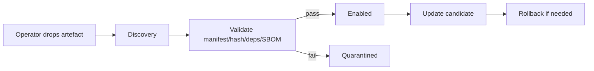

<!-- markdownlint-disable MD025 -->
# Marketplace Architecture

## Scope

Defines local plugin lifecycle operations for roadmap phases 1–5: on-disk artefact model,
discovery, validation, enablement, update/rollback mechanics, and integrity
checks. Remote catalog operations are out of scope in this phase.

## Responsibilities

1. Discover local plugin artefacts and versions.
2. Validate manifest/dependencies/SBOM/hash before enablement.
3. Drive install/update/rollback through operator-managed artefacts.
4. Persist install records and boot-time re-verification.

## Contracts consumed

| Contract | From | Notes |
| --- | --- | --- |
| Plugin manifest schema | `plugins.md` | Validation gate. |
| Filesystem broker | `contracts.md` | Controlled artefact access. |

## Contracts published

| Contract | Artefact | Notes |
| --- | --- | --- |
| Install record schema | `specs/marketplace/install-record.schema.json` (planned) | Version, hash, state. |
| Artefact layout contract | `specs/marketplace/layout.md` (planned) | `.tar.gz` / unpacked directory model. |

## Invariants

None declared yet; load-gating and hash revalidation invariants pending.

## Failure modes

- Hash mismatch on boot revalidation -> quarantine.
- Dependency conflict -> disable candidate version.
- Rollback artefact missing -> remain on current stable version.
- SBOM missing/invalid -> validation failure.

## Cross-refs

- `plugins.md`
- `contracts.md`
- `security.md`
- `data.md`
- `future-considerations.md`

## Change Log

| Date | Status | Reviewer | Notes |
| --- | --- | --- | --- |
| 2026-04-19 | Proposed | GriffinAD | Initial local marketplace architecture draft. |
| 2026-04-19 | Accepted | GriffinAD | Self-review; Gate 2 Tier B acceptance. |
| 2026-04-19 | Accepted | GriffinAD | Scope line: clarify roadmap phases 1–5 vs documentation Phase 1. |
