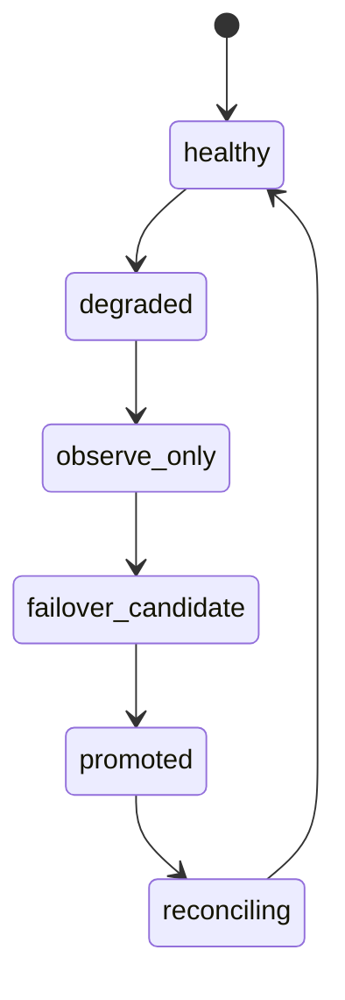

<!-- markdownlint-disable MD025 -->
# Nebula Sync Integration Architecture

## Scope

Defines Nebula Sync interaction model for Kea config synchronization between Kea
servers, including partner health detection, fencing posture, and failover
operator workflow.

## Responsibilities

1. Observe Nebula partner health and sync state.
2. Prevent unsafe dual-active behavior under degraded conditions.
3. Surface reconciliation and operator action paths.
4. Keep Kea Fabric state replication concerns separate from Nebula sync.

## Contracts consumed

| Contract | From | Notes |
| --- | --- | --- |
| Kea integration contract | `kea-integration.md` | Kea-side command/state bridge. |
| Event contracts | `events.md` | Partner health and transition events. |

## Contracts published

| Contract | Artefact | Notes |
| --- | --- | --- |
| Nebula health contract | `specs/contracts/nebula_health.py` (planned) | Status snapshot model. |
| Failover runbook schema | `specs/nebula/failover-steps.yaml` (planned) | Operator workflow representation. |

## Invariants

None declared yet; split-brain avoidance and fencing invariants pending.

## Failure modes

- Partner unreachable with stale state certainty.
- Conflicting authority signals during transition.
- Prolonged degraded sync without operator acknowledgment.
- Rejoin reconciliation mismatch after outage.

## Cross-refs

- `overview.md`
- `threat-model.md`
- `events.md`
- `kea-integration.md`
- `deployment.md`

## Change Log

| Date | Status | Reviewer | Notes |
| --- | --- | --- | --- |
| 2026-04-19 | Proposed | GriffinAD | Initial Nebula sync architecture draft. |
| 2026-04-19 | Accepted | GriffinAD | Self-review; Gate 2 Tier B acceptance. |
