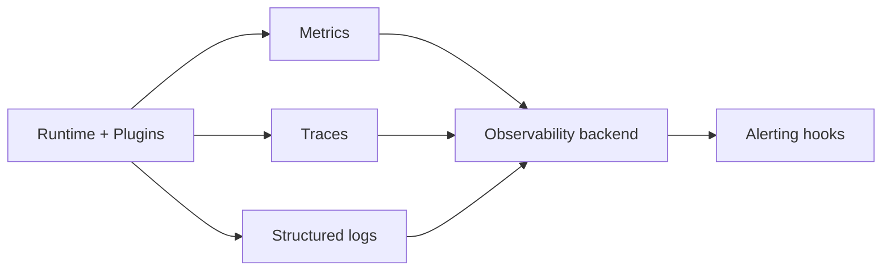

<!-- markdownlint-disable MD025 -->
# Observability Architecture

## Scope

Defines metrics, traces, logs, health model, SLO/error-budget framing, and
alert/export hooks for core runtime and plugins.

## Responsibilities

1. Standardize telemetry dimensions and propagation IDs.
2. Provide unified health model for components and subsystems.
3. Define SLO and error-budget views for control-plane operations.
4. Support alerting hooks for threshold and anomaly events.

## Contracts consumed

| Contract | From | Notes |
| --- | --- | --- |
| Event stream contract | `events.md` | Telemetry-driven event emissions. |
| Audit broker contract | `contracts.md` | Security and change audit linkage. |

## Contracts published

| Contract | Artefact | Notes |
| --- | --- | --- |
| Metrics schema | [`specs/observability/metrics.yaml`](../../specs/observability/metrics.yaml) | Canonical metric names/labels. |
| Trace attribute schema | [`specs/observability/traces.yaml`](../../specs/observability/traces.yaml) | Required span attributes (v1 conventions). |
| Health payload contract | `specs/contracts/health.py` (planned) | Component and aggregate health. |
| Durable journal counters | `/api/v1/metrics/prometheus` | Includes `events_durable_journal_write` and `events_durable_journal_error` labels/counters. |
| Bundled metric catalog | `src/kea_fabric/observability/catalog_metrics.yaml` | Runtime mirror of [`specs/observability/metrics.yaml`](../../specs/observability/metrics.yaml); `MetricsRegistry` validates **declared** metrics' labels on `inc()` when the app loads the bundled catalog (unknown names still allowed for plugin extensions; tests enforce parity). |

## Invariants

None declared yet; telemetry completeness and ID propagation invariants pending.

## Failure modes

- Cardinality explosion from unbounded labels.
- Trace breaks across broker/plugin boundaries.
- Health endpoint false-green due to stale cache.
- Alert storms from poorly tuned thresholds.

## Cross-refs

- `overview.md`
- `events.md`
- `security.md`
- `core-runtime.md`
- `contracts.md`

## Change Log

| Date | Status | Reviewer | Notes |
| --- | --- | --- | --- |
| 2026-04-19 | Proposed | GriffinAD | Initial observability architecture draft. |
| 2026-04-19 | Accepted | GriffinAD | Self-review; Gate 2 Tier B acceptance. |
| 2026-04-20 | Accepted | GriffinAD | Phase 5 update: documented durable-event journal write/error counters in Prometheus export path. |
| 2026-04-20 | Accepted | GriffinAD | Phase 9a: metrics and traces YAML catalogs linked; ADR-0042. |
| 2026-04-20 | Accepted | GriffinAD | Phase 9b PR1: bundled catalog + `MetricsRegistry` validation; tracing span naming stub. |
| 2026-04-20 | Accepted | GriffinAD | Phase 9b PR1 follow-up: validate only catalogued metric names; allow extension counters. |
| 2026-04-20 | Accepted | GriffinAD | Phase 9b runtime closure: ADR-0044. |
