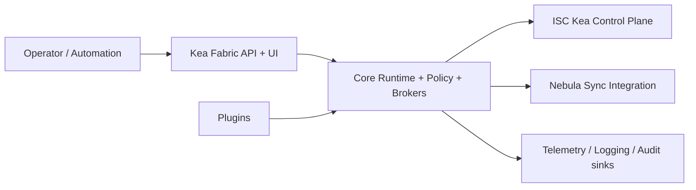
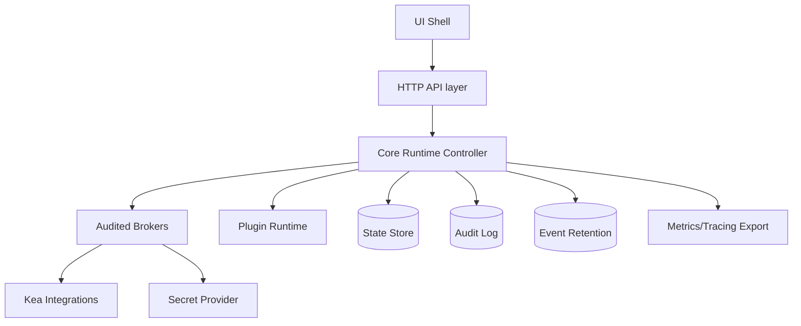
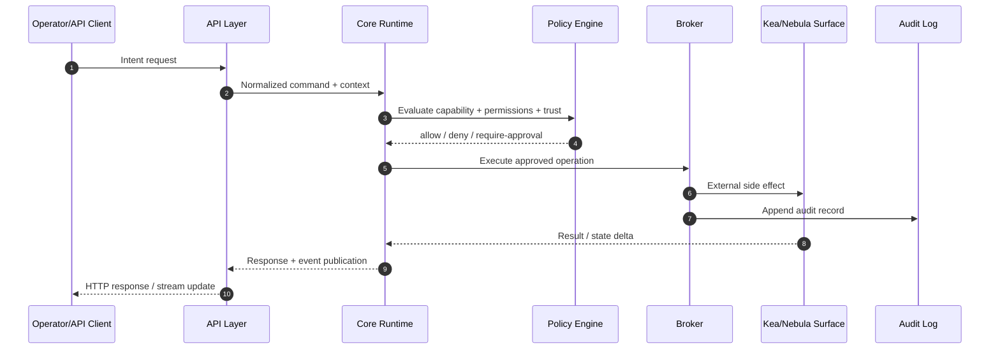

<!-- markdownlint-disable MD025 -->
# Architecture Overview

> **Tier A** - high-level system view of Kea Fabric: context, container
> boundaries, runtime topology, request/event flow, deployment modes, and
> failure domains.

## Scope

This document gives a system-level architecture view that all Tier B docs build
on. It focuses on stable boundaries and flow, not low-level implementation.

In scope:

- C4-like context and container views.
- Runtime topology and major communication paths.
- Operator request and event flow across core components.
- Deployment modes for roadmap phases 1–5 (single-node, warm-standby, air-gapped).
- Failure domains and blast-radius boundaries.

Out of scope:

- Contract details and schemas (Tier B `contracts.md` + `specs/`).
- Per-subsystem state machines (Tier B docs).
- Threat catalog and STRIDE breakdown (Tier A `threat-model.md`).

## System context (C4-like)

Kea Fabric sits between human operators/automation and ISC Kea deployment(s),
providing policy-aware orchestration, plugin-hosted domain functionality,
audited broker mediation, and UI/API surfaces.

## Container/runtime topology

At runtime, the platform separates shell/API ingress from orchestration core,
plugin execution surfaces, and durability surfaces (state, audit, event
retention). This separation contains failures and preserves clear boundaries.

## Request and event flow

### Request flow (operator intent -> controlled side effect)

1. Request enters UI/API.
2. Identity and session context are resolved.
3. Capability intent is mapped to required permissions.
4. Policy evaluates trust level + permissions + context.
5. If approved, broker executes target operation and emits audit trail.
6. Result is returned as API response and optionally emitted as event.

### Event flow (state changes -> subscribers)

1. Runtime and plugins emit namespaced events.
2. Events are classified (ephemeral, durable, must-survive-failover).
3. Appropriate retention/derivation path is applied.
4. Subscribers (UI streams, automation hooks, internal handlers) consume.

## Deployment modes

### Single-node

Default mode for small and medium deployments. All control-plane components run
on one host with local durability surfaces.

### Warm-standby

Primary plus standby with asynchronous replication for Kea Fabric state.
Standby remains passive until failover conditions are met. No third-party
distributed control-plane service is required.

### Air-gapped

Operationally equivalent topology with constrained ingress/egress. All required
artefacts are pre-staged; no runtime internet dependency is assumed.

## Failure domains

Primary failure-domain boundaries used for containment and runbook design:

- **Ingress domain**: UI/API edge and session handling.
- **Decision domain**: policy evaluation and capability authorization.
- **Execution domain**: broker-mediated side effects against Kea/adjacent systems.
- **Extension domain**: plugin execution and plugin-owned state.
- **Durability domain**: state persistence, audit append, event retention.
- **Replication domain**: warm-standby replication and role transition.

Design intent:

- Failure in one domain should degrade gracefully, not collapse all domains.
- Audit append path remains available even when side-effect targets fail.
- Plugin failures are isolated from core lifecycle whenever possible.

## Invariants

None declared here. Concrete `INV-*` identifiers are introduced in
`invariants.md` and referenced from subsystem docs.

## Contracts

None declared here. This document is the system map; machine-readable contracts
are defined under `specs/` and referenced from Tier B docs.

## Cross-refs

- `README.md`
- `DOC_STANDARDS.md`
- `glossary.md`
- `principles.md`
- `invariants.md`
- `threat-model.md`
- `core-runtime.md`
- `contracts.md`
- `events.md`
- `security.md`
- `kea-integration.md`
- `nebula-sync.md`

## Change Log

| Date | Status | Reviewer | Notes |
| --- | --- | --- | --- |
| 2026-04-19 | Proposed | GriffinAD | Initial Tier A overview with context, topology, request/event flow, deployment modes, and failure domains. |
| 2026-04-19 | Accepted | GriffinAD | Self-review; Gate 1 Tier A acceptance. |
| 2026-04-19 | Accepted | GriffinAD | Deployment modes bullet: "roadmap phases 1–5" wording. |
