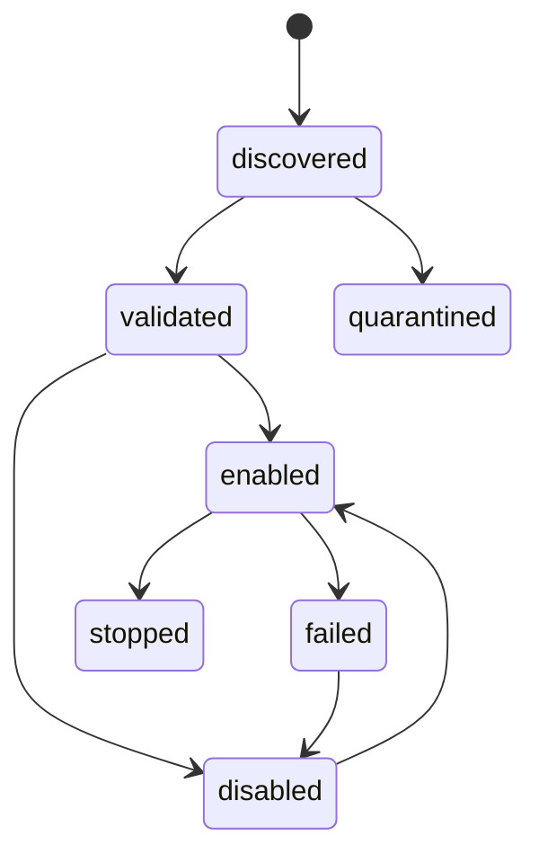

<!-- markdownlint-disable MD025 -->
# Plugin System Architecture

## Scope

Defines plugin manifest model, ingestion/enablement rules, lifecycle states,
local dependency checks, and plugin-owned data boundary.

## Responsibilities

1. Discover plugin artefacts from configured local sources.
2. Validate manifest schema and dependency constraints.
3. Enforce explicit enablement before load.
4. Manage plugin lifecycle transitions.
5. Quarantine invalid or unsafe plugins.

## Contracts consumed

| Contract | From | Notes |
| --- | --- | --- |
| Filesystem broker | `contracts.md` | Artefact discovery and hash checks. |
| Audit broker | `contracts.md` | Load/unload/validation events. |
| Secret broker | `contracts.md` | Plugin-config secret resolution. |

## Contracts published

| Contract | Artefact | Notes |
| --- | --- | --- |
| Plugin manifest schema | `specs/manifest/plugin-manifest.schema.json` | Versioned manifest validation (v2 + v1→v2 migration in code). |
| Event envelope (incl. owner) | `specs/events/event-envelope.schema.json` | Envelope fields for bus payloads; lifecycle events from runtime/plugins. |

## Invariants

None declared yet; planned entries include load gating and dependency safety.

## Failure modes

- Invalid schema -> quarantine and block enablement.
- Missing dependency -> remain discovered/disabled.
- Runtime crash -> failed state with optional auto-restart policy.
- Unsatisfied capability probe -> disabled until requirement met.

## Cross-refs

- `principles.md`
- `overview.md`
- `invariants.md`
- `contracts.md`
- `events.md`
- `data.md`
- `marketplace.md`

## Change Log

| Date | Status | Reviewer | Notes |
| --- | --- | --- | --- |
| 2026-04-19 | Proposed | GriffinAD | Initial plugin system architecture draft. |
| 2026-04-19 | Accepted | GriffinAD | Self-review; Gate 1 Tier B (core) acceptance. |
| 2026-04-19 | Accepted | GriffinAD | Contracts table: manifest and event envelope artefacts are implemented (`ADR-0034`). |
