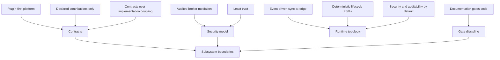

<!-- markdownlint-disable MD025 -->
# Architecture Principles

> **Tier A** - foundational design principles that every Tier B and Tier C doc
> must cite before proposing subsystem-level decisions.

## Scope

This document defines the non-negotiable architectural principles for Kea
Fabric during roadmap phases 1–5. These principles are decision drivers, not
implementation details.

Out of scope:

- Concrete protocol schemas (covered by `contracts.md` and `specs/`).
- Subsystem-specific lifecycle machines (covered by Tier B docs).
- Product naming and governance process mechanics (covered by
  `../_governance/` docs).

## Principles

### P1. Plugin-first platform

Kea Fabric is a host platform first, not a monolith with plugin-like add-ons.
Core runtime exposes stable contracts; value-added behavior arrives via plugins
that declare contributions through manifests.

### P2. Declared contributions only

No hidden capability injection. Every plugin contribution is explicit,
versioned, and validated at load time. If a contribution is not declared, it
does not exist from the platform's perspective.

### P3. Contracts over implementation coupling

Subsystems depend on versioned contracts, not direct implementation reach-in.
Boundaries are typed, documented, and testable with conformance harnesses.

### P4. Audited broker mediation

Sensitive operations flow through audited broker wrappers:
permission -> policy -> audit -> call. Direct bypass paths are architectural
defects and should be treated as severity-1 design bugs.

### P5. Single ownership and explicit accountability

Every architectural artefact (doc, ADR, contract, major resource) has an
`owner` and, for Tier A/B docs, a `peer_reviewer`. Undefined ownership implies
undefined accountability and is not acceptable for accepted artefacts.

### P6. Principle of least trust

Trust level, permission, and policy are evaluated explicitly per capability
request. Trust is contextual and revocable, never assumed by location or
historical behavior alone.

### P7. Event-driven, sync-at-the-edge

Core orchestration is event-driven. Synchronous behavior is allowed only at
well-defined edges (request boundaries, external control-plane calls, operator
approval points), not as hidden cross-component coupling.

### P8. Deterministic lifecycle state machines

Plugin, runtime, and failover lifecycles are finite-state and explicitly
documented with allowed transitions. "Ad-hoc intermediate states" are banned.

### P9. Security and auditability by default

Security controls (policy checks, approval flow, redaction, traceability) are
first-order architecture concerns, not optional hardening to bolt on later.

### P10. Documentation gates code

The architecture contract lives in **accepted** docs and ADRs. Implementation
must follow them; behaviour that drifts from accepted decisions must update or
supersede the relevant ADRs and architecture text first.

## Principle dependency map

This map shows how foundational principles constrain subsystem decisions.

## Invariants

None declared here. This file states guiding principles; subsystem docs derive
specific `INV-*` invariants from these principles.

## Contracts

None declared here.

## Cross-refs

- `DOC_STANDARDS.md`
- `README.md`
- `glossary.md`
- `overview.md`
- `invariants.md`
- `threat-model.md`
- `../_governance/REVIEWERS.md`
- `../_governance/NAMING.md`
- `../../AGENTS.md`

## Change Log

| Date | Status | Reviewer | Notes |
| --- | --- | --- | --- |
| 2026-04-19 | Proposed | GriffinAD | Initial Tier A principles set for plugin-first, audited, event-driven architecture. |
| 2026-04-19 | Accepted | GriffinAD | Self-review; Gate 1 Tier A acceptance. |
| 2026-04-19 | Accepted | GriffinAD | P10 wording: reflect satisfied doc gates; principle unchanged. |
| 2026-04-19 | Accepted | GriffinAD | P1 intro: "roadmap phases 1–5" wording (product phases, not doc Phase 1). |
