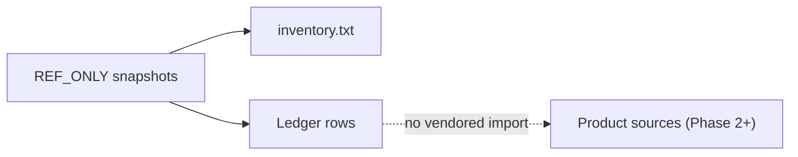

<!-- markdownlint-disable MD025 -->
# Reference Material Ledger

> **Tier A — Gate 1.** Maps everything under `REF_ONLY/` to **Ported** (with a
> mandatory `Delta:` field) or **Dropped** (with ADR rationale). This file is
> **not** Rolling — completeness was required for the Phase 1 documentation
> exit gate (satisfied).

## Scope

- Every path under `REF_ONLY/` is covered by the registry below: **meta** rows,
  **repository-root** rows (files directly under each snapshot), and **module**
  rows (first-level directories under each snapshot).
- Nested files and directories inherit the disposition of the **nearest listed
  ancestor** in this table (for example, everything under
  `REF_ONLY/plugin-branch/core/` rolls up to the `core/` row). The exhaustive
  file list remains [`REF_ONLY/inventory.txt`](../../REF_ONLY/inventory.txt).
- `Delta:` is required on every row (meta rows use `Delta: N/A` with a short
  reason). **Ported** rows describe what changed versus the donor. **Dropped**
  rows state that the subtree is not vendored into Kea Fabric product sources
  and point to the replacement direction.
- CI enforces that **release `git archive` archives** do not contain `REF_ONLY/`
  paths (see `scripts/check_git_archive_excludes_ref_only.sh`). A separate
  automated row-count invariant is not wired; ledger completeness remains a
  human review obligation.

## Coverage model

## Snapshot SHAs

| Snapshot | Branch | Commit |
| --- | --- | --- |
| `plugin-branch/` | `plugin` | `7537309b209d0c38d66ce188783913332577ef70` |
| `cicd-branch/` | `CICD` | `7b58e3851e9dd16e6b0de284a4327283c8bc5c9a` |

Authoritative source: [`REF_ONLY/PROVENANCE.md`](../../REF_ONLY/PROVENANCE.md).

## Registry — meta and manifests

| REF_ONLY path | Disposition | Port target / notes | Delta | ADR / doc |
| --- | --- | --- | --- | --- |
| `REF_ONLY/README.md` | Meta | Governance file; not ported into runtime. | Delta: N/A — policy text only. | [`../../.cursor/rules/reference-material.mdc`](../../.cursor/rules/reference-material.mdc) |
| `REF_ONLY/PROVENANCE.md` | Meta | Donor URL, branches, SHAs, import dates. | Delta: N/A — provenance index. | [`../../REF_ONLY/PROVENANCE.md`](../../REF_ONLY/PROVENANCE.md) |
| `REF_ONLY/LEDGER.md` | Meta | Short-form ledger mirror. | Delta: N/A — human summary shard. | — |
| `REF_ONLY/inventory.txt` | Meta | Sorted path list under `plugin-branch/` and `cicd-branch/`. | Delta: N/A — generated manifest; regenerate per `PROVENANCE.md`. | [`../../REF_ONLY/PROVENANCE.md`](../../REF_ONLY/PROVENANCE.md) |

## Registry — `plugin-branch/` (donor `plugin`)

Repository root files (not under a subdirectory): `.gitignore`, `README.md`,
`README.fr.md`, `LICENSE`, `VERSION`, `CHANGELOG.md`, `CONTRIBUTING.md`,
`SECURITY.md`, `SNMP-FEATURE.md`, `THEME.md`, `requirements.txt`,
`check-dependencies.sh`, `create-installer.sh`, `install.sh`, `start.sh`,
`test-distro-detection.sh`, `ultimate-kea-dashboard-installer.sh`.

| REF_ONLY path | Disposition | Port target / notes | Delta | ADR / doc |
| --- | --- | --- | --- | --- |
| `REF_ONLY/plugin-branch/` (repo root files) | Dropped | Kea Fabric uses its own repo layout, docs, licensing, and Phase 2 packaging; not the donor root corpus. | Delta: not vendored; operator-facing docs live under `docs/` and `docs/operator/` with English-only policy. | [ADR-0004](../adr/ADR-0004-legacy-monolith-exclusion.md), [ADR-0024](../adr/ADR-0024-documentation-english-only.md) |
| `REF_ONLY/plugin-branch/.github/` | Dropped | CI/CD for Kea Fabric will be defined fresh for this repo. | Delta: not vendored; pipeline shape informed by Tier B `cicd.md`, not these workflows. | [ADR-0004](../adr/ADR-0004-legacy-monolith-exclusion.md), [ADR-0019](../adr/ADR-0019-cicd-signing-slsa-future.md) |
| `REF_ONLY/plugin-branch/assets/` | Dropped | UI asset strategy follows ADR-0016 / ADR-0017 and `ui-assets.md`. | Delta: not vendored; icon/font registries will be Kea Fabric–specific. | [ADR-0004](../adr/ADR-0004-legacy-monolith-exclusion.md), [ADR-0016](../adr/ADR-0016-ui-icons-lucide-registry.md) |
| `REF_ONLY/plugin-branch/bin/` | Dropped | Entrypoints will be part of Phase 2 packaging, not these launcher scripts. | Delta: not vendored; avoids inheriting monolith bootstrap. | [ADR-0004](../adr/ADR-0004-legacy-monolith-exclusion.md) |
| `REF_ONLY/plugin-branch/core/` | Dropped | Core runtime boundaries in `core-runtime.md`, contracts, and ADR-0003 / ADR-0002 — greenfield implementation. | Delta: patterns (manifests, policy) inform design; code not copied. | [ADR-0004](../adr/ADR-0004-legacy-monolith-exclusion.md), [ADR-0003](../adr/ADR-0003-core-decomposition.md), [ADR-0002](../adr/ADR-0002-plugin-isolation.md) |
| `REF_ONLY/plugin-branch/data/` | Dropped | Locale and copy strategy per ADR-0015 and Tier B `i18n.md`. | Delta: not vendored; translation bundles will be regenerated for Kea Fabric. | [ADR-0004](../adr/ADR-0004-legacy-monolith-exclusion.md), [ADR-0015](../adr/ADR-0015-default-locale-en.md) |
| `REF_ONLY/plugin-branch/docs/` | Dropped | Upstream product docs; Kea Fabric documentation is this repo’s `docs/` tree. | Delta: not vendored; historical comparison only. | [ADR-0004](../adr/ADR-0004-legacy-monolith-exclusion.md), [ADR-0024](../adr/ADR-0024-documentation-english-only.md) |
| `REF_ONLY/plugin-branch/etc/` | Dropped | Configuration model per ADR-0010 and `config.md`. | Delta: not vendored; sample configs are reference for operator docs only. | [ADR-0004](../adr/ADR-0004-legacy-monolith-exclusion.md), [ADR-0010](../adr/ADR-0010-configuration-model.md) |
| `REF_ONLY/plugin-branch/packaging/` | Dropped | Packaging and release process per `packaging.md`, ADR-0020, ADR-0031. | Delta: not vendored; formats may be reimplemented to match the matrix. | [ADR-0004](../adr/ADR-0004-legacy-monolith-exclusion.md), [ADR-0020](../adr/ADR-0020-release-channels.md) |
| `REF_ONLY/plugin-branch/plugins/` | Dropped | Example plugins inform `plugin-dev/` and contracts; implementation is not carried forward verbatim. | Delta: not vendored; plugin API and isolation per ADR-0002 / ADR-0013 / ADR-0029. | [ADR-0004](../adr/ADR-0004-legacy-monolith-exclusion.md), [ADR-0013](../adr/ADR-0013-plugin-distribution-local.md) |
| `REF_ONLY/plugin-branch/scripts/` | Dropped | Ad-hoc automation; no direct port. | Delta: not vendored; any replacement scripts land in Phase 2 tooling with review. | [ADR-0004](../adr/ADR-0004-legacy-monolith-exclusion.md) |
| `REF_ONLY/plugin-branch/server/` | Dropped | HTTP/API surface per ADR-0005, `api.md`, `core-runtime.md`. | Delta: not vendored; FastAPI-based greenfield stack, not this server package. | [ADR-0004](../adr/ADR-0004-legacy-monolith-exclusion.md), [ADR-0005](../adr/ADR-0005-http-stack-fastapi.md) |
| `REF_ONLY/plugin-branch/ui/` | Dropped | UI shell per ADR-0006, ADR-0018, `ui.md`. | Delta: not vendored; Svelte 5 SPA and mount contract are specified independently. | [ADR-0004](../adr/ADR-0004-legacy-monolith-exclusion.md), [ADR-0006](../adr/ADR-0006-ui-shell-svelte-5.md), [ADR-0018](../adr/ADR-0018-spa-web-components-mount.md) |

## Registry — `cicd-branch/` (donor `CICD`)

Repository root files match the `plugin-branch/` list (same filenames at snapshot
root); disposition and rationale align with the `plugin-branch/` repo-root row.

| REF_ONLY path | Disposition | Port target / notes | Delta | ADR / doc |
| --- | --- | --- | --- | --- |
| `REF_ONLY/cicd-branch/` (repo root files) | Dropped | Same rationale as `plugin-branch/` repo root. | Delta: not vendored; Kea Fabric owns its own root metadata and installers. | [ADR-0004](../adr/ADR-0004-legacy-monolith-exclusion.md), [ADR-0024](../adr/ADR-0024-documentation-english-only.md) |
| `REF_ONLY/cicd-branch/.github/` | Dropped | Release automation reference only; Kea Fabric CI/CD pipelines are specified in Phase 2 per `cicd.md`. | Delta: not vendored; informed by `cicd.md` and future signing posture (ADR-0019). | [ADR-0004](../adr/ADR-0004-legacy-monolith-exclusion.md), [ADR-0019](../adr/ADR-0019-cicd-signing-slsa-future.md) |
| `REF_ONLY/cicd-branch/bin/` | Dropped | Same as `plugin-branch/bin/`. | Delta: not vendored. | [ADR-0004](../adr/ADR-0004-legacy-monolith-exclusion.md) |
| `REF_ONLY/cicd-branch/data/` | Dropped | Same as `plugin-branch/data/`. | Delta: not vendored. | [ADR-0004](../adr/ADR-0004-legacy-monolith-exclusion.md), [ADR-0015](../adr/ADR-0015-default-locale-en.md) |
| `REF_ONLY/cicd-branch/docs/` | Dropped | Same as `plugin-branch/docs/`. | Delta: not vendored. | [ADR-0004](../adr/ADR-0004-legacy-monolith-exclusion.md) |
| `REF_ONLY/cicd-branch/etc/` | Dropped | Same as `plugin-branch/etc/`. | Delta: not vendored. | [ADR-0004](../adr/ADR-0004-legacy-monolith-exclusion.md), [ADR-0010](../adr/ADR-0010-configuration-model.md) |
| `REF_ONLY/cicd-branch/lib/` | Dropped | Donor library layer; Kea Fabric core and integrations are greenfield per Tier B docs. | Delta: not vendored; behaviour may be re-derived against contracts and Kea integration docs. | [ADR-0004](../adr/ADR-0004-legacy-monolith-exclusion.md), [ADR-0003](../adr/ADR-0003-core-decomposition.md) |
| `REF_ONLY/cicd-branch/packaging/` | Dropped | Broader packaging (docker, publish scripts) — reference for `packaging.md` / ADR-0020 only. | Delta: not vendored; release mechanics will match Kea Fabric channels. | [ADR-0004](../adr/ADR-0004-legacy-monolith-exclusion.md), [ADR-0020](../adr/ADR-0020-release-channels.md) |
| `REF_ONLY/cicd-branch/plugins/` | Dropped | Same as `plugin-branch/plugins/` (subset). | Delta: not vendored. | [ADR-0004](../adr/ADR-0004-legacy-monolith-exclusion.md), [ADR-0013](../adr/ADR-0013-plugin-distribution-local.md) |
| `REF_ONLY/cicd-branch/static/` | Dropped | Static web assets; superseded by Kea Fabric UI asset policy. | Delta: not vendored; see ADR-0016 / ADR-0017 and `ui-assets.md`. | [ADR-0004](../adr/ADR-0004-legacy-monolith-exclusion.md), [ADR-0016](../adr/ADR-0016-ui-icons-lucide-registry.md) |

## Post-import workflow

When snapshots are refreshed, update **PROVENANCE**, regenerate **inventory.txt**,
and adjust **Snapshot SHAs** plus any new first-level directories (add a **Dropped**
row with `Delta:` and ADR links). CI should fail if an unlisted `REF_ONLY/` path
exists once the guard is active.

## Cross-refs

- [`README.md`](README.md)
- [`../../REF_ONLY/README.md`](../../REF_ONLY/README.md)
- [`../../REF_ONLY/LEDGER.md`](../../REF_ONLY/LEDGER.md)

## Change Log

| Date | Status | Reviewer | Notes |
| --- | --- | --- | --- |
| 2026-04-19 | Proposed | GriffinAD | Imported `plugin` and `CICD` snapshots; added `inventory.txt` and aggregation rule. |
| 2026-04-19 | Proposed | GriffinAD | Module-level **Dropped** rows with `Delta:` and ADR cross-refs for Gate 1. |
| 2026-04-19 | Accepted | GriffinAD | Self-review; Gate 1 Tier A acceptance; added coverage Mermaid model. |
| 2026-04-19 | Accepted | GriffinAD | Intro blockquote: Phase 1 documentation exit satisfied; ledger policy unchanged. |
| 2026-04-19 | Accepted | GriffinAD | Scope: clarify git-archive CI vs row-count automation. |
