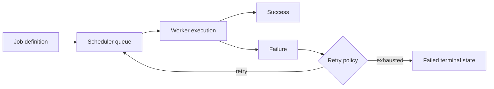

<!-- markdownlint-disable MD025 -->
# Scheduler Architecture

## Scope

Defines async scheduling model for platform and plugin jobs, ownership tagging,
cancellation semantics, and persistence of recurring schedules.

## Responsibilities

1. Execute interval/cron jobs with ownership context.
2. Guarantee cancellation on plugin unload/disable.
3. Provide bounded concurrency and retry controls.
4. Persist schedule metadata for restart continuity.

## Contracts consumed

| Contract | From | Notes |
| --- | --- | --- |
| Scheduler broker contract | `contracts.md` | Job registration and control API. |
| Audit broker | `contracts.md` | Job lifecycle and failure audit records. |

## Contracts published

| Contract | Artefact | Notes |
| --- | --- | --- |
| Job descriptor schema | [`specs/scheduler/job.schema.json`](../../specs/scheduler/job.schema.json) | Timing, owner, policy tags. |
| Job event contract | [`specs/contracts/scheduler_events.py`](../../specs/contracts/scheduler_events.py) | Started/succeeded/failed/cancelled. |
| Runtime scheduler host | `src/kea_fabric/scheduler/engine.py` | `FabricScheduler` validates descriptors, runs interval/cron asyncio loops, emits `fabric.scheduler.*` on the bus, exposes `GET /api/v1/scheduler/jobs`. |

## Invariants

None declared yet; cancellation and ownership invariants pending indexing.

## Failure modes

- Long-running job overlap causing backlog.
- Orphaned job on plugin unload.
- Retry storm after transient downstream failures.
- Clock skew impacting cron semantics.

## Cross-refs

- `core-runtime.md`
- `plugins.md`
- `events.md`
- `security.md`
- `observability.md`

## Change Log

| Date | Status | Reviewer | Notes |
| --- | --- | --- | --- |
| 2026-04-19 | Proposed | GriffinAD | Initial scheduler architecture draft. |
| 2026-04-19 | Accepted | GriffinAD | Self-review; Gate 2 Tier B acceptance. |
| 2026-04-20 | Accepted | GriffinAD | Phase 9a: job JSON Schema and scheduler_events contract linked; ADR-0042. |
| 2026-04-20 | Accepted | GriffinAD | Phase 9b PR2: `FabricScheduler` + audited broker wiring + operator jobs list; ADR-0043. |
| 2026-04-20 | Accepted | GriffinAD | Phase 9b runtime closure: ADR-0044. |
