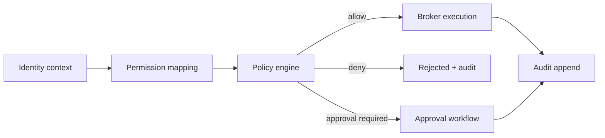

<!-- markdownlint-disable MD025 -->
# Security Architecture

## Scope

Defines trust levels, permission taxonomy, policy evaluation flow, approval
workflow, and audit integrity constraints for control-plane actions.

## Responsibilities

1. Define identity, trust, and permission model.
2. Enforce policy-before-execution semantics.
3. Route sensitive actions through approval workflow.
4. Maintain tamper-evident audit chain.

## Contracts consumed

| Contract | From | Notes |
| --- | --- | --- |
| Audit broker | `contracts.md` | Security-relevant action logging. |
| Secret broker | `contracts.md` | Secret retrieval and redaction policy. |
| Route capability map | `api.md` | API authorization linkage. |

## Contracts published

| Contract | Artefact | Notes |
| --- | --- | --- |
| Policy decision contract | `specs/contracts/policy_engine.py` (planned) | Allow/deny/approval outcome. |
| Permission taxonomy | `specs/security/permissions.json` (planned) | Canonical permission catalogue. |

## Invariants

None declared yet; policy and audit invariants will be indexed as Tier B matures.

## Failure modes

- Policy service unavailable -> fail closed for privileged actions.
- Permission taxonomy drift -> CI validation failure.
- Audit append failure -> action marked failed unless explicit safe fallback.
- Secret redaction bug -> immediate security incident path.

## Cross-refs

- `threat-model.md`
- `principles.md`
- `contracts.md`
- `brokers.md`
- `api.md`
- `config.md`
- `data-governance.md`

## Change Log

| Date | Status | Reviewer | Notes |
| --- | --- | --- | --- |
| 2026-04-19 | Proposed | GriffinAD | Initial security architecture draft. |
| 2026-04-19 | Accepted | GriffinAD | Self-review; Gate 1 Tier B (core) acceptance. |
