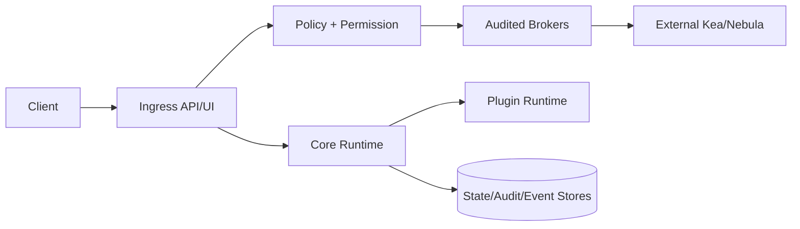

<!-- markdownlint-disable MD025 -->
# Threat Model

> **Tier A** - security baseline for Kea Fabric using STRIDE, trust boundaries,
> and top-threat mitigations. Tier B docs must align with this model.

## Scope

This document identifies major assets, trust boundaries, and top threats across
the control plane. It defines the baseline risk model used by Gate-1 docs.

In scope:

- STRIDE framing at system level.
- Trust boundary map.
- Asset inventory relevant to architecture decisions.
- Top threats and required mitigations.

Out of scope:

- Full implementation hardening checklist.
- Product security policy/legal commitments.
- CVE management process mechanics.

## Trust boundaries

Core boundaries requiring explicit controls:

1. Client boundary: browser/API client -> Kea Fabric ingress.
2. Policy boundary: authenticated request -> permission/policy decision.
3. Execution boundary: approved command -> broker-mediated side effect.
4. Plugin boundary: core runtime -> plugin code execution.
5. Persistence boundary: runtime -> state/audit/event durability stores.
6. External control boundary: Kea Fabric -> ISC Kea/Nebula surfaces.

## Asset inventory

| Asset | Why it matters | Primary threats |
| --- | --- | --- |
| Operator identity/session context | Authorizes privileged actions | spoofing, session hijack, privilege escalation |
| Policy decisions and approval records | Determines allowed side effects | tampering, repudiation |
| Audit log chain | Forensics and accountability | tampering, deletion, replay |
| Plugin manifests and artefacts | Defines executable extensions | supply-chain injection, elevation, DoS |
| Kea command/config surface | Impacts DHCP availability/correctness | unauthorized mutation, destructive misconfiguration |
| Runtime state + replication stream | Required for safe failover | stale state, split-brain, corruption |
| Event stream and notifications | Operational visibility and automation triggers | spoofing, loss, flooding |

## STRIDE summary

| Category | Representative risks | Baseline controls |
| --- | --- | --- |
| Spoofing | Fake operator/plugin identity | OIDC + local break-glass guardrails, signed session context, plugin identity binding |
| Tampering | Mutation of policy/audit/config state | append-only audit chain, role-gated config writes, integrity checks |
| Repudiation | \"I didn't perform that action\" | immutable audit trail with actor, capability, timestamp, outcome |
| Information disclosure | Secrets/PII leakage via logs/events | redaction flags, least-privilege access, secure secret provider |
| Denial of service | Plugin or API flood starves control plane | rate limits, backpressure, plugin isolation/quarantine |
| Elevation of privilege | Policy bypass/direct side effects | mandatory broker mediation, policy-before-call invariant |

## Top threats and mitigations

1. **Unauthorized config mutation through bypass path**  
   Mitigation: no direct side effects; all mutating operations through broker
   path with permission + policy + audit.

2. **Plugin supply-chain compromise**  
   Mitigation: manifest validation, explicit enablement, dependency checks,
   artefact hash verification, quarantine on validation failure.

3. **Audit trail tampering or truncation**  
   Mitigation: append-only hash-chained audit model and verification jobs.

4. **Failover inconsistency (stale/partial replicated state)**  
   Mitigation: explicit replication contract, health-gated promotion, recovery
   runbooks, post-failover reconciliation checks.

5. **Event flood causing control-plane instability**  
   Mitigation: event durability classes, bounded queues, drop/slow-path
   strategies, subscriber backpressure signaling.

6. **Privilege escalation via policy misconfiguration**  
   Mitigation: policy linting, dual-review for sensitive policy changes,
   default-deny posture for unknown capabilities.

7. **Secret disclosure through logs/errors**  
   Mitigation: schema-level sensitive markers, centralized redaction, tests that
   assert no secret material in logs and problem responses.

8. **Client-side origin/csrf abuse on operator sessions**  
   Mitigation: strict CORS and CSP, CSRF protections, session binding.

9. **Split-brain operational behavior in warm-standby transitions**  
   Mitigation: fencing strategy, explicit role-state machine, operator-visible
   transition states and safe rollback path.

10. **Dependency-induced resource exhaustion (CPU/memory/file handles)**  
    Mitigation: subsystem quotas, watchdog health signals, bounded retries, and
    failure-domain isolation.

## Invariants

None declared directly in this file. Threat mitigations become enforceable
`INV-*` entries in subsystem docs (security, brokers, plugins, data, events).

## Contracts

None declared here. Relevant contracts are specified in `contracts.md`,
`security.md`, `events.md`, and `config.md`.

## Cross-refs

- `README.md`
- `DOC_STANDARDS.md`
- `principles.md`
- `overview.md`
- `invariants.md`
- `security.md`
- `brokers.md`
- `plugins.md`
- `events.md`
- `data.md`
- `config.md`

## Change Log

| Date | Status | Reviewer | Notes |
| --- | --- | --- | --- |
| 2026-04-19 | Proposed | GriffinAD | Initial Tier A STRIDE and trust-boundary model with top-10 threats and mitigations. |
| 2026-04-19 | Accepted | GriffinAD | Self-review; Gate 1 Tier A acceptance. |
