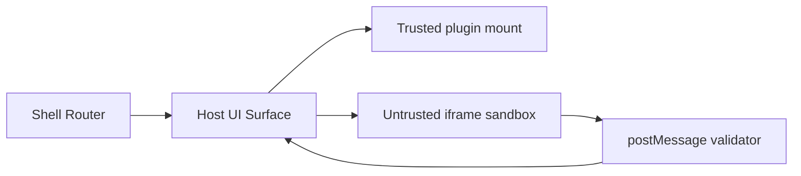

<!-- markdownlint-disable MD025 -->
# UI Architecture

## Scope

Defines SPA shell boundaries, plugin UI mount contract, routing/state seams,
iframe sandboxing for untrusted UI, and accessibility baseline.

## Responsibilities

1. Provide shell-level navigation and layout primitives.
2. Enforce typed plugin mount/event boundary.
3. Isolate untrusted plugin UI surfaces.
4. Maintain WCAG 2.2 AA baseline and i18n readiness.

## Boundary with dashboard blueprint

`ui.md` remains the Tier B authority for shell boundaries, mount contracts, and
trust/isolation mechanics.

Dashboard editor composition, host controls, drag/drop layout semantics,
reactive sizing contracts, and plugin `Compact`/`Full` mode behavior are
defined in `dashboard-plugin-blueprint.md`.

**Component primitives:** the operator shell uses **Flowbite Svelte v2** on
**Tailwind CSS v4** for buttons, tables, tabs, and other shell chrome (ADR-0046).
Semantic **icons** stay **Lucide** via the registry (ADR-0016); **fonts** stay
self-hosted (ADR-0017). Third-party components are a **primitive layer**;
shell tokens and themes in `ui-design-system.md` / `ui-themes.md` remain the
styling authority where they intentionally override vendor defaults.

## Contracts consumed

| Contract | From | Notes |
| --- | --- | --- |
| UI icon contract | `contracts.md` | Plugins use semantic icon IDs only. |
| UI plugin mount contract | `specs/contracts/ui_mount.py` (planned) | Custom event boundaries. |

## Contracts published

| Contract | Artefact | Notes |
| --- | --- | --- |
| Shell event API | `specs/contracts/ui_shell_events.py` (planned) | Typed custom events. |
| Route capability map | `specs/ui/route-capabilities.json` (planned) | Route to capability binding. |
| UI unit/component tests | Vitest (required) | Svelte unit/component testing baseline. |
| UI automation tests | Playwright (required) | Browser automation and end-to-end regression coverage. |

## Invariants

None declared yet; sandbox and boundary invariants to be added in later pass.

## Failure modes

- Plugin UI contract mismatch -> plugin mount refused.
- Sandboxed iframe message validation failure -> drop + audit event.
- Route permission mismatch -> guarded fallback state.
- Theme/i18n asset mismatch -> fallback token set.

## Cross-refs

- `overview.md`
- `principles.md`
- `contracts.md`
- `security.md`
- `api.md`
- `ui-design-system.md`
- `dashboard-plugin-blueprint.md`

## Change Log

| Date | Status | Reviewer | Notes |
| --- | --- | --- | --- |
| 2026-04-19 | Proposed | GriffinAD | Initial UI architecture draft. |
| 2026-04-19 | Accepted | GriffinAD | Self-review; Gate 1 Tier B (core) acceptance. |
| 2026-04-20 | Accepted | GriffinAD | Testing stack requirement captured: Vitest for unit/component testing and Playwright for UI automation. |
| 2026-04-21 | Accepted | GriffinAD | Added boundary note pointing dashboard editor/layout authority to `dashboard-plugin-blueprint.md`. |
| 2026-04-22 | Accepted | GriffinAD | Linked ADR-0046 (Flowbite Svelte v2 + Tailwind v4 primitive stack). |
