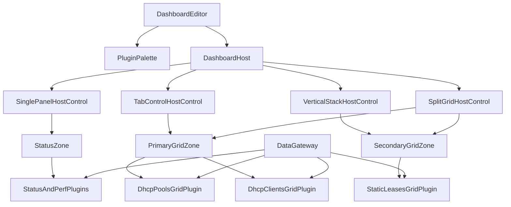

<!-- markdownlint-disable MD025 -->
# Dashboard Plugin Blueprint

> **Tier C — Rolling.** Defines the plugin-composed dashboard editor and runtime
> layout contracts for the Operational Readiness v1 track.

## Scope

This document defines the dashboard composition architecture for plugin-backed
operator views:

- Drag-and-drop dashboard editor for UI-capable plugins.
- Host container controls (`single-panel`, `tab-control`, `vertical-stack`,
  `split-grid` with percentage splits).
- Plugin display contracts for `Compact` and `Full` modes.
- Saved layout schema and migration behavior across releases.
- Permission and conflict model for shared dashboards.

This doc does not redefine design tokens or theme mechanics. Those remain in:
`ui-design-system.md`, `ui-themes.md`, `ui-icons.md`, and `ui-fonts.md`.

## System UI baseline (Item 1)

The dashboard architecture inherits the platform UI baseline as mandatory input:

- **Icon library baseline:** semantic icon IDs from the shell registry as
  defined by `ui-icons.md` and ADR-0016.
- **Font baseline:** shell-owned font stack and fallback policy as defined by
  `ui-fonts.md` and ADR-0017.

Dashboard plugins consume these baselines through shared UI contracts; they do
not bundle alternate icon packs or custom font stacks at runtime.

## Dashboard composition model

The dashboard runtime is a host shell that renders plugin surfaces inside
container controls selected by dashboard configuration.

- `DashboardEditor` provides palette + layout editing.
- `DashboardHost` resolves stored layout into active containers.
- Containers expose drop targets and sizing behavior.
- Plugins render according to host-provided context and capabilities.



## Plugin taxonomy (initial v1)

- **Status/performance widgets** (top-of-dashboard cards).
- **DHCP pools grid plugin**.
- **DHCP clients grid plugin**.
- **Static leases/reservations grid plugin**.

Each UI-capable plugin declares host compatibility and sizing constraints before
it can appear in the editor palette.

## Editor and layout contracts

### Editor behavior

- Drag from plugin palette into valid host drop targets.
- Reorder and resize where host/container allows.
- Persist layout mutations only after validation.
- Reject invalid drops with user-visible reason.

### Host controls

- `single-panel`: one plugin surface per container.
- `tab-control`: multiple child surfaces with active tab state.
- `vertical-stack`: ordered block stack with per-block sizing rules.
- `split-grid`: cell matrix with percentage-based split definitions; supports
  drag/drop fill per cell.

### Reactive sizing and scaling

A reactive UI is mandatory:

- Container size changes propagate to plugin render context.
- Split percentage updates are deterministic and persisted.
- Plugins must support dynamic resize without full page reload.
- Runtime must preserve usable states across viewport size classes.

## Plugin UI mode contract

UI-capable plugins must implement both modes:

- **`Compact`**: a defined subset of `Full` data/actions for constrained
  footprints.
- **`Full`**: complete dataset and interaction surface for that plugin role.

Required manifest metadata (`ui_dashboard` contract surface):

- `allowed_host_controls`
- `default_size_hint`
- `min_size` / `max_size`
- `compact_min_footprint` (minimum viable compact width/height)
- `supports_compact` / `supports_full`

Seeded machine-readable artifacts for this contract family:

- `specs/dashboard/layout.schema.json`
- `specs/contracts/ui_dashboard_plugin.py`

### Optional `embed_path` (HTML surface)

Plugins may declare `ui_dashboard.embed_path` pointing to a static HTML file inside the bundle.
The API serves it at `GET /api/v1/plugins/{plugin_id}/dashboard/embed` for same-origin iframes in the shell.

**Operator guidance**

- Treat embed HTML as **public to anyone who can call the embed URL** when the process has **no**
  `http_jwt_hs256_secret` configured: suitable for trusted dev bundles and non-sensitive copy.
- When **`http_jwt_hs256_secret`** is set, the API advertises `dashboard_embed_auth: signed` on
  `GET /api/v1/meta`. The shell must obtain a short-lived `eab` JWT via
  `GET /api/v1/plugins/{id}/dashboard/embed-launch` (authenticated) and append it to the iframe URL.
  Embeds must **not** ship secrets or PII in static files; use the parent shell for authenticated API work
  and pass results via `postMessage` if needed.
- Embed pages may resize the iframe by posting
  `{ keaFabricDashboardEmbed: true, type: "resize", height: <px> }` to `parent`; the host clamps height.
- Iframes use a restrictive `sandbox` (`allow-scripts` + `allow-same-origin` where needed for same-origin APIs).

## State, permissions, and conflicts

### Saved layout schema and migration

- Dashboard layouts are stored as versioned schema payloads.
- New releases provide forward migration for prior schema versions.
- Migration failures produce non-destructive fallback rendering and audit logs.

### Editor permissions

- Any user can edit dashboards they own.
- Admin users can edit all dashboards.
- Authorization is evaluated before save/apply operations.

### Shared-dashboard conflict model

Initial strategy is **last-write-wins** for save conflicts to keep complexity
low in v1. Future locking/merge models remain open.

## Plugin primitives (operator UI)

Shared building blocks for `apps/ui` live under `lib/components/` and
`lib/dashboard/eventBus.ts` (fabric SSE fan-out). Prefer these over
copy-pasting Card + Table + gauge markup:

- **`SemicircleGauge`** — arc gauge; see [Gauge primitive](../operator/gauge-primitive.md).
- **`MetricList`** — monospace list lines for percent-only / summary modes.
- **`GaugeTileLayout`** — Card chrome + title + loading/error for gauge-class tiles.
- **`TablePluginShell`** — titled list tables with compact summary + full table paths.
- **`createFabricEventBus`** — single `EventSource` subscription; plugins use
  `getContext(FABRIC_EVENT_BUS)` and `subscribe(topic, selector, onValue)` (see
  [events.md](events.md) §Operator UI).

`lib/plugins/` must not import `lib/dashboard/*` except `types` and `eventBus`
(enforced by `npm run check:ui-plugin-dashboard-imports`). Layout math shared
with the host uses `lib/plugins/builtinMeta.ts` (`GRID_COLUMNS`, `clampGridColSpan`,
`tileColSpanForPlugin`).

## Fault isolation and fallback behavior

Implementation scope and trade-offs for v1 are recorded in
[ADR-0049](../adr/ADR-0049-operator-dashboard-fault-isolation-host-controls-v1.md)
(`TileErrorBoundary`, `TileFallback`, `single-panel` vs placeholder host controls).

- A failing plugin must not crash host rendering.
- Missing/disabled plugins render a placeholder tile with:
  - plugin identifier
  - unavailable reason
  - suggested recovery action (install/enable/replace/remove)
- Host preserves surrounding layout and continues rendering remaining plugins.

## Acceptance criteria for Rolling close

- [x] Dashboard editor host/container model documented for all v1 controls.
- [x] Plugin contract fields for sizing, host compatibility, and mode support
      are specified in architecture and backed by specs.
- [x] `Compact`/`Full` mode behavior is defined for all initial v1 UI plugins
      (uniform contract; per-plugin UX is manifest-driven).
- [x] Layout schema versioning + migration policy is documented with fallback.
- [x] Permission model reflects owner-edit/admin-edit-all behavior.
- [x] Shared save conflict strategy (`last-write-wins`) is documented.
- [x] Missing/disabled plugin placeholder and recovery path are documented.
- [x] `ui.md` cross-links this doc as the dashboard editor/layout authority.
- [x] All contracts referenced exist in `specs/` (or are created in paired work).
- [x] Paired implementation and tests are merged for the accepted scope.

### Implementation snapshot (shell)

Authoritative code paths (operator UI, Svelte 5):

- **Kernel / data:** `apps/ui/src/lib/dataGateway.ts` (Zod on HTTP + SSE per
  OpenAPI-derived schemas).
- **Layout state:** `apps/ui/src/lib/dashboard/layoutStore.ts` (debounced
  `putDashboardLayout`, flush on edit exit); persistence helpers in
  `layoutStorage.ts` / `layoutTree.ts` (v1→v2 `rowPanel` migration:
  `migrateV1ToV2`).
- **Plugin resolution:** `apps/ui/src/lib/plugins/registry.ts`
  (`ManifestRegistry`, `resolvePluginTileMount`) — [ADR-0048](../adr/ADR-0048-operator-dashboard-plugin-registry.md).
- **Host + fault isolation:** `DashboardHost.svelte`, `PluginTileMount.svelte`,
  `TileErrorBoundary.svelte`, `TileFallback.svelte`, `TileHostControl.svelte` —
  [ADR-0049](../adr/ADR-0049-operator-dashboard-fault-isolation-host-controls-v1.md).
- **Event fan-out:** `apps/ui/src/lib/dashboard/eventBus.ts`
  (`createFabricEventBus`, `FABRIC_EVENT_BUS` context).
- **E2E:** `apps/ui/tests/e2e/*.e2e.ts` (dashboard, plugin isolation, render parity).
- **Icons / fonts:** `specs/contracts/registry.json` + `KfIcon` (ADR-0016);
  self-hosted fonts in `apps/ui/src/main.ts` (ADR-0017).

Sequencing / engine design notes (non-normative): [UI_ENGINE_PLAN.md](../planning/UI_ENGINE_PLAN.md).

### Plugin contract (runtime, informative)

The wire shape for manifests is `UiDashboardManifest` + `PluginEntry` in
[`specs/api/openapi.yaml`](../../specs/api/openapi.yaml). The TypeScript runtime
shape below mirrors [`UI_ENGINE_SPEC.md`](../planning/UI_ENGINE_SPEC.md) §5.1 and
documents what plugin components should expect from the host (today some fields
are still being threaded through; this is the target surface).

```ts
type DashboardTileProps = {
  tile: DashboardTile;
  manifest: UiDashboardManifest;
  gateway: DataGateway;
  bus: FabricEventBus;
  hostContext: {
    inGroup: boolean;
    containerColumns: number;
    editing: boolean;
    openSettings?: () => void;
  };
  hint: (h: GridHint) => void;
};

type PluginSettingsProps = {
  tile: DashboardTile;
  bindOptions: Writable<TileOptions>;
};
```

Rules from the same spec section: plugins must not import `LayoutStore` or
`DashboardHost`; they read `tile.displayMode` / `tile.hostControl` and honour
manifest `supports_compact` / `allowed_host_controls` so the settings overlay can
hide irrelevant toggles.

## Twelve-column grid placement (Phase C)

Implemented in `apps/ui` (`gridPlacement.ts`, `DashboardHost.svelte`, `DashboardEditor.svelte`) and persisted via `tile.grid` in `specs/dashboard/layout.schema.json`.

- **Widths:** `perf.summary` uses **12** columns; other dashboard plugins use **6** (`tileColSpan`).
- **Editor DnD:** `svelte-dnd-action` reorders tiles. Children use **`grid-column: span N` only** (CSS auto-placement in row order) so drag/FLIP animations stay stable; **fixed** `grid-row` / `grid-column` lines are not applied to draggable nodes.
- **Persistence:** `packTilesToGrid` assigns non-overlapping `{ col, row, colSpan, rowSpan }` for API validation and hints; geometry matches auto-flow for the current packing rules.
- **Reflow / collision (v1):** **Order-based packing** — changing tile order recomputes cells. Free-form snap-to-cell, push, and swap policies are **out of scope** for this slice; last-write-wins on `PUT` layout remains the conflict rule.

### Tile settings in edit mode

Operators can change **display mode**, **host control** (from the plugin manifest `allowed_host_controls`), and **performance tile options** (`cpu_total`, `network_by_adapter`, `disk_by_volume`, `display_style`) inline in the editor. **localStorage** updates immediately; **`PUT /api/v1/dashboards/{id}/layout`** is **debounced** (~400 ms) to batch rapid toggles. Leaving edit mode (Dashboard tab) **flushes** a final PUT so the server matches the latest layout.

## Cross-refs

- Tier B core: `ui.md`, `plugins.md`, `contracts.md`, `security.md`, `api.md`
- Contract artifacts: `../../specs/dashboard/layout.schema.json`,
  `../../specs/contracts/ui_dashboard_plugin.py`
- Tier C UI baseline: `ui-design-system.md`, `ui-themes.md`, `ui-icons.md`,
  `ui-fonts.md`, `performance.md`, `testing.md`
- Sequencing context: `product-roadmap.md`
- ADRs: `../adr/ADR-0016-ui-icons-lucide-registry.md`,
  `../adr/ADR-0017-ui-fonts-self-hosted.md`,
  `../adr/ADR-0045-operational-readiness-v1-definition.md`,
  `../adr/ADR-0046-operator-ui-flowbite-tailwind.md`,
  `../adr/ADR-0047-operator-ui-charts-flowbite-plugin.md`,
  `../adr/ADR-0048-operator-dashboard-plugin-registry.md`,
  `../adr/ADR-0049-operator-dashboard-fault-isolation-host-controls-v1.md`
- Planning (non-normative): `../planning/UI_ENGINE_REVIEW.md`,
  `../planning/UI_ENGINE_SPEC.md`, `../planning/UI_ENGINE_PLAN.md`

## Change Log

| Date | Status | Reviewer | Notes |
|---|---|---|---|
| 2026-04-21 | Proposed | GriffinAD | Initial Tier C dashboard plugin blueprint with editor/layout, permissions, schema migration, Compact/Full modes, and fallback behavior. |
| 2026-04-21 | Proposed | GriffinAD | Added seeded `specs/` contract artifacts for dashboard layout schema and UI plugin protocol stub. |
| 2026-04-21 | Accepted | GriffinAD | Rolling acceptance closed; shell snapshot + e2e/registry/fonts cross-refs. |
| 2026-04-22 | Accepted | GriffinAD | Phase C grid + edit-mode semantics: span-only editor grid, packing rules, debounced layout PUT. |
| 2026-04-22 | Accepted | GriffinAD | Cross-ref ADR-0047 (charts: Flowbite Svelte plugin + bespoke SVG). |
| 2026-04-23 | Accepted | GriffinAD | Working UI engine docs at repo root: `UI_ENGINE_REVIEW.md`, `UI_ENGINE_SPEC.md`, `UI_ENGINE_PLAN.md` (implementation plan; promote into this doc when execution completes). |
| 2026-04-23 | Accepted | GriffinAD | Phase 8 closure: implementation snapshot refreshed (registry, layout store, event bus, ADR-0048/0049); runtime plugin contract §; `specs/contracts/ui_dashboard_plugin.py` aligned with OpenAPI; planning docs moved under `docs/planning/` with banners. |
