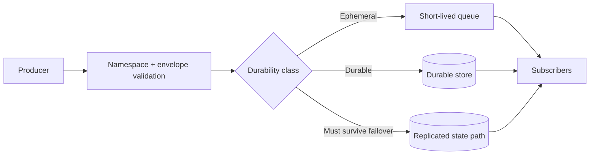

<!-- markdownlint-disable MD025 -->
# Event Architecture

## Scope

Defines event envelope, namespace semantics, ordering/delivery expectations,
and durability classes (ephemeral, durable, must-survive-failover).

## Responsibilities

1. Standardize event naming and payload envelope.
2. Classify each event into durability tier.
3. Provide subscriber-facing delivery semantics.
4. Support replay/re-derivation for failover-sensitive events.

## Contracts consumed

| Contract | From | Notes |
| --- | --- | --- |
| Event envelope schema | `specs/events/event-envelope.schema.json` (planned) | Canonical envelope. |
| Broker contracts | `contracts.md` | Publication and subscription mediation. |

## Contracts published

| Contract | Artefact | Notes |
| --- | --- | --- |
| Durable event journal | `src/kea_fabric/events/journal.py` | JSONL append log for non-ephemeral events under `data_dir/events/`. |
| Durable event diagnostics | `GET /api/v1/events/durable` | Reports journal path, count, and write errors. |
| Durable event recent view | `GET /api/v1/events/durable/recent?limit=N` | Reads bounded recent JSONL rows for operator inspection. |
| Event namespace registry | `specs/events/registry.md` (planned) | Names + durability class. |
| Stream egress contract | `specs/contracts/event_stream.py` (planned) | SSE/WS delivery semantics. |

## Invariants

None declared yet; durable routing invariants will be added as registry lands.

## Failure modes

- Producer flood -> bounded queues and backpressure.
- Durable event loss -> replay from persisted state.
- Subscriber lag -> drop policy for ephemeral classes.
- Namespace collision -> schema/registry validation failure.

## Operator UI — `FabricEventBus` data plane

The dashboard kernel treats **`FabricEventBus`** as the **single real-time data
plane** for operator tiles (Kea Fabric shell and Pi-hole HA control plane). Upstream
sources are **transports** only; they call `bus.emit` or attach Kea SSE via
`bus.connect()` — plugins never open their own `EventSource` or `setInterval`
poll loops.

| Role | Module | Responsibility |
| --- | --- | --- |
| Kernel | `fabricBusKernel.ts` | `attachFabricBusKernel` creates the bus, calls `bus.connect()` for Kea SSE, optional `registerCpTransports` |
| Kea SSE | `eventBus.ts` `connect()` | One `EventSource` on `/api/v1/events/stream` via `DataGateway.subscribeFabricEvents` |
| CP perf | `transports/cpFabricTransport.ts` | Polls CP `/v1/node/perf/summary`; emits `fabric.perf.updated` |
| Tiles | `plugins/pluginDataBus.ts` | `subscribeWithInitialFetch` / `subscribeListWithInitialFetch` — one-shot GET bootstrap, then bus topics |

**Invariant:** `DataGateway` is for **commands** (POST/PATCH/PUT) and **initial
hydrate** GETs inside `pluginDataBus` helpers. Ongoing tile refresh is **bus
topics only** (enforced by `scripts/check_ui_plugin_no_gateway_poll.sh`).

`createFabricEventBus` demultiplexes by `topic`. Tiles call
`bus.subscribe("fabric.perf.updated", selector, onValue)` without owning the
stream. Invalid payloads are logged and skipped at the gateway (Zod); subscribers
only see typed values their selector returns.

**Connection state:** each transport registers with `bus.declareTransport(id)`
and sets `idle` \| `connecting` \| `open` \| `error`. The shell reads aggregated
`bus.connectionState` (`open` when **any** transport is connected). Kea operator
shell: transport `kea-sse`. Pi-hole CP: `cp-perf` always; `kea-sse` when
`meta.kea_fabric_api_base_url` is configured.

### Fabric topic registry (operator dashboard)

| Topic | Typical payload | Transport | Tile / consumer |
| --- | --- | --- | --- |
| `fabric.perf.updated` | `PerfSummaryResponse` (+ optional `tick` stripped) | Kea SSE, CP poll (`emit`) | `perf.*` tiles |
| `fabric.discovery.scan.updated` | `DiscoveryScanResponse` | Kea SSE | `DiscoveryTile` |
| `fabric.dhcp.clients.updated` | `{ items: DhcpClient[] }` or `{ revision: number }` | Kea SSE | `DhcpClientsTile` (revision → refetch) |
| `fabric.dhcp.pools.updated` | `{ items: DhcpPool[] }` or `{ revision: number }` | Kea SSE (when emitted); local `emit` after mutation | `DhcpPoolsTile` |
| `fabric.dhcp.reservations.updated` | `{ items: DhcpReservation[] }` or `{ revision: number }` | Kea SSE (when emitted); local `emit` after mutation | `DhcpReservationsTile` |

Selectors live in `eventBus.ts` (`perfUpdatedFullSummary`, `discoveryScanUpdated`,
`dhcpPoolsListUpdated`, …). List topics accept revision-only payloads so tiles
refetch via `subscribeListWithInitialFetch`.

## Cross-refs

- `principles.md`
- `overview.md`
- `invariants.md`
- `contracts.md`
- `data.md`
- `nebula-sync.md`

## Change Log

| Date | Status | Reviewer | Notes |
| --- | --- | --- | --- |
| 2026-05-17 | Accepted | GriffinAD | FabricEventBus as dashboard data plane; transport aggregation; topic registry table. |
| 2026-04-23 | Accepted | GriffinAD | Document operator UI fabric event bus (`eventBus.ts`). |
| 2026-04-19 | Proposed | GriffinAD | Initial event architecture draft with durability model. |
| 2026-04-19 | Accepted | GriffinAD | Self-review; Gate 1 Tier B (core) acceptance. |
| 2026-04-20 | Accepted | GriffinAD | Phase 5 update: durable event JSONL journal and API diagnostics endpoint documented. |
| 2026-04-20 | Accepted | GriffinAD | Phase 5 update: added recent durable-event read endpoint for bounded operator inspection. |
