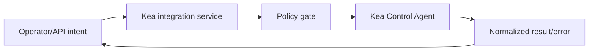

<!-- markdownlint-disable MD025 -->
# Kea Integration Architecture

## Scope

Defines integration boundaries for ISC Kea control-plane operations, command
mapping, error taxonomy, and guardrails for config-get/config-set workflows.

## Responsibilities

1. Normalize Kea command surface into internal contracts.
2. Separate read-only and mutating operation paths.
3. Enforce governance around config mutation operations.
4. Translate Kea/CA failures into platform error taxonomy.

## Contracts consumed

| Contract | From | Notes |
| --- | --- | --- |
| Kea broker contract | `contracts.md` | Typed operations over Kea CA/HA surfaces. |
| Policy decisions | `security.md` | Guard privileged Kea mutations. |

## Contracts published

| Contract | Artefact | Notes |
| --- | --- | --- |
| Kea client contract | `specs/contracts/kea_client.py` | Protocol stub (Phase 2); implementation with live CA in a later phase. |
| Kea error map | `specs/kea/error-taxonomy.json` (planned) | Normalized failure translation. |

## Invariants

None declared yet; command-governance invariants to be indexed later.

## Failure modes

- Kea CA unavailable -> degraded mode with retry/backoff guidance.
- Partial config apply -> rollback/compensation workflow.
- HA state disagreement -> mark uncertain and require operator action.
- Version incompatibility -> startup probe marks unsupported integration.

## External references

Authoritative ISC documentation for **adapter and mock design** (Phase B services and Phase A realistic fixtures). Kea Fabric’s operator HTTP contract remains [`specs/api/openapi.yaml`](../../specs/api/openapi.yaml) (`/api/v1`); wire formats below inform **private** Kea clients only, not public DTOs.

| Resource | URL | Notes |
| --- | --- | --- |
| Kea API and Control Sockets (KB) | [kb.isc.org/docs/kea-api-sockets](https://kb.isc.org/docs/kea-api-sockets) | Control sockets, Kea 3.0+ direct HTTP API, Control Agent, HA listeners, hardening. |
| Kea ARM — API reference | [kea.readthedocs.io/en/stable/api.html](https://kea.readthedocs.io/en/stable/api.html) | Command catalogue and semantics for mapping to Kea-agnostic resources. |

## Cross-refs

- `overview.md`
- `principles.md`
- `contracts.md`
- `security.md`
- `api.md`
- `nebula-sync.md`
- `platform-support.md`

## Change Log

| Date | Status | Reviewer | Notes |
| --- | --- | --- | --- |
| 2026-04-19 | Proposed | GriffinAD | Initial Kea integration architecture draft. |
| 2026-04-19 | Accepted | GriffinAD | Self-review; Gate 1 Tier B (core) acceptance. |
