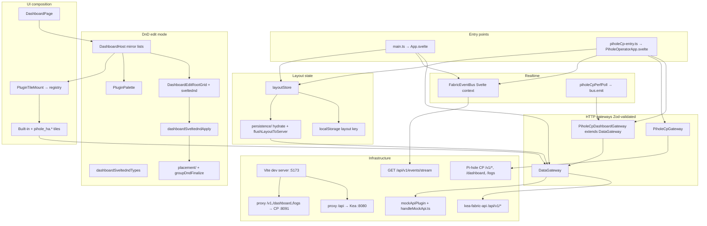

<!-- markdownlint-disable MD025 -->
# UI component and service map

> **As-built reference** for `apps/ui/` (Kea Fabric operator shell and Pi-hole HA
> control-plane embed). Normative contracts remain in
> [`dashboard-plugin-blueprint.md`](dashboard-plugin-blueprint.md),
> [`UI_ENGINE_SPEC.md`](../planning/UI_ENGINE_SPEC.md), and
> [`ui.md`](ui.md). This document maps **what exists in code today** after the
> `@thisux/sveltednd` dashboard editor work (2026-05).

## Scope

1. How UI components connect to services and infrastructure.
2. Per-component composition (“what each component composes / is mounted by”).
3. Review findings: risks, test gaps, and refactor opportunities.

**Out of scope:** Python API implementation, REF_ONLY trees, full ADR text.

---

## 1. Executive summary

The UI is **architecturally sound**: two entry bundles converge on `DashboardPage`
→ `layoutStore` → HTTP gateways, with drag-and-drop logic in testable TypeScript
(`dashboard/placement/*`, `dashboardSveltedndApply`, `groupDndFinalize`) and thin
Svelte shells under `dashboard/editor/`.

**Post-refactor layout (Part A R1–R5, 2026-05):**

| Area | Path | Notes |
| --- | --- | --- |
| Grid math | `apps/ui/src/lib/dashboard/placement/` | `root.ts`, `group.ts`, `tile.ts`, `constants.ts`, `clone.ts`; `gridPlacement.ts` is a 2-line barrel re-exporting `./placement` |
| Editor chrome | `apps/ui/src/lib/dashboard/editor/` | `EditorRootTileCell.svelte`, `EditorRootGroupShell.svelte`, `EditorDropZone.svelte`, … |
| Root edit grid | `DashboardEditRootGrid.svelte` | ~274 lines (orchestration + `@thisux/sveltednd` wiring) |
| Shared tile shell | `DashboardTileShell.svelte` | Read/edit tile wrapper (R4) |
| Pointer tracking | `interactions/editorPointerTracking.ts` | Single module for edit-mode pointer position during drag (R2) |
| Palette ghost | `palette/paletteDragGhost.ts` | Drag-image helpers extracted from `PluginPalette.svelte` (R5) |

Remaining maintainability risks:

| Risk | Detail |
| --- | --- |
| Large Svelte files | `PluginPalette.svelte` (~648 lines), `EditorRootGroupShell.svelte` (~700+ lines) |
| Svelte not in Vitest coverage | Dashboard `.svelte` files are outside the coverage `include` list; wiring is E2E-smoke + behavioural tests |
| Drop-time hover fallback | `getLastEditorDragClient()` from `dashboardEditorDragHover.ts` still consulted on drop alongside `editorPointerTracking` |
| Pi-hole layout resync | `PiholeCpDashboardShell` `$effect` may overwrite in-progress edits during `editorOpen` (R6 not landed) |

## Refactor track (2026-05)

Executable plan: [`docs/superpowers/plans/2026-05-17-ui-refactor-separation-of-concerns.md`](../superpowers/plans/2026-05-17-ui-refactor-separation-of-concerns.md).

| Phase | Status | Deliverable |
| --- | --- | --- |
| R0 | Done | `swapRootItemGridPlacements` unit tests; coverage gate |
| R1 | Done | `dashboard/placement/*`; slim `gridPlacement.ts` barrel |
| R2 | Done | `interactions/editorPointerTracking.ts` |
| R3 | Done | `editor/*` subcomponents; `DashboardEditRootGrid` ~274 lines |
| R4 | Done | `DashboardTileShell.svelte` |
| R5 | Done | `palette/paletteDragGhost.ts` |
| R6 | Pending | `piholeCpSession.ts` + resync gate |
| R7 | Partial | E2E pointer-DnD chrome and drop-zone geometry; palette→grid persist tests optional |
| R8 | In progress | Docs refresh (this pass) |

---

## 2. Entry points and bundles

| Entry | HTML | Bootstrap | Root component |
| --- | --- | --- | --- |
| Kea operator | `index.html` | `src/main.ts` → `mountOperatorApp` | `App.svelte` |
| Pi-hole CP embed | `index-pihole-cp.html` | `src/piholeCp-entry.ts` | `PiholeOperatorApp.svelte` |

Both entries:

- Import `app.css` and `@thisux/sveltednd`.
- Apply theme + dashboard gap settings from `themeStorage` / `dashboardSettings`.

Build / dev infra (`apps/ui/vite.config.ts`):

| Path | Target | Purpose |
| --- | --- | --- |
| `/api` | `127.0.0.1:8080` | Kea Fabric OpenAPI |
| `/v1`, `/dashboard`, `/logs`, `/health` | CP (`8091` default) | Pi-hole control plane |
| In-process mock | `handleMockApi.ts` | Dev when `KEA_FABRIC_UI_PROXY_API` unset |

Embed build: `PIHOLE_CP_UI_EMBED=1` → single CP bundle, `base: /next/`.

---

## 3. Service and infrastructure map

### 3.1 Layer diagram



### 3.2 TypeScript class inheritance

Svelte components do **not** extend each other. Only these TS types use `extends`:

| Class | Extends | Role |
| --- | --- | --- |
| `PiholeCpDashboardGateway` | `DataGateway` | CP perf + no-op layout PUT; Kea repoint via `setKeaFabricApiBaseUrl` |
| `GatewayError` | `Error` | Typed HTTP / Zod failures from gateways |

### 3.3 `DataGateway` (Kea Fabric API)

**File:** `apps/ui/src/lib/dataGateway.ts`

| Concern | Methods / behaviour |
| --- | --- |
| Config | `VITE_KEA_FABRIC_API_BASE_URL`, `VITE_API_BASE_URL`, `VITE_API_AUTH_TOKEN` |
| Plugins | `listPlugins()` |
| Layout | `getDashboardLayout`, `putDashboardLayout`, `postDashboardLayoutSaveFile`, `resetDashboardLayout` |
| DHCP / discovery | `listDhcp*`, `patchDhcp*`, `listDiscoveryRecords`, `getDiscoveryScan`, `pauseDiscoveryScan` |
| Perf | `getPerfSummary()` |
| Admin | `getAdminLogs()` |
| Realtime | `subscribeFabricEvents()` → `EventSource` (`access_token` query when auth set) |
| Validation | Zod via `openapiZod.ts` on every response |

### 3.4 `PiholeCpGateway` (control plane only)

**File:** `apps/ui/src/lib/piholeCp/PiholeCpGateway.ts`

| Concern | Endpoints (representative) |
| --- | --- |
| Dashboard / meta | `getDashboard()`, `getMeta()` |
| Env mutations | env schema/config/apply (ADR-0053) |
| Logs | `getLogsCatalog()`, log stream URLs |
| Health | `waitForControlPlaneReady`, `waitForControlPlaneRestart` |

### 3.5 `FabricEventBus`

**File:** `apps/ui/src/lib/dashboard/eventBus.ts`

- Context key: `FABRIC_EVENT_BUS` (set in `App.svelte` and `PiholeOperatorApp.svelte`).
- `connect()` → `gateway.subscribeFabricEvents`.
- `emit()` used by `piholeCpPerfPoll` for CP-sourced perf when Kea SSE is optional.
- Selectors: `perfUpdatedCpuPercent`, `perfUpdatedFullSummary`.

### 3.6 `layoutStore`

**File:** `apps/ui/src/lib/dashboard/layoutStore.ts`

| Responsibility | Detail |
| --- | --- |
| State | `writable` layout v3, editor open, errors, layout source |
| Undo | 50-step cap |
| Persist | `localStorage` + debounced `putDashboardLayout` (400 ms) unless `skipServerLayoutPersist` |
| Structure API | `applyStructure`, `addRootTile`, `addGroup`, DnD callbacks via `DashboardPage` |

Pi-hole CP: `createLayoutStore({ skipServerLayoutPersist: true, layoutStorageKey: PIHOLE_CP_LAYOUT_STORAGE_KEY })`.

### 3.7 DnD data flow (edit mode)

1. **Canonical model:** `DashboardLayoutV3.items` in `layoutStore`.
2. **Mirror lists:** `DashboardHost` keeps `dndRoot` / `dndByGroup`; resync from layout when `!dndState.isDragging`.
3. **Drop:** `DashboardEditRootGrid` → `applyDashboardDrop` → `placement/` (via `gridPlacement` barrel) / `groupDndFinalize` → `onLayoutStructureChange` → `layoutStore.applyStructure`.
4. **Palette:** per-plugin containers `palette:p:{id}`; payloads in `dashboardSveltedndTypes.ts`.

See `docs/planning/UI_ENGINE_SPEC.md` and `apps/ui/src/lib/dashboard/interactions/dashboardSveltedndTypes.ts`.

---

## 4. Kea Fabric operator UI tree

```
App.svelte
├── DataGateway + FabricEventBus context
├── createAppDashboardShell → layoutStore + overlayActions
├── attachOperatorShellLifecycle → mountDashboardGatewaySideEffects
├── ShellHeader
│   ├── ThemeControls
│   └── DashboardControls
└── route home → DashboardPage
    route admin → AdminPage
```

### 4.1 `DashboardPage` subtree

```
DashboardPage
├── DashboardToolbar (Kea only; hidden on CP via hideEditorToolbar)
├── DashboardHost
│   ├── [edit] PluginPalette
│   ├── [edit] DashboardEditRootGrid
│   │   ├── editor/EditorRootTileCell, EditorRootGroupShell, EditorDropZone
│   │   ├── TileEditChrome, TileColSpanResizeHandle
│   │   └── tileContent snippet → PluginTileMount / DashboardTileShell
│   └── [read] inline grid OR GroupReadNoWrap / DashboardReadNestedHost
│       └── TileEditChrome → PluginTileMount
├── InspectorPanel (edit)
├── TileSettingsOverlay (modal)
└── GroupSettingsOverlay (modal)
```

### 4.2 `PluginTileMount` resolution chain

```
PluginTileMount
├── resolvePluginTileMount (platform/extensions → plugins/registry)
├── TileHostControl
│   └── SinglePanelHost (hostControl === "single-panel")
│       └── dynamic plugin Svelte component
├── TileErrorBoundary
└── TileFallback (disabled / unknown / bad options)
```

---

## 5. Pi-hole control plane UI tree

```
PiholeOperatorApp
├── PiholeCpDashboardGateway + FabricEventBus context
├── startPiholeCpPerfPolling → bus.emit
├── loadAll: PiholeCpGateway.getDashboard + getMeta
│   → gateway.setKeaFabricApiBaseUrl(meta.kea_fabric_api_base_url)
│   → fabricEventBus.connect when Kea base present
├── PiholeCpDashboardShell
│   ├── module init: registerDynamicPluginResolver("pihole_ha.section", …)
│   ├── PiholeCpShellHeader (ThemeControls, DashboardControls, ls undo)
│   ├── [edit] PiholeCpEnvSettings
│   └── DashboardPage (shared with Kea)
└── LogStreamPanel (PiholeCpGateway + EventSource)
```

Layout merge on refresh / env apply: `buildLayoutFromDashboard.ts` in
`PiholeCpDashboardShell` `$effect` (`layoutResyncEpoch`, `dataRefreshEpoch`).

---

## 6. Component composition reference

**Convention:** “Composes” = direct child `.svelte` imports. “Mounted by” = parent in the product tree. “Dynamic” = resolved at runtime, not a static import.

### 6.1 Entry and shell

| Component | Composes | Mounted by | Services / context |
| --- | --- | --- | --- |
| `App.svelte` | `ShellHeader`, `DashboardPage`, `AdminPage` | `main.ts` | `DataGateway`, `FabricEventBus`, `layoutStore` |
| `PiholeOperatorApp.svelte` | `PiholeCpDashboardShell`, `LogStreamPanel` | `piholeCp-entry.ts` | `PiholeCpDashboardGateway`, `PiholeCpGateway`, `FabricEventBus` |
| `ShellHeader.svelte` | Flowbite `Button`, `Modal`; `ThemeControls`; `DashboardControls` | `App.svelte` | — |
| `PiholeCpShellHeader.svelte` | Flowbite `Button`, `Modal`; `ThemeControls`; `DashboardControls` | `PiholeCpDashboardShell` | `ls` (layout store) |
| `DashboardControls.svelte` | Flowbite `Input` | Both shell headers | `dashboardSettings` on document |
| `PiholeCpDashboardShell.svelte` | `PiholeCpShellHeader`, `PiholeCpEnvSettings`, `DashboardPage` | `PiholeOperatorApp` | `layoutStore`, CP layout keys |
| `PiholeCpEnvSettings.svelte` | Flowbite `Spinner` | `PiholeCpDashboardShell` (edit) | `PiholeCpGateway` |
| `LogStreamPanel.svelte` | — (native HTML) | `PiholeOperatorApp` | `PiholeCpGateway`, `EventSource` |

### 6.2 Dashboard editor

| Component | Composes | Mounted by | Notes |
| --- | --- | --- | --- |
| `DashboardPage.svelte` | Flowbite `Button`; `DashboardToolbar`, `InspectorPanel`, `DashboardHost`, overlays | `App`, `PiholeCpDashboardShell` | Wires `ls`, `overlay`, `gateway` |
| `DashboardToolbar.svelte` | Flowbite `Button` | `DashboardPage` | Undo/redo |
| `InspectorPanel.svelte` | — | `DashboardPage` (edit) | `editorSelection` store |
| `DashboardHost.svelte` | `PluginPalette`, `DashboardEditRootGrid` or read grid; `PluginTileMount`, `TileEditChrome`, `GroupReadNoWrap`, `DashboardReadNestedHost` | `DashboardPage` | DnD mirrors, document listeners |
| `DashboardEditRootGrid.svelte` | `editor/EditorRootTileCell`, `EditorRootGroupShell`, `EditorDropZone`; `TileColSpanResizeHandle`, `TileEditChrome`; snippet `tileContent` | `DashboardHost` (edit) | `@thisux/sveltednd` orchestration (~274 lines) |
| `editor/EditorRootTileCell.svelte` | `TileEditChrome`, `EditorDropZone` | `DashboardEditRootGrid` | Root tile cell + DnD |
| `editor/EditorRootGroupShell.svelte` | nested editor cells, `TileEditChrome` | `DashboardEditRootGrid` | Root group shell |
| `editor/EditorDropZone.svelte` | — | `EditorRootTileCell`, root grid | Drop target chrome |
| `DashboardTileShell.svelte` | `TileEditChrome`; snippet `children` | `DashboardHost` (read/edit) | Shared tile wrapper (R4) |
| `DashboardReadNestedHost.svelte` | self (recursive), `TileEditChrome` | `DashboardHost` (read) | Nested groups |
| `GroupReadNoWrap.svelte` | `TileEditChrome`; snippet `tileContent` | `DashboardHost` (read) | Horizontal strips |
| `PluginPalette.svelte` | `PluginTileMount`; sveltednd | `DashboardHost` (edit) | `paletteStorage`, `paletteDragGhost.ts` |
| `PluginTileMount.svelte` | `TileHostControl`, `TileErrorBoundary`, `TileFallback` | `DashboardHost`, `PluginPalette` | **Dynamic** plugin component |
| `TileHostControl.svelte` | `SinglePanelHost` or `TileFallback` | `PluginTileMount` | By `hostControl` |
| `hosts/SinglePanelHost.svelte` | snippet `children` | `TileHostControl` | Pass-through |
| `TileErrorBoundary.svelte` | `TileFallback` | `PluginTileMount` | Render errors |
| `TileFallback.svelte` | Flowbite `Button`, `Card` | Mount / host / boundary | — |
| `TileEditChrome.svelte` | Lucide; snippet `children` | Edit/read hosts, `DashboardEditRootGrid` | `editorChrome.ts` classes |
| `TileColSpanResizeHandle.svelte` | — | `DashboardEditRootGrid` | — |
| `TileSettingsOverlay.svelte` | Flowbite `Button`; `TilePlacementForm`, `TileGenericFields`; **dynamic** `PerfOptionsForm` | `DashboardPage` | `resolvePluginTileSettings` |
| `GroupSettingsOverlay.svelte` | Flowbite `Button` | `DashboardPage` | — |
| `TilePlacementForm.svelte` | — | `TileSettingsOverlay` | — |
| `TileGenericFields.svelte` | — | `TileSettingsOverlay` | — |

### 6.3 Built-in plugin tiles

Registered in `apps/ui/src/lib/plugins/registry.ts`; mounted via `PluginTileMount`.

| Component | Composes | Plugin id(s) | Data source |
| --- | --- | --- | --- |
| `DhcpPoolsTile.svelte` | `BaseDataTable` | `dhcp.pools` | `gateway.listDhcpPools` |
| `DhcpClientsTile.svelte` | `BaseDataTable` | `dhcp.clients` | `gateway.listDhcpClients` |
| `DhcpReservationsTile.svelte` | `BaseDataTable` | `dhcp.reservations` | `gateway.listDhcpReservations` |
| `DiscoveryTile.svelte` | Flowbite `Button`, `Card`, `Spinner` | `discovery.records` | Discovery APIs |
| `PerfTile.svelte` | Flowbite `Card`; `MetricList`, `SemicircleGauge` | `perf.summary` | `gateway` + optional SSE |
| `PerfMetricTile.svelte` | `GaugeTileLayout`, `MetricList`, `SemicircleGauge` | `perf.cpu`, `perf.ram`, `perf.network`, `perf.disk` | Same + grid hints |
| `PerfOptionsForm.svelte` | `PerfGaugeGradientSelect` | Tile settings only | Binds `draft` tile |
| `PerfGaugeGradientSelect.svelte` | — | — | Perf settings |
| `E2EThrowingTile.svelte` | — | `e2e.throwing` | E2E only |

### 6.4 Pi-hole HA plugin tiles (dynamic)

| Component | Composes | Registration |
| --- | --- | --- |
| `PiholeHaSectionPluginTile.svelte` | `SectionDashboardTile` | `registerDynamicPluginResolver("pihole_ha.section", …)` in `PiholeCpDashboardShell` `<script module>` |
| `SectionDashboardTile.svelte` | — (markup) | Renders CP `/dashboard` section payload |

### 6.5 Shared components (`lib/components/`)

| Component | Composes | Used by |
| --- | --- | --- |
| `BaseDataTable.svelte` | Flowbite table stack; `BaseDataTableModal`, `BasePagination`, `InlineSelectEditor` | DHCP tiles, `AdminLogsPage` |
| `BaseDataTableModal.svelte` | Flowbite `Modal`, `Input`, `Button` | `BaseDataTable` |
| `BasePagination.svelte` | — | `BaseDataTable` |
| `InlineSelectEditor.svelte` | — | `BaseDataTable` |
| `TablePluginShell.svelte` | `BaseDataTable` | Tests / legacy |
| `GaugeTileLayout.svelte` | Flowbite `Card` | `PerfMetricTile` |
| `SemicircleGauge.svelte` | Svelte `tweened`; `gaugeMath`, theme | Perf tiles, `AdminPage` |
| `MetricList.svelte` | — | `PerfTile`, `PerfMetricTile` |

### 6.6 Admin (`#/admin/...`)

| Component | Composes | Route / mount |
| --- | --- | --- |
| `AdminPage.svelte` | Flowbite `Card`; `SemicircleGauge`, `GaugeThemeControls`; **dynamic** registry pages | `App.svelte` |
| `AdminLogsPage.svelte` | Flowbite `Card`; `BaseDataTable` | `#/admin/logs` via `adminRouteRegistry` |
| `AdminRegistrySamplePage.svelte` | — | `#/admin/ext/sample` |
| `GaugeThemeControls.svelte` | Flowbite `Select` | `#/admin/ui/gauges` |
| `ThemeControls.svelte` | Flowbite `Select` | Shell headers |

### 6.7 Dynamic resolvers (not in static import graph)

| Resolver | Location | Input → output |
| --- | --- | --- |
| `resolvePluginTileMount` | `plugins/registry.ts` | `tile.pluginId` → plugin Svelte component + props |
| `resolvePluginTileSettings` | `plugins/registry.ts` | `perf.*` → `PerfOptionsForm` or `null` |
| `resolveAdminRoute` | `admin/adminRouteRegistry.ts` | subpath → `AdminLogsPage`, etc. |
| `registerDynamicPluginResolver` | CP shell module | `pihole_ha.section` → `PiholeHaSectionPluginTile` |

### 6.8 Test-only harnesses (not product UI)

`TileErrorBoundary.harness.svelte`, `GaugeTileLayoutHarness.svelte`,
`BaseDataTableCoverageHarness.svelte`, `BaseDataTablePageClampHarness.svelte`,
`BaseDataTableModalSaveAllHarness.svelte`, `PerfOptionsFormTestRoot.svelte`,
`__fixtures__/CrashTile.svelte`.

### 6.9 CSS and design tokens (not components)

| Source | Consumers |
| --- | --- |
| `editorChrome.ts` + `app.css` | Editor grips, hover rings, `EDITOR_LAYOUT_ELEVATED_CLASS` |
| `themeStorage.ts` | `ThemeControls`, `GaugeThemeControls`, `SemicircleGauge`, document theme |
| `dashboardSettings.ts` | `--dashboard-gap` on document root |

---

## 7. Pure TypeScript modules (dashboard engine)

No Svelte; heavily unit-tested. Primary dependencies:

| Module | Role |
| --- | --- |
| `placement/` (`root.ts`, `group.ts`, `tile.ts`, …) | 20-column grid, pack/reflow, resize, DnD placement helpers (R1) |
| `gridPlacement.ts` | Deprecated barrel: `export * from "./placement"` |
| `groupDndFinalize.ts` | Rebuild layout from DnD mirror lists |
| `interactions/dashboardSveltedndApply.ts` | Drop handlers, root tile bands, persist gate |
| `interactions/dashboardSveltedndTypes.ts` | Drag payloads + container id vocabulary |
| `interactions/editorPointerTracking.ts` | Edit-mode pointer position during drag (R2) |
| `interactions/dashboardEditorDragHover.ts` | Pointer hover sync; `getLastEditorDragClient` on drop |
| `palette/paletteDragGhost.ts` | Palette drag-image DOM helpers (R5) |
| `interactions/dndEditorFeedback.ts` | Invalid drop feedback |
| `interactions/editorChrome.ts` | Chrome class constants |
| `interactions/editorDomContract.ts` | DOM `data-testid` contract tests |
| `layoutTree.ts` | Find tiles/groups, parent ids |
| `layoutStorage.ts` / `persistence/` | localStorage + server flush |
| `overlayActions.ts` | Settings overlay mutations |
| `buildLayoutFromDashboard.ts` | CP server widget merge |

---

## 8. Review findings (2026-05-17)

Ordered by severity. No code changes were made as part of this documentation pass.

### 8.1 Important

1. **Large Svelte without Vitest line coverage:** DnD wiring in `editor/*` / `DashboardHost` relies on `placement/` unit tests + E2E (drop zone geometry, pointer-DnD chrome; full palette→grid persist optional).
2. **Drop-time pointer fallback:** `editorPointerTracking.ts` owns live pointer position; `getLastEditorDragClient()` still used on drop — document or consolidate per drag phase.
4. **Pi-hole layout resync:** `PiholeCpDashboardShell` `$effect` may overwrite in-progress edits if refresh runs during `editorOpen` unless explicitly gated.
5. **SSE auth in query string:** `access_token` on EventSource URL — ensure proxies/logging policy in production.

### 8.2 Medium (maintainability)

1. Further trim `PluginPalette.svelte` and `EditorRootGroupShell.svelte` line counts.
2. Single CP “session” object instead of multiple `PiholeCpGateway` instances per flow (R6).
3. Gate Pi-hole `$effect` layout merge when `editorOpen` (R6).

### 8.3 Minor

1. `SHOW_RECENTS = false` in `PluginPalette` — dead flag.
2. `appDashboardShell.ts` excluded from coverage (thin glue; acceptable).

### 8.4 Strengths

- Clear gateway → store → pure layout/DnD → thin Svelte layering.
- Typed drag payloads and container ID vocabulary.
- Mid-drag mirror guard (`!dndState.isDragging` before resetting `dndRoot`).
- `dropCommittedForActiveDrag` prevents double drop apply.
- Undo/history with preview vs commit for col-span resize.
- Pi-hole `skipServerLayoutPersist` separation from Kea layout API.

---

## 9. Recommended follow-ups

1. Playwright: palette → grid drop; root reorder with `localStorage` or DOM order assertion (R7).
2. `piholeCpSession` facade + resync gate (R6).
3. Document pointer-tracking and CP resync policy in `UI_ENGINE_SPEC` when behaviour is decided.

---

## 10. Related documents

| Document | Relationship |
| --- | --- |
| [`ui.md`](ui.md) | Tier B shell boundaries, Flowbite/Lucide |
| [`dashboard-plugin-blueprint.md`](dashboard-plugin-blueprint.md) | Normative dashboard/plugin contracts |
| [`UI_ENGINE_SPEC.md`](../planning/UI_ENGINE_SPEC.md) | Layout store, persistence spec |
| [`UI_ENGINE_PLAN.md`](../planning/UI_ENGINE_PLAN.md) | Phased implementation plan |
| [`UI_ENGINE_REVIEW.md`](../planning/UI_ENGINE_REVIEW.md) | Earlier phase-d diagnosis (historical) |
| [`operations/control-plane-ui.md`](../operations/control-plane-ui.md) | CP deploy / embed |
| [`2026-05-13-pihole-ha-control-plane-ui-design.md`](../superpowers/specs/2026-05-13-pihole-ha-control-plane-ui-design.md) | CP UI product design |

---

## Change log

| Date | Change |
| --- | --- |
| 2026-05-17 | Initial as-built map: service layers, component composition, DnD review (GriffinAD). |
| 2026-05-17 | Post R1–R5 refactor: `placement/`, `editor/*`, executive summary and refactor-track status (GriffinAD). |
