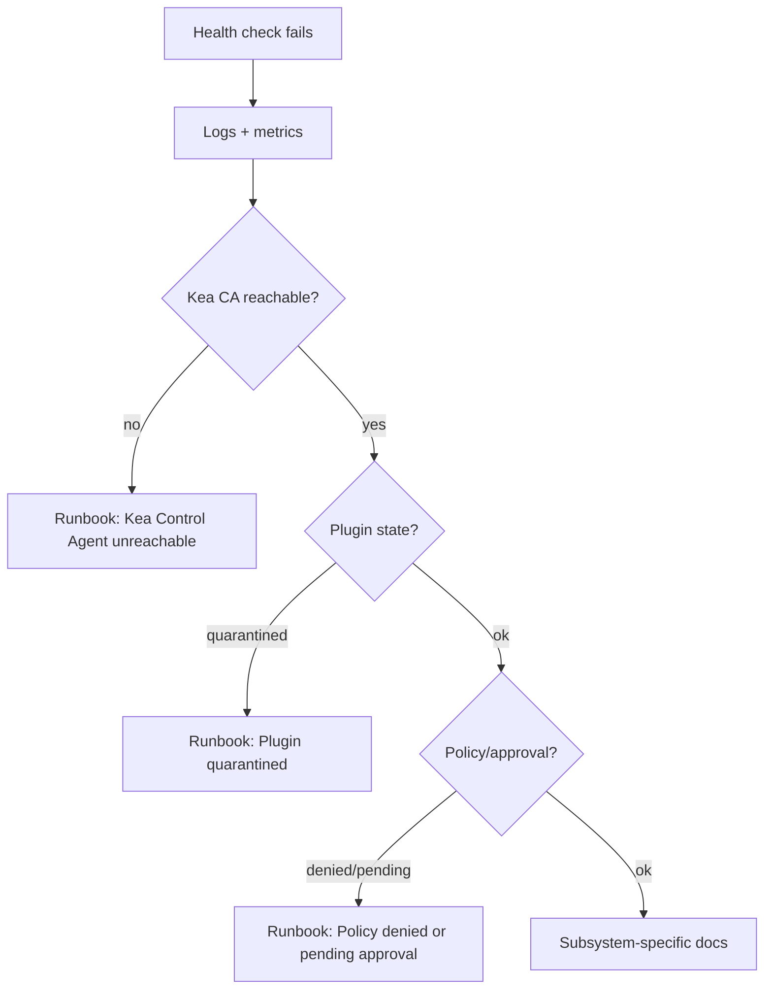

# Troubleshooting

## Triage flow

## Symptom index

| Symptom | First checks | Runbook |
| --- | --- | --- |
| API 503 / degraded health | Recent deploy, resource limits, dependency down | [`runbooks/warm-standby-failover.md`](runbooks/warm-standby-failover.md) if clustered |
| Kea commands fail | CA URL, TLS, auth, Kea logs | [`runbooks/kea-control-agent-unreachable.md`](runbooks/kea-control-agent-unreachable.md) |
| Plugin will not enable | Manifest validation, dependency closure | [`runbooks/plugin-quarantined.md`](runbooks/plugin-quarantined.md) |
| Plugins UI or API looks wrong | `GET /api/v1/plugins`, scan issues, deps, install records | [`runbooks/plugins-diagnostics.md`](runbooks/plugins-diagnostics.md) |
| Action blocked | Permissions, policy, approval queue | [`runbooks/policy-denied-or-pending-approval.md`](runbooks/policy-denied-or-pending-approval.md) |

## Cross-refs

- [`../architecture/observability.md`](../architecture/observability.md)
- [`runbooks/README.md`](runbooks/README.md)
