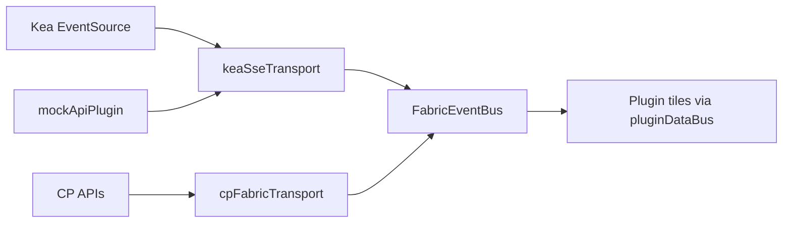

# UI refactor and platform extensions

> **For agentic workers:** REQUIRED SUB-SKILL: Use superpowers:subagent-driven-development (recommended) or superpowers:executing-plans to implement this plan task-by-task. Steps use checkbox (`- [ ]`) syntax for tracking.

**Goal:** (A) Reduce size and coupling in `apps/ui/` after the `@thisux/sveltednd` work. (B) Add **tab containers** (groups whose children are tabs — tiles or nested containers, including nested tab groups), **layout import (replace-only) / export**, and make **`FabricEventBus` the dashboard data plane** so all tiles react to pushed events (Kea SSE, CP bridges, mocks) — not ad-hoc polling inside plugins.

**Architecture:** Part A: `DashboardPage` → `layoutStore` → pure placement/DnD TS → thin Svelte. Part B: **Tab control lives on `DashboardGroup`**, not on a single tile — each tab is one `children[]` entry (`DashboardTile` or nested `DashboardGroup`), with renameable `tabLabel`, editor add/move/delete/reorder. **`FabricEventBus` is mandatory dashboard kernel context** (Kea operator + Pi-hole CP): transports (`KeaSseTransport`, `CpFabricTransport`, …) connect upstream APIs and **only** call `bus.emit`; plugins subscribe via shared helpers and do not poll. Import replaces the entire layout after Zod validation.

**Tech stack:** Svelte 5, `@thisux/sveltednd`, Vitest, Playwright, Flowbite Svelte v2, `FabricEventBus`, `DataGateway` (mutations + one-shot bootstrap only), Python SSE in `event_stream.py`, `specs/dashboard/layout.schema.json`, ADR-0054 (tab groups).

## Locked product decisions (2026-05-17)

| # | Decision |
| --- | --- |
| **D1** | **Tabs = group children.** A tab container is a `DashboardGroup` with `hostControl: "tab-control"`. Each tab is one child (tile **or** nested group). Nested groups may themselves be tab containers. Tabs are **renameable**, and the editor supports **add / move / delete** tabs (not read-only labels). |
| **D2** | **Import = replace only.** Importing a layout JSON **replaces** the current dashboard layout (with confirm dialog). No merge mode in v1. |
| **D3** | **`FabricEventBus` is core.** Every data-driven tile subscribes through the bus. Kea SSE, Pi-hole CP adapters, and dev mock are **transports into the bus**, not parallel patterns. Remove plugin-level polling (`setInterval` + `gateway.get*`) except inside transport modules. |

**Prerequisites:** [`docs/architecture/ui-component-and-service-map.md`](../architecture/ui-component-and-service-map.md). [`UI_ENGINE_PLAN.md`](../planning/UI_ENGINE_PLAN.md) P0–P8 done. [`UI_ENGINE_SPEC.md`](../planning/UI_ENGINE_SPEC.md) §4.3 host controls, §4.5 EventBus.

**Worktree:** Branch `refactor/ui-platform` off `main`. Execute **Part A R0–R2 before Part B H0** (host controls need a stable `TileHostControl` / `dashboard/hosts/` tree).

**Execution order:** `R0 → R1 → R2 → … → R8` (maintainability), then `H0 → H* → I* → J*` (features). Part B tasks that touch layout JSON require ADR + schema before code.

---

## Flags — address before or during this plan

| ID | Severity | Issue | Address in phase |
| --- | --- | --- | --- |
| F1 | **Blocker** | `npm run check:ui-unit` fails: ~99.1% lines; `swapRootItemGridPlacements` untested | R0 |
| F2 | **High** | `DashboardEditRootGrid.svelte` ~964 lines — editor + DnD markup monolith | R3 |
| F3 | **High** | `gridPlacement.ts` ~1397 lines — mixed root/group/resize/DnD concerns | R1 |
| F4 | **High** | `PluginPalette.svelte` ~707 lines — dock UI + drag ghost + DnD | R5 |
| F5 | **Medium** | `DashboardHost` duplicates read vs edit tile/group shells | R4 |
| F6 | **Medium** | Dual pointer pipelines (`pointermove` + `dragover` + `getLastEditorDragClient`) | R2 |
| F7 | **Medium** | Pi-hole `$effect` layout merge can run while `editorOpen` (refresh/env) | R6 |
| F8 | **Medium** | Multiple `new PiholeCpGateway(baseUrl)` per flow | R6 |
| F9 | **Low** | Dashboard `.svelte` excluded from Vitest coverage (`vite.config.ts`) | R7 (optional) |
| F10 | **Low** | `SHOW_RECENTS = false` dead code in `PluginPalette` | R5 |
| F11 | **Ops** | SSE `access_token` query on `EventSource` — document proxy/logging policy | R8 |
| F12 | **Docs** | E2E comments still say `svelte-dnd-action` | R8 |
| F13 | **Product** | Tab containers not implemented — only `single-panel` tiles; group `tab-control` missing | H0–H4 |
| F14 | **Product** | Layout **download** helpers exist but no shell **Import**; Save button is server snapshot not local export | I1–I2 |
| F15 | **Realtime** | Kea SSE emits only `fabric.perf.updated`; DHCP/discovery tiles fetch on mount | J1–J3 |
| F16 | **Realtime** | Pi-hole CP uses `piholeCpPerfPoll` (`setInterval`) instead of SSE | J4 |
| F17 | **Layout** | Tab containers need `group.hostControl` + `tabLabel` on children — ADR-0054 | H0 |
| F19 | **Architecture** | `FabricEventBus` optional in CP / plugins use gateway directly | J0–J4 |
| F18 | **UX** | `SectionDashboardTile` 30s uptime `setInterval` (display only; not data poll) | J0 (document) |

**Out of scope (do not start here):** SvelteKit/router, Pinia, marketplace external plugins, multi-dashboard IDs, CRDT collaborative editing, full `gridPlacement` algorithm rewrite, `vertical-stack` / `split-grid` full implementation (placeholders remain until a follow-up ADR unless H-series expands scope).

---

## Target module boundaries (end state)

```
apps/ui/src/lib/
  dashboard/
    placement/           # Pure grid math (split from gridPlacement.ts)
      constants.ts
      root.ts
      group.ts
      resize.ts
      clone.ts
      index.ts           # re-exports; gridPlacement.ts → thin barrel
    interactions/        # DnD + editor pointer (existing + R2)
    editor/              # Svelte: toolbar, inspector, col resize, root cells (R3)
    read/                # Read-mode hosts (optional move from root)
    layoutStore.ts       # State + persist orchestration (unchanged role)
    DashboardHost.svelte # Orchestration only (~250 lines target)
    DashboardPage.svelte
  palette/
    paletteDragGhost.ts  # R5
    PluginPalette.svelte
  piholeCp/
    piholeCpSession.ts   # R6 — single gateway facade for CP HTTP
  plugins/               # No new dashboard imports (CI guard)
  dataGateway.ts
```

**Success metric (unchanged from UI_ENGINE_PLAN):** Adding built-in plugin `audit.log` requires **only** `lib/plugins/audit/` + registry entry — **zero** edits to `DashboardEditRootGrid`, `gridPlacement`/`placement`, or `App.svelte`.

---

## Ground rules

1. **Tests green between every task:** `npm --prefix apps/ui run check:ui-unit` and `npm --prefix apps/ui run check:ui-e2e` (and `bash scripts/check_app.sh` before merge).
2. **One concern per commit** — mechanical moves separate from behaviour changes.
3. **DCO:** `git commit -s` per `.cursor/rules/commits.mdc`; verify local `user.name` / `user.email` before each commit.
4. **No contract drift** unless paired with blueprint/ADR update (R6 resync gate is behavioural — document in plan task).
5. **Import stability:** During R1, keep `from "./gridPlacement"` working via barrel until a follow-up codemod (optional) switches call sites to `placement/`.

---

## File structure — phases overview

| Phase | Creates / modifies (summary) |
| --- | --- |
| **R0** | Tests for `swapRootItemGridPlacements`; E2E comment fixes; map doc status |
| **R1** | `dashboard/placement/*`; slim `gridPlacement.ts` barrel |
| **R2** | `interactions/editorPointerTracking.ts`; slim `DashboardHost` |
| **R3** | `editor/EditorRootTileCell.svelte`, `EditorRootGroupShell.svelte`, … |
| **R4** | `dashboard/DashboardTileShell.svelte` (read/edit shared wrapper) |
| **R5** | `palette/paletteDragGhost.ts`; trim `PluginPalette` |
| **R6** | `piholeCp/piholeCpSession.ts`; resync gate in shell |
| **R7** | Playwright behavioural DnD tests |
| **R8** | Spec/docs + optional line-count guard |

---

## Phase R0 — Safety baseline (~½ day)

**Goal:** Restore CI coverage gate and lock behaviour before file moves.

### Task R0.1: Cover `swapRootItemGridPlacements`

**Files:**
- Modify: `apps/ui/src/lib/dashboard/gridPlacement.test.ts` (append tests)
- Test: same file

- [ ] **Step 1: Write the failing tests**

Append after `swapRootSingleRowTilePlacements` tests (~line 2323):

```typescript
  it("swapRootItemGridPlacements exchanges full grid objects for multi-row items", () => {
    const groupA: RootLayoutItem = {
      kind: "group",
      id: "ga",
      showBorder: true,
      children: [],
      grid: { col: 0, row: 0, colSpan: 20, rowSpan: 2 },
    };
    const groupB: RootLayoutItem = {
      kind: "group",
      id: "gb",
      showBorder: true,
      children: [],
      grid: { col: 0, row: 2, colSpan: 20, rowSpan: 1 },
    };
    const items: RootLayoutItem[] = [groupA, groupB];
    const next = swapRootItemGridPlacements(items, "ga", "gb");
    expect(next.find((it) => it.id === "ga")!.grid).toEqual(groupB.grid);
    expect(next.find((it) => it.id === "gb")!.grid).toEqual(groupA.grid);
  });

  it("swapRootItemGridPlacements is a no-op when either item lacks grid", () => {
    const items: RootLayoutItem[] = [
      tile("a", 0, 4, 0),
      { kind: "tile", id: "b", pluginId: "perf.cpu", hostControl: "single-panel", displayMode: "full" },
    ];
    const next = swapRootItemGridPlacements(items, "a", "b");
    expect(next).toBe(items);
  });
```

Add import at top of test file if missing:

```typescript
import {
  // ...existing imports...
  swapRootItemGridPlacements,
} from "./gridPlacement";
```

- [ ] **Step 2: Run tests to verify they fail or pass**

Run: `cd apps/ui && npx vitest run src/lib/dashboard/gridPlacement.test.ts -t "swapRootItemGridPlacements" -v`

Expected: PASS (function exists; tests exercise uncovered branches).

- [ ] **Step 3: Run full UI unit coverage**

Run: `npm run check:ui-unit` (from repo root)

Expected: PASS with lines/functions/statements **100%**, branches **≥99%**.

- [ ] **Step 4: Commit**

```bash
git add apps/ui/src/lib/dashboard/gridPlacement.test.ts
git commit -s -m "test(ui): cover swapRootItemGridPlacements for coverage gate"
```

---

### Task R0.2: Record refactor baseline in component map

**Files:**
- Modify: `docs/architecture/ui-component-and-service-map.md` (add “Refactor track” pointer)

- [ ] **Step 1: Add section after executive summary**

```markdown
## Refactor track (2026-05)

Executable plan: [`docs/superpowers/plans/2026-05-17-ui-refactor-separation-of-concerns.md`](../superpowers/plans/2026-05-17-ui-refactor-separation-of-concerns.md).
```

- [ ] **Step 2: Commit**

```bash
git add docs/architecture/ui-component-and-service-map.md
git commit -s -m "docs(ui): link component map to refactor plan"
```

---

## Phase R1 — Split `gridPlacement` by concern (~1.5 days)

**Goal:** One responsibility per file; `gridPlacement.ts` becomes a backward-compatible barrel.

### Task R1.1: Extract constants and clone helper

**Files:**
- Create: `apps/ui/src/lib/dashboard/placement/constants.ts`
- Create: `apps/ui/src/lib/dashboard/placement/clone.ts`
- Create: `apps/ui/src/lib/dashboard/placement/index.ts`
- Modify: `apps/ui/src/lib/dashboard/gridPlacement.ts` (re-export from placement)

- [ ] **Step 1: Create `placement/clone.ts`**

```typescript
/** Deep clone layout graph JSON (Svelte proxies are not structuredClone-safe). */
export function cloneLayoutJson<T>(value: T): T {
  return JSON.parse(JSON.stringify(value)) as T;
}
```

- [ ] **Step 2: Create `placement/constants.ts`**

Move from `gridPlacement.ts` (lines ~28–43 area): `GRID_ROW_SPAN_MAX`, `GROUP_CHILD_INNER_STRIP_MAX_EXTENT`, `stripInnerPhysicalTrackCount`, and re-export `clampGridColSpan`, `GRID_COLUMNS` from `../../plugins/builtinMeta`.

- [ ] **Step 3: Create `placement/index.ts`**

```typescript
export * from "./clone";
export * from "./constants";
```

- [ ] **Step 4: Update `gridPlacement.ts` top**

Replace local `cloneLayoutJson` and moved constants with:

```typescript
export { cloneLayoutJson, GRID_ROW_SPAN_MAX, GROUP_CHILD_INNER_STRIP_MAX_EXTENT, stripInnerPhysicalTrackCount, clampGridColSpan, GRID_COLUMNS } from "./placement";
```

Delete the duplicated implementations from `gridPlacement.ts`.

- [ ] **Step 5: Run tests**

Run: `npm --prefix apps/ui run check:ui-unit`

Expected: PASS (no behaviour change).

- [ ] **Step 6: Commit**

```bash
git add apps/ui/src/lib/dashboard/placement apps/ui/src/lib/dashboard/gridPlacement.ts
git commit -s -m "refactor(ui): extract placement constants and clone helper"
```

---

### Task R1.2: Extract root placement functions

**Files:**
- Create: `apps/ui/src/lib/dashboard/placement/root.ts`
- Modify: `apps/ui/src/lib/dashboard/gridPlacement.ts`
- Modify: `apps/ui/src/lib/dashboard/placement/index.ts`

- [ ] **Step 1: Move root-only exports to `placement/root.ts`**

Move these functions (cut/paste) from `gridPlacement.ts` into `placement/root.ts`, with imports from `./constants`, `./clone`, `../layoutTree`, `../types`, `../../plugins/builtinMeta`:

- `tileColSpan`, `clampGridRowSpan`, `rootItemColSpan`, `assignRootItemColReflow`
- `packRootLayoutItems`, `reorderRootLayoutItemsPreservingSlotOrigins`, `mergeRootLayoutGridsForEdit`
- `applyRootLayoutPointerDropPlacement`, `relocateRootItemToRow`, `swapRootItemGridPlacements`, `swapRootSingleRowTilePlacements`, `reflowRootLayoutRowInListOrder`, `reflowRootLayoutRow`
- `resizeRootLayoutItemColSpan`, `gridAreaStyle`, `gridColumnSpanStyle`, `rootEditGridColumnCount`
- Any other function that only mutates `RootLayoutItem[]` at dashboard root (grep `RootLayoutItem` in `gridPlacement.ts`).

- [ ] **Step 2: Re-export from `gridPlacement.ts`**

```typescript
export {
  tileColSpan,
  clampGridRowSpan,
  // ...every moved symbol...
  swapRootItemGridPlacements,
} from "./placement/root";
```

- [ ] **Step 3: Export from `placement/index.ts`**

`export * from "./root";`

- [ ] **Step 4: Run tests**

Run: `npx vitest run apps/ui/src/lib/dashboard/gridPlacement.test.ts -v` then `npm run check:ui-unit`

Expected: PASS.

- [ ] **Step 5: Commit**

```bash
git commit -s -m "refactor(ui): extract root grid placement module"
```

---

### Task R1.3: Extract group placement functions

**Files:**
- Create: `apps/ui/src/lib/dashboard/placement/group.ts`
- Modify: `apps/ui/src/lib/dashboard/gridPlacement.ts`
- Modify: `apps/ui/src/lib/dashboard/placement/index.ts`

- [ ] **Step 1: Move group/child helpers to `placement/group.ts`**

Move functions that operate on `GroupChild`, `DashboardGroup`, `packGroupChildrenRowWrapInOrder`, `groupGridAreaStyle`, `groupGridColumnSpanStyle`, `groupOuterColSpan`, `groupEditInnerColumnCount`, nested nowrap strip math, `resizeGroupChildTileColSpan`, etc.

- [ ] **Step 2: Barrel re-export from `gridPlacement.ts`**

- [ ] **Step 3: Run** `npm run check:ui-unit` — PASS

- [ ] **Step 4: Commit**

```bash
git commit -s -m "refactor(ui): extract group grid placement module"
```

---

### Task R1.4: Slim `gridPlacement.ts` to barrel only

**Files:**
- Modify: `apps/ui/src/lib/dashboard/gridPlacement.ts`

- [ ] **Step 1: Replace file body**

After R1.2–R1.3, `gridPlacement.ts` should only contain:

```typescript
/** @deprecated Import from `./placement` in new code; this barrel preserves existing paths. */
export * from "./placement";
```

- [ ] **Step 2: Run full checks**

Run: `npm run check:ui-unit` && `npm run check:ui-e2e`

- [ ] **Step 3: Commit**

```bash
git commit -s -m "refactor(ui): gridPlacement.ts becomes placement barrel"
```

**Done when:** `wc -l apps/ui/src/lib/dashboard/gridPlacement.ts` ≤ 5 lines; largest logic in `placement/root.ts` and `placement/group.ts` each ideally &lt; 600 lines.

---

## Phase R2 — Editor pointer tracking (~1 day)

**Goal:** Single module owns document listeners for DnD pointer position and hover sync; `DashboardHost` only wires callbacks.

### Task R2.1: Extract `editorPointerTracking`

**Files:**
- Create: `apps/ui/src/lib/dashboard/interactions/editorPointerTracking.ts`
- Create: `apps/ui/src/lib/dashboard/interactions/editorPointerTracking.test.ts`
- Modify: `apps/ui/src/lib/dashboard/DashboardHost.svelte`

- [ ] **Step 1: Write failing unit test**

`apps/ui/src/lib/dashboard/interactions/editorPointerTracking.test.ts`:

```typescript
import { describe, expect, it, vi, beforeEach, afterEach } from "vitest";

import {
  attachEditorPointerTracking,
  type EditorPointerTrackingHandlers,
} from "./editorPointerTracking";

describe("attachEditorPointerTracking", () => {
  let handlers: EditorPointerTrackingHandlers;

  beforeEach(() => {
    handlers = {
      onPointer: vi.fn(),
      onDragOver: vi.fn(),
      onDragEnd: vi.fn(),
    };
  });

  afterEach(() => {
    vi.restoreAllMocks();
  });

  it("invokes onPointer on pointermove while active", () => {
    const release = attachEditorPointerTracking(true, handlers);
    document.dispatchEvent(new PointerEvent("pointermove", { clientX: 10, clientY: 20 }));
    expect(handlers.onPointer).toHaveBeenCalledWith({ x: 10, y: 20 });
    release();
  });

  it("does not attach listeners when inactive", () => {
    const spy = vi.spyOn(document, "addEventListener");
    attachEditorPointerTracking(false, handlers);
    expect(spy).not.toHaveBeenCalled();
    spy.mockRestore();
  });
});
```

- [ ] **Step 2: Run test — expect FAIL**

Run: `npx vitest run apps/ui/src/lib/dashboard/interactions/editorPointerTracking.test.ts -v`

- [ ] **Step 3: Implement `editorPointerTracking.ts`**

```typescript
import { clearEditorDragHover, syncEditorDragHoverFromPointer } from "./dashboardEditorDragHover";
import { parseDragPayload } from "./dashboardSveltedndTypes";
import type { DashboardDndListItem } from "../groupDndFinalize";
import { dndState } from "@thisux/sveltednd";

export type EditorPointerTrackingHandlers = {
  onPointer: (pt: { x: number; y: number }) => void;
  onDragOver?: (e: DragEvent) => void;
  onDragEnd?: () => void;
};

export type EditorPointerTrackingOptions = {
  getDndRoot: () => DashboardDndListItem[];
};

export function attachEditorPointerTracking(
  active: boolean,
  handlers: EditorPointerTrackingHandlers,
  opts?: EditorPointerTrackingOptions,
): () => void {
  if (!active) return () => {};

  const onMove = (e: PointerEvent) => {
    handlers.onPointer({ x: e.clientX, y: e.clientY });
    if (opts?.getDndRoot) {
      syncEditorDragHoverFromPointer(e.clientX, e.clientY, opts.getDndRoot());
    }
  };

  const onDragOver = (e: DragEvent) => {
    if (e.clientX === 0 && e.clientY === 0) return;
    handlers.onPointer({ x: e.clientX, y: e.clientY });
    if (opts?.getDndRoot) {
      syncEditorDragHoverFromPointer(e.clientX, e.clientY, opts.getDndRoot());
    }
    const overGrid =
      document.elementFromPoint(e.clientX, e.clientY)?.closest('[data-dashboard-editor="grid-chrome"]') !=
      null;
    if (overGrid) e.preventDefault();
    const drag = parseDragPayload(dndState.draggedItem);
    if (e.dataTransfer && (drag?.k === "pp" || drag?.k === "pg")) {
      e.dataTransfer.dropEffect = dndState.invalidDrop ? "none" : "copy";
    }
    handlers.onDragOver?.(e);
  };

  const onDragEnd = () => {
    clearEditorDragHover();
    handlers.onDragEnd?.();
  };

  document.addEventListener("pointermove", onMove, { passive: true });
  document.addEventListener("dragover", onDragOver);
  document.addEventListener("dragend", onDragEnd, true);

  return () => {
    document.removeEventListener("pointermove", onMove);
    document.removeEventListener("dragover", onDragOver);
    document.removeEventListener("dragend", onDragEnd, true);
    clearEditorDragHover();
  };
}
```

- [ ] **Step 4: Run test — PASS**

- [ ] **Step 5: Refactor `DashboardHost.svelte`**

Replace the two `$effect` blocks that attach `pointermove` / `dragover` / `dragend` (lines ~159–198) with one effect:

```typescript
  $effect(() => {
    if (!editorPointerDndActive) {
      pointerClient = undefined;
      return;
    }
    return attachEditorPointerTracking(
      true,
      {
        onPointer: (pt) => {
          pointerClient = pt;
        },
        onDragEnd: () => clearEditorDragHover(),
      },
      { getDndRoot: () => dndRoot },
    );
  });
```

Remove duplicate listener logic from `DashboardHost`.

- [ ] **Step 6: Run** `npm run check:ui-unit` && `npm run check:ui-e2e`

- [ ] **Step 7: Commit**

```bash
git commit -s -m "refactor(ui): centralize editor pointer tracking for DnD"
```

---

### Task R2.2: Document pointer contract

**Files:**
- Modify: `docs/planning/UI_ENGINE_SPEC.md` (add § “Editor pointer tracking”)

- [ ] **Step 1: Add short normative paragraph**

Document that during edit-mode drag, pointer position for root tile band detection comes from `editorPointerTracking.ts`, and drop may still consult `getLastEditorDragClient()` from `dashboardEditorDragHover.ts`.

- [ ] **Step 2: Commit**

```bash
git commit -s -m "docs(ui): document editor pointer tracking module"
```

---

## Phase R3 — Decompose `DashboardEditRootGrid` (~2 days)

**Goal:** `DashboardEditRootGrid.svelte` orchestrates layout; cells live in focused child components.

### Task R3.1: `EditorRootTileCell.svelte`

**Files:**
- Create: `apps/ui/src/lib/dashboard/editor/EditorRootTileCell.svelte`
- Modify: `apps/ui/src/lib/dashboard/DashboardEditRootGrid.svelte`

- [ ] **Step 1: Identify root **tile** block in `DashboardEditRootGrid`**

Search `data-testid="editor-tile"` at root level — extract the `{#if isDndCellGroup ... {:else}` tile branch into new component.

Props (minimum):

```typescript
{
  item: DashboardDndListItem;
  rootPackedById: Map<string, RootLayoutItem>;
  dropCb: { onDrop; onDragOver; onDragEnd };
  chromeDragSm: string;
  chromeEditSm: string;
  editorTileInPlay: (id: string) => boolean;
  onEditTile?: (tile: DashboardTile) => void;
  onItemColSpanChange?: ...;
  tileContent: Snippet<[DashboardTile]>;
}
```

- [ ] **Step 2: Replace inline markup with `<EditorRootTileCell ... />`**

- [ ] **Step 3: Run** `npm run check:ui-unit` && `npm run check:ui-e2e`

- [ ] **Step 4: Commit**

```bash
git commit -s -m "refactor(ui): extract EditorRootTileCell from edit grid"
```

---

### Task R3.2: `EditorRootGroupShell.svelte`

**Files:**
- Create: `apps/ui/src/lib/dashboard/editor/EditorRootGroupShell.svelte`
- Modify: `apps/ui/src/lib/dashboard/DashboardEditRootGrid.svelte`

- [ ] **Step 1: Extract root **group** container** block (container drag handle, nested droppable, caption bar)

- [ ] **Step 2: Run tests + e2e**

- [ ] **Step 3: Commit**

```bash
git commit -s -m "refactor(ui): extract EditorRootGroupShell from edit grid"
```

---

### Task R3.3: `EditorDropZone.svelte` (canvas + append + empty)

**Files:**
- Create: `apps/ui/src/lib/dashboard/editor/EditorDropZone.svelte`
- Modify: `apps/ui/src/lib/dashboard/DashboardEditRootGrid.svelte`

- [ ] **Step 1: Move outer `data-testid="editor-drop-zone"` grid wrapper and bottom padding droppables into `EditorDropZone`**

Pass `dndRoot`, `dropCb`, `children` snippet for row content.

- [ ] **Step 2: Assert** `DashboardEditRootGrid.svelte` ≤ 400 lines (`wc -l`)

- [ ] **Step 3: Run** `npm run check:ui-e2e` (drop zone padding tests)

- [ ] **Step 4: Commit**

```bash
git commit -s -m "refactor(ui): extract EditorDropZone wrapper"
```

---

## Phase R4 — Unify read/edit tile shell (~1 day)

**Goal:** One wrapper for tile chrome + elevation classes; read and edit paths share markup.

### Task R4.1: `DashboardTileShell.svelte`

**Files:**
- Create: `apps/ui/src/lib/dashboard/DashboardTileShell.svelte`
- Modify: `apps/ui/src/lib/dashboard/DashboardHost.svelte`
- Modify: `apps/ui/src/lib/dashboard/GroupReadNoWrap.svelte` (optional: use shell)

- [ ] **Step 1: Create component**

```svelte
<script lang="ts">
  import type { Snippet } from "svelte";
  import TileEditChrome from "./TileEditChrome.svelte";
  import { EDITOR_LAYOUT_ELEVATED_CLASS } from "./interactions/editorChrome";
  import type { DashboardTile } from "./types";

  let {
    tile,
    editLayout = false,
    elevated = false,
    onEditTile,
    children,
  }: {
    tile: DashboardTile;
    editLayout?: boolean;
    elevated?: boolean;
    onEditTile?: (t: DashboardTile) => void;
    children: Snippet;
  } = $props();
</script>

<div
  class="flex w-full min-w-0 max-w-full flex-col self-start {elevated ? EDITOR_LAYOUT_ELEVATED_CLASS : ''}"
  data-tile-id={tile.id}
>
  <TileEditChrome {tile} onEdit={onEditTile} showEditButton={editLayout}>
    {#snippet children()}
      {@render children()}
    {/snippet}
  </TileEditChrome>
</div>
```

- [ ] **Step 2: Use in `DashboardHost` read path** for root tiles (replace duplicated `editor-layout-elevated` + `TileEditChrome` block ~lines 376–390)

- [ ] **Step 3: Run** `npm run check:ui-e2e` including `renderParity.e2e.ts`

- [ ] **Step 4: Commit**

```bash
git commit -s -m "refactor(ui): shared DashboardTileShell for read/edit tiles"
```

---

## Phase R5 — Slim `PluginPalette` (~1 day)

### Task R5.1: Extract drag ghost module

**Files:**
- Create: `apps/ui/src/lib/palette/paletteDragGhost.ts`
- Create: `apps/ui/src/lib/palette/paletteDragGhost.test.ts`
- Modify: `apps/ui/src/lib/palette/PluginPalette.svelte`

- [ ] **Step 1: Test transparent drag image helper**

```typescript
import { describe, expect, it } from "vitest";
import { buildPaletteDragImageTile, paletteDragImagePluginId } from "./paletteDragGhost";

describe("paletteDragGhost", () => {
  it("buildPaletteDragImageTile uses stable ghost id", () => {
    const t = buildPaletteDragImageTile("dhcp.pools");
    expect(t.id).toBe("__palette-drag-image__");
    expect(t.pluginId).toBe("dhcp.pools");
  });
});
```

- [ ] **Step 2: Move `buildDragImageTile`, `preparePluginDragImage` logic from `PluginPalette.svelte` into `paletteDragGhost.ts`**

Export `buildPaletteDragImageTile(pluginId: string): DashboardTile` using `tileColSpanForPlugin` from `../plugins/pluginGridPolicy`.

- [ ] **Step 3: Remove `SHOW_RECENTS` and dead branches** (F10)

- [ ] **Step 4: Run** `npm run check:ui-unit`

- [ ] **Step 5: Commit**

```bash
git commit -s -m "refactor(ui): extract palette drag ghost helpers"
```

---

## Phase R6 — Pi-hole CP session and resync policy (~1 day)

### Task R6.1: `piholeCpSession` facade

**Files:**
- Create: `apps/ui/src/lib/piholeCp/piholeCpSession.ts`
- Create: `apps/ui/src/lib/piholeCp/piholeCpSession.test.ts`
- Modify: `apps/ui/src/lib/piholeCp/PiholeOperatorApp.svelte`
- Modify: `apps/ui/src/lib/piholeCp/LogStreamPanel.svelte` (accept session or gateway from props)

- [ ] **Step 1: Test factory**

```typescript
import { describe, expect, it } from "vitest";
import { createPiholeCpSession } from "./piholeCpSession";

describe("createPiholeCpSession", () => {
  it("returns shared controlPlane and dashboard gateways", () => {
    const s = createPiholeCpSession("http://cp.test");
    expect(s.controlPlane).toBeDefined();
    expect(s.dashboardGateway).toBeDefined();
    expect(s.controlPlane).not.toBe(s.dashboardGateway);
  });
});
```

- [ ] **Step 2: Implement**

```typescript
import { PiholeCpGateway } from "./PiholeCpGateway";
import { PiholeCpDashboardGateway } from "./PiholeCpDashboardGateway";

export type PiholeCpSession = {
  baseUrl: string;
  controlPlane: PiholeCpGateway;
  dashboardGateway: PiholeCpDashboardGateway;
};

export function createPiholeCpSession(baseUrl: string): PiholeCpSession {
  return {
    baseUrl,
    controlPlane: new PiholeCpGateway(baseUrl),
    dashboardGateway: new PiholeCpDashboardGateway(baseUrl),
  };
}
```

- [ ] **Step 3: `PiholeOperatorApp` — single `const session = createPiholeCpSession(baseUrl)`; pass `session.dashboardGateway` to shell; use `session.controlPlane` in `loadAll` / `reloadDashboardAfterEnvMutation` / `LogStreamPanel`**

- [ ] **Step 4: Run** `npm run check:ui-unit`

- [ ] **Step 5: Commit**

```bash
git commit -s -m "refactor(ui-pihole-cp): single session facade for CP gateways"
```

---

### Task R6.2: Gate layout resync when editor is open

**Files:**
- Modify: `apps/ui/src/lib/piholeCp/PiholeCpDashboardShell.svelte`
- Test: `apps/ui/src/lib/piholeCp/buildLayoutFromDashboard.test.ts` or new `PiholeCpDashboardShell.test.ts` (logic-only test for `shouldResyncLayout`)

- [ ] **Step 1: Extract pure helper** in `buildLayoutFromDashboard.ts` or new `piholeCpLayoutResync.ts`:

```typescript
export function shouldApplyCpLayoutResync(opts: {
  layoutResyncEpoch: number;
  editorOpen: boolean;
  forceAfterEnvApply: boolean;
}): boolean {
  if (opts.layoutResyncEpoch > 0) return true;
  if (opts.forceAfterEnvApply) return true;
  return false;
}

export function shouldMergeServerWidgets(editorOpen: boolean): boolean {
  return !editorOpen;
}
```

- [ ] **Step 2: In `$effect`, skip `mergeNewServerWidgetsIntoLayout` when `get(ls.editorOpen)` is true; still allow explicit `layoutResyncEpoch > 0` full re-pick after env apply**

- [ ] **Step 3: Unit test** both branches

- [ ] **Step 4: Manual check:** CP UI, enter edit mode, trigger refresh — layout should not reset; env apply should still resync

- [ ] **Step 5: Commit**

```bash
git commit -s -m "fix(ui-pihole-cp): avoid server layout merge while editor open"
```

**Product note:** If operators *should* lose edits on refresh, stop and get human sign-off before R6.2.

---

## Phase R7 — Behavioural E2E for DnD (~1 day)

**Goal:** Playwright proves palette drop and root reorder change persisted layout order.

### Task R7.1: Palette chip to grid drop

**Files:**
- Modify: `apps/ui/tests/e2e/dashboard.e2e.ts`
- Use: `apps/ui/tests/e2e/fixtures/editorGridFixture.ts`

- [ ] **Step 1: Add test**

```typescript
test("palette drag adds tile to editor grid", async ({ page }) => {
  await page.goto("/");
  await page.getByRole("button", { name: "Edit layout" }).click();
  const palette = page.getByTestId("layout-edit-palette").or(page.getByTestId("layout-edit-palette-v2"));
  await expect(palette).toBeVisible();
  const chip = page.getByRole("button", { name: "Add Static reservations" });
  const dropZone = page.getByTestId("editor-drop-zone");
  await chip.dragTo(dropZone);
  await expect(dropZone.getByRole("heading", { name: "Static reservations" })).toBeVisible({ timeout: 8000 });
});
```

Adjust button name to match palette catalog label for `dhcp.reservations`.

- [ ] **Step 2: Run**

Run: `npm run check:ui-e2e -- --grep "palette drag adds"`

- [ ] **Step 3: Commit**

```bash
git commit -s -m "test(ui-e2e): palette drag adds tile to editor grid"
```

---

### Task R7.2: Root tile reorder changes DOM order

**Files:**
- Modify: `apps/ui/tests/e2e/dashboard.e2e.ts`

- [ ] **Step 1: Add test using `editor-container-drag-handle` on two root tiles from `E2E_EDITOR_GRID_LAYOUT` seed**

Drag first tile handle to second position; assert `data-tile-id` order in `editor-drop-zone` changed (evaluate `querySelectorAll('[data-testid="editor-tile"]')` order).

- [ ] **Step 2: Run full e2e**

- [ ] **Step 3: Commit**

```bash
git commit -s -m "test(ui-e2e): root tile reorder updates editor DOM order"
```

---

## Phase R8 — Docs, guards, acceptance (~½ day)

### Task R8.1: Update architecture map and blueprint cross-link

**Files:**
- Modify: `docs/architecture/ui-component-and-service-map.md` (refresh line counts, mark R1–R7 done)
- Modify: `docs/architecture/dashboard-plugin-blueprint.md` (one paragraph: placement module path)

- [ ] **Step 1: Update map §1 executive summary** with post-refactor file paths

- [ ] **Step 2: Commit**

```bash
git commit -s -m "docs(ui): refresh component map after separation refactor"
```

---

### Task R8.2: E2E comment cleanup + SSE ops note

**Files:**
- Modify: `apps/ui/tests/e2e/dashboard.e2e.ts` (replace `svelte-dnd-action` with `@thisux/sveltednd`)
- Modify: `docs/operations/control-plane-ui.md` or `docs/architecture/ui.md` (F11 — SSE token query param logging)

- [ ] **Step 1: Fix comments** in `dashboard.e2e.ts` lines referencing centre-based index resolution

- [ ] **Step 2: Add ops bullet:** reverse proxies must not log query strings on `/api/v1/events/stream` when `access_token` is used

- [ ] **Step 3: Commit**

```bash
git commit -s -m "docs(ui): sveltednd e2e comments and SSE token logging note"
```

---

### Task R8.3 (optional): Line-count CI guard for known monoliths

**Files:**
- Create: `scripts/check_ui_file_sizes.sh`
- Modify: root `package.json` add `"check:ui-file-sizes": "bash scripts/check_ui_file_sizes.sh"`

- [ ] **Step 1: Script**

```bash
#!/usr/bin/env bash
set -euo pipefail
ROOT="$(cd "$(dirname "$0")/.." && pwd)"
fail=0
check() {
  local file="$1" max="$2"
  local n
  n=$(wc -l < "$ROOT/$file" | tr -d ' ')
  if [[ "$n" -gt "$max" ]]; then
    echo "check:ui-file-sizes: $file has $n lines (max $max)"
    fail=1
  fi
}
check apps/ui/src/lib/dashboard/DashboardEditRootGrid.svelte 450
check apps/ui/src/lib/dashboard/DashboardHost.svelte 350
check apps/ui/src/lib/palette/PluginPalette.svelte 450
exit "$fail"
```

Tune thresholds after R3–R5 land.

- [ ] **Step 2: Wire into CI** only when thresholds are achievable

- [ ] **Step 3: Commit**

---

# Part B — Platform extensions

## Part B target boundaries

```
apps/ui/src/lib/dashboard/
  groups/
    TabGroupHost.svelte         # H2 — read/edit tab strip + active pane
    tabGroupOps.ts              # H1 — add/remove/reorder/rename tab children
    tabGroupOps.test.ts
  hosts/
    SinglePanelHost.svelte      # tile-level single-panel (unchanged role)
  fabricBusKernel.ts            # J0 — attach transports, require context
  transports/
    keaSseTransport.ts          # J1 — EventSource → bus.emit
    cpFabricTransport.ts        # J1 — CP perf/logs → bus.emit (replaces poll in plugins)
  layoutImport.ts               # I1 — replace-only import

apps/ui/src/lib/plugins/
  pluginDataBus.ts              # J2 — subscribeWithInitialFetch; bus required

src/kea_fabric/api/event_stream.py   # J1 — discovery/dhcp topics → SSE → bus
```

---

## Phase H — Tab containers (group-based) (~4–5 days)

**Goal:** Tab UI is a **container** (`DashboardGroup` with `hostControl: "tab-control"`). Each tab is a **child** (plugin tile or nested container). Operators can **add, move, delete, and rename** tabs in edit mode. Nested tab groups are allowed.

**Depends on:** R2–R3 (stable editor grid). **Supersedes** tile-level `hostSlots` approach.

**Not in v1:** `vertical-stack` / `split-grid` (placeholders per ADR-0049). Tile-level `hostControl: "tab-control"` is **deprecated** — migration wraps legacy tiles into a tab group (H0).

### Task H0: ADR-0054 + schema — tab groups

**Files:**
- Create: `docs/adr/ADR-0054-dashboard-tab-group-containers.md`
- Modify: `specs/dashboard/layout.schema.json`
- Modify: `apps/ui/src/lib/dashboard/layoutZod.ts`
- Modify: `apps/ui/src/lib/dashboard/types.ts`
- Modify: `apps/ui/src/lib/dashboard/migration/layoutUpgrade.ts` (legacy tile `tab-control` → group wrap)
- Test: `apps/ui/src/lib/dashboard/layoutZod.test.ts`, `layoutUpgrade.test.ts`

**Wire model (D1):**

```typescript
// types.ts — extend DashboardGroup
export type GroupHostControl = "panel" | "tab-control" | "vertical-stack" | "split-grid";

export interface GroupHostState {
  activeChildId?: string;
}

export interface DashboardGroup {
  kind: "group";
  id: string;
  showBorder: boolean;
  innerWrap?: boolean;
  grid?: GridPlacement;
  /** Container chrome. Default `panel` = today’s bordered group. */
  hostControl?: GroupHostControl;
  hostState?: GroupHostState;
  children: GroupChild[];
}

/** Shown on tab strip; required when parent group is tab-control. */
export interface TabLabelled {
  tabLabel?: string;
}
// DashboardTile and DashboardGroup both include tabLabel?: string
```

**Validation rules (ADR):**

- `hostControl: "tab-control"` ⇒ `innerWrap` must not be `true` (tabs use single visible pane, not wrap grid).
- Tab group: `children.length` 1–12; each child has unique `id`; `tabLabel` defaults to `id` if omitted.
- `hostState.activeChildId` must reference a child `id` or be omitted (first child active).
- Nested group child may have `hostControl: "tab-control"` (tabs within a tab).

- [ ] **Step 1: Write ADR-0054** documenting D1; amend ADR-0049: tile-level `tab-control` is legacy; real tabs are groups.

- [ ] **Step 2: Extend schema + Zod + types** per wire model above.

- [ ] **Step 3: Failing layoutZod test**

```typescript
it("accepts tab-control group with tile and nested group children", () => {
  const parsed = parseDashboardLayoutZod({
    version: 3,
    items: [
      {
        kind: "group",
        id: "tabs-root",
        showBorder: true,
        hostControl: "tab-control",
        hostState: { activeChildId: "tab-cpu" },
        grid: { col: 0, row: 0, colSpan: 20, rowSpan: 2 },
        children: [
          {
            id: "tab-cpu",
            tabLabel: "CPU",
            pluginId: "perf.cpu",
            hostControl: "single-panel",
            displayMode: "full",
            grid: { col: 0, row: 0, colSpan: 8, rowSpan: 1 },
          },
          {
            kind: "group",
            id: "tab-nested",
            tabLabel: "DHCP",
            showBorder: true,
            hostControl: "tab-control",
            hostState: { activeChildId: "pools" },
            children: [
              {
                id: "pools",
                tabLabel: "Pools",
                pluginId: "dhcp.pools",
                hostControl: "single-panel",
                displayMode: "compact",
              },
            ],
          },
        ],
      },
    ],
  });
  expect(parsed).not.toBeNull();
});
```

- [ ] **Step 4: Run** `npx vitest run apps/ui/src/lib/dashboard/layoutZod.test.ts -t "tab-control group" -v` — PASS after implementation.

- [ ] **Step 5: Migration test** — v3 tile with `hostControl: "tab-control"` upgrades to group wrapper (document exact shape in `layoutUpgrade.ts`).

- [ ] **Step 6: Commit**

```bash
git commit -s -m "docs(adr): ADR-0054 tab containers as dashboard groups"
```

---

### Task H1: `tabGroupOps.ts` — tab CRUD on layout

**Files:**
- Create: `apps/ui/src/lib/dashboard/groups/tabGroupOps.ts`
- Create: `apps/ui/src/lib/dashboard/groups/tabGroupOps.test.ts`

- [ ] **Step 1: Write failing tests**

```typescript
import { describe, expect, it } from "vitest";
import {
  addTabChild,
  removeTabChild,
  renameTabChild,
  reorderTabChildren,
  setActiveTab,
} from "./tabGroupOps";
import type { DashboardGroup } from "../types";

function tabGroup(): DashboardGroup {
  return {
    kind: "group",
    id: "g1",
    showBorder: true,
    hostControl: "tab-control",
    hostState: { activeChildId: "a" },
    children: [
      {
        id: "a",
        tabLabel: "A",
        pluginId: "perf.cpu",
        hostControl: "single-panel",
        displayMode: "full",
      },
    ],
  };
}

describe("tabGroupOps", () => {
  it("addTabChild appends a new tile tab", () => {
    const next = addTabChild(tabGroup(), { pluginId: "perf.ram", tabLabel: "RAM" });
    expect(next.children).toHaveLength(2);
    expect(next.children[1]).toMatchObject({ pluginId: "perf.ram", tabLabel: "RAM" });
  });

  it("renameTabChild updates tabLabel", () => {
    const next = renameTabChild(tabGroup(), "a", "CPU gauge");
    expect(next.children[0]).toMatchObject({ tabLabel: "CPU gauge" });
  });

  it("removeTabChild drops tab and fixes activeChildId", () => {
    const g = addTabChild(tabGroup(), { pluginId: "perf.ram", tabLabel: "RAM" });
    const next = removeTabChild(g, "a");
    expect(next.children).toHaveLength(1);
    expect(next.hostState?.activeChildId).toBe(next.children[0]!.id);
  });
});
```

- [ ] **Step 2: Implement** `addTabChild`, `removeTabChild`, `renameTabChild`, `reorderTabChildren`, `setActiveTab`, `addTabContainer` (empty nested group with `hostControl: tab-control`).

- [ ] **Step 3: Run** `npx vitest run apps/ui/src/lib/dashboard/groups/tabGroupOps.test.ts -v` — PASS

- [ ] **Step 4: Commit**

```bash
git commit -s -m "feat(ui): tab group layout operations (add/remove/rename/reorder)"
```

---

### Task H2: `TabGroupHost.svelte` — render + edit chrome

**Files:**
- Create: `apps/ui/src/lib/dashboard/groups/TabGroupHost.svelte`
- Create: `apps/ui/src/lib/dashboard/groups/TabGroupHost.test.ts`
- Modify: `apps/ui/src/lib/dashboard/DashboardHost.svelte`, `DashboardEditRootGrid.svelte`, `DashboardReadNestedHost.svelte`

- [ ] **Step 1: Read mode** — tab strip from `children[].tabLabel`; render **only** `activeChildId` pane via existing nested host / `PluginTileMount` (mount inactive tabs lazily or unmount — **unmount inactive** per ADR).

- [ ] **Step 2: Edit mode** — tab strip with:
  - Click to select tab (`setActiveTab` → `onGroupChange`).
  - **Rename:** double-click label or pencil → inline input.
  - **Add tab:** “+ Tab” opens picker (plugin list) or “+ Container” adds nested empty tab group.
  - **Delete:** trash on tab (confirm if last tab forbidden — require ≥1 tab).
  - **Reorder:** drag tabs on strip (`@thisux/sveltednd` horizontal list) calling `reorderTabChildren`.

- [ ] **Step 3: Wire** — when `group.hostControl === "tab-control"`, render `TabGroupHost` instead of default group chrome in read and edit paths.

- [ ] **Step 4: Vitest** — strip shows labels; switch tab changes visible `data-tile-id`.

- [ ] **Step 5: Commit**

```bash
git commit -s -m "feat(ui): TabGroupHost with renameable tabs and active pane"
```

---

### Task H3: Editor integration — palette drop into tab group

**Files:**
- Modify: `apps/ui/src/lib/dashboard/interactions/dashboardSveltedndApply.ts`
- Modify: `apps/ui/src/lib/dashboard/interactions/dashboardSveltedndTypes.ts` (tab strip container ids, e.g. `g:{groupId}:tabs`)
- Modify: `apps/ui/src/lib/palette/PluginPalette.svelte`

- [ ] **Step 1: New drop targets** — dropping plugin on tab strip append zone calls `addTabChild` via `onLayoutStructureChange`.

- [ ] **Step 2: Playwright** — edit mode, create tab group, drag palette chip onto tab strip, expect new tab.

```typescript
test("palette drop on tab strip adds a tab", async ({ page }) => {
  await page.goto("/");
  await page.getByRole("button", { name: "Edit layout" }).click();
  // …seed or create tab-control group via fixture…
  await page.getByTestId("tab-group-add").click();
  // assert children count in layout localStorage or DOM
});
```

- [ ] **Step 3: Run** `npm run check:ui-e2e`

- [ ] **Step 4: Commit**

```bash
git commit -s -m "feat(ui): palette and DnD add tabs to tab-control groups"
```

---

### Task H4: `GroupSettingsOverlay` — convert container to tab control

**Files:**
- Modify: `apps/ui/src/lib/dashboard/GroupSettingsOverlay.svelte`

- [ ] **Step 1: Add “Container type” select:** `panel` | `tab-control` (others disabled with tooltip “not implemented”).

- [ ] **Step 2: Switching to `tab-control`** wraps existing children as initial tabs (each child gets `tabLabel` from plugin id or group id).

- [ ] **Step 3: Commit**

```bash
git commit -s -m "feat(ui): group settings can set tab-control container type"
```

---

## Phase I — Dashboard export / import (~1.5 days)

**Goal:** Operators can **export** layout JSON locally and **import** a validated file that **replaces** the entire current layout (D2). Distinct from **Save to server** (`postDashboardLayoutSaveFile`).

**Existing code:** `downloadDashboardLayoutFile`, `parseDashboardLayout` in `layoutStorage.ts`. **Gap:** no Import UX; Export not exposed in shell.

### Task I1: `layoutImport.ts`

**Files:**
- Create: `apps/ui/src/lib/dashboard/layoutImport.ts`
- Create: `apps/ui/src/lib/dashboard/layoutImport.test.ts`

- [ ] **Step 1: Write failing tests**

```typescript
import { describe, expect, it } from "vitest";
import { importDashboardLayoutFromJson } from "./layoutImport";

describe("importDashboardLayoutFromJson", () => {
  it("returns error for invalid JSON", () => {
    const r = importDashboardLayoutFromJson("{not json");
    expect(r.ok).toBe(false);
  });

  it("returns v3 layout when valid", () => {
    const body = JSON.stringify({
      version: 3,
      items: [
        {
          kind: "tile",
          id: "a",
          pluginId: "perf.cpu",
          hostControl: "single-panel",
          displayMode: "full",
          grid: { col: 0, row: 0, colSpan: 4, rowSpan: 1 },
        },
      ],
    });
    const r = importDashboardLayoutFromJson(body);
    expect(r.ok).toBe(true);
    if (r.ok) expect(r.layout.version).toBe(3);
  });
});
```

- [ ] **Step 2: Implement**

```typescript
import { ensureLayoutV3 } from "./migration";
import { normalizeLayoutStrict } from "./layoutNormalize";
import { parseDashboardLayout } from "./layoutStorage";
import type { DashboardLayoutV3 } from "./types";

export type LayoutImportResult =
  | { ok: true; layout: DashboardLayoutV3 }
  | { ok: false; message: string };

/** Import always replaces the full dashboard layout (D2). */
export function importDashboardLayoutFromJson(raw: string): LayoutImportResult {
  let parsed: unknown;
  try {
    parsed = JSON.parse(raw);
  } catch {
    return { ok: false, message: "File is not valid JSON." };
  }
  const layout = parseDashboardLayout(parsed);
  if (!layout) {
    return { ok: false, message: "Layout failed validation (version, grid, or plugin options)." };
  }
  try {
    const v3 = ensureLayoutV3(layout);
    const normalized = normalizeLayoutStrict(v3);
    return { ok: true, layout: normalized };
  } catch (e) {
    return { ok: false, message: e instanceof Error ? e.message : String(e) };
  }
}
```

- [ ] **Step 3: Run** `npx vitest run apps/ui/src/lib/dashboard/layoutImport.test.ts -v` — PASS

- [ ] **Step 4: Commit**

```bash
git commit -s -m "feat(ui): layout import parser with replace mode"
```

---

### Task I2: Shell export + import UI

**Files:**
- Modify: `apps/ui/src/lib/dashboard/ShellHeader.svelte`
- Modify: `apps/ui/src/lib/piholeCp/PiholeCpShellHeader.svelte`
- Modify: `apps/ui/src/lib/dashboard/layoutStore.ts` (add `importLayout(layout, opts?)` method)

- [ ] **Step 1: Add `layoutStore.importLayout`**

```typescript
importLayout(next: DashboardLayout, opts?: ApplyLayoutOpts) {
  applyStructure(next, { skipHistory: false, ...opts });
},
```

- [ ] **Step 2: ShellHeader — two actions**

- **Export layout** — `downloadDashboardLayoutFile(get(layout))` (no server round-trip).
- **Import layout** — hidden `<input type="file" accept="application/json,.json" />`; confirm dialog (“Replace entire dashboard layout?”); on accept, `importDashboardLayoutFromJson(text)` → `ls.importLayout` (replace only, D2).

- [ ] **Step 3: Playwright smoke**

```typescript
test("export layout downloads JSON", async ({ page }) => {
  await page.goto("/");
  const [download] = await Promise.all([
    page.waitForEvent("download"),
    page.getByRole("button", { name: "Export layout" }).click(),
  ]);
  expect(download.suggestedFilename()).toMatch(/Dashboard_Layout_.*\.json/);
});
```

- [ ] **Step 4: Run** `npm run check:ui-e2e`

- [ ] **Step 5: Commit**

```bash
git commit -s -m "feat(ui): shell export and import dashboard layout JSON"
```

---

## Phase J — `FabricEventBus` as dashboard kernel (~4–5 days)

**Goal (D3):** The event bus is **not** a perf-only optimization — it is the **single real-time data plane** for the dashboard. All transports (Kea SSE, Pi-hole CP bridges, dev mock) publish into `FabricEventBus`; all tiles consume through `pluginDataBus.ts`. **No `setInterval` polling inside plugins.**



### Current state (audit baseline)

| Source | Today | Target |
| --- | --- | --- |
| `FabricEventBus` | Context on App / CP; perf tiles subscribe | **Required** on every dashboard mount; tiles get `bus` in `TileHostContext` |
| `piholeCpPerfPoll` | Polls CP, `bus.emit` | Logic moves to **`cpFabricTransport.ts`** only |
| `DiscoveryTile` / DHCP | `gateway.get*` on mount | **`subscribeWithInitialFetch`** + topics |
| Kea SSE | `fabric.perf.updated` only | Add discovery + DHCP topics |
| Plugins | Some use `getContext(FABRIC_EVENT_BUS)` ad hoc | **Uniform** `pluginDataBus` + lint guard |

### Task J0: `fabricBusKernel` + required context

**Files:**
- Create: `apps/ui/src/lib/dashboard/fabricBusKernel.ts`
- Create: `apps/ui/src/lib/dashboard/fabricBusKernel.test.ts`
- Modify: `apps/ui/src/lib/appMount.ts`, `apps/ui/src/lib/piholeCp/PiholeOperatorApp.svelte`
- Modify: `apps/ui/src/lib/dashboard/DashboardPage.svelte`
- Modify: `apps/ui/src/lib/plugins/registry.ts` (`TileHostContext` adds `bus: FabricEventBus`)

- [ ] **Step 1: Extend `TileHostContext`**

```typescript
export type TileHostContext = {
  gateway: DataGateway;
  bus: FabricEventBus;
  tile: DashboardTile;
  editLayout: boolean;
  onEditTile?: (t: DashboardTile) => void;
  onPerfTileGridHint?: (tileId: string, hint: { colSpan: number; rowSpan: number }) => void;
};
```

- [ ] **Step 2: Implement `attachFabricBusKernel`**

```typescript
export type FabricBusKernel = {
  bus: FabricEventBus;
  /** Tear down transports + SSE connection. */
  dispose: () => void;
};

export type FabricBusKernelOptions = {
  gateway: DataGateway;
  /** Register CP/control-plane transports (Pi-hole bundle). */
  registerCpTransports?: (bus: FabricEventBus, gateway: DataGateway) => () => void;
};

export function attachFabricBusKernel(opts: FabricBusKernelOptions): FabricBusKernel {
  const bus = createFabricEventBus(opts.gateway);
  const releases: Array<() => void> = [];
  releases.push(bus.connect());
  if (opts.registerCpTransports) {
    releases.push(opts.registerCpTransports(bus, opts.gateway));
  }
  return {
    bus,
    dispose: () => {
      for (const r of releases) r();
    },
  };
}
```

- [ ] **Step 3: `DashboardPage` — assert bus in context** (throw in dev if `getContext(FABRIC_EVENT_BUS)` missing).

- [ ] **Step 4: Pass `bus` into every `PluginTileMount` / `resolvePluginTileMount` call site.**

- [ ] **Step 5: Commit**

```bash
git commit -s -m "feat(ui): fabric bus kernel required for dashboard mounts"
```

---

### Task J1: Transports layer (Kea SSE + CP bridge)

**Files:**
- Create: `apps/ui/src/lib/dashboard/transports/keaSseTransport.ts` (thin wrapper: `createFabricEventBus` already connects — document as pass-through)
- Create: `apps/ui/src/lib/dashboard/transports/cpFabricTransport.ts`
- Modify: `apps/ui/src/lib/piholeCp/piholeCpPerfPoll.ts` → move body into `cpFabricTransport.ts`
- Modify: `apps/ui/src/lib/piholeCp/PiholeOperatorApp.svelte`
- Modify: `src/kea_fabric/api/event_stream.py`
- Test: `tests/test_event_stream_topics.py`, `cpFabricTransport.test.ts`

- [ ] **Step 1: `cpFabricTransport.ts`** — sole owner of CP perf sampling loop; **only** publishes:

```typescript
export function attachCpFabricTransport(
  bus: FabricEventBus,
  gateway: PiholeCpDashboardGateway,
  opts?: { sampleMs?: number },
): () => void {
  return startPiholeCpPerfPolling(gateway, bus, opts);
}
```

Refactor `startPiholeCpPerfPolling` to live under `transports/` (or re-export). **Delete** direct calls from `PiholeOperatorApp` except `attachFabricBusKernel({ registerCpTransports: attachCpFabricTransport })`.

- [ ] **Step 2: Kea API** — emit additional topics on SSE (same envelope as perf):

```python
{"topic": "fabric.discovery.scan.updated", "payload": {...}}
{"topic": "fabric.dhcp.clients.updated", "payload": {"revision": N}}
```

Prefer emit on mutation hooks in services; mock may emit on same cadence as perf for dev.

- [ ] **Step 3: When `meta.kea_fabric_api_base_url` is set on CP**, also call `bus.connect()` via Kea gateway (existing `syncFabricSseAfterKeaBaseChange`) **in addition to** CP transport — both feed one bus.

- [ ] **Step 4: Run** `bash scripts/check_app.sh` && `npm run check:ui-unit`

- [ ] **Step 5: Commit**

```bash
git commit -s -m "feat(ui): fabric bus transports for Kea SSE and Pi-hole CP"
```

---

### Task J2: `pluginDataBus.ts` — mandatory tile subscription API

**Files:**
- Create: `apps/ui/src/lib/plugins/pluginDataBus.ts`
- Create: `apps/ui/src/lib/plugins/pluginDataBus.test.ts`
- Create: `scripts/check_ui_plugin_no_gateway_poll.sh`

- [ ] **Step 1: Implement**

```typescript
import { onDestroy } from "svelte";
import type { FabricEventBus } from "../dashboard/eventBus";

export function requireFabricBus(bus: FabricEventBus | undefined): FabricEventBus {
  if (!bus) throw new Error("FabricEventBus is required (dashboard kernel)");
  return bus;
}

/** One-shot bootstrap GET, then topic-driven updates. No setInterval. */
export function subscribeWithInitialFetch<T>(opts: {
  bus: FabricEventBus;
  topic: string;
  selector: (payload: unknown) => T | null;
  fetch: () => Promise<T>;
  onValue: (v: T) => void;
}): () => void {
  let alive = true;
  void opts.fetch().then((v) => {
    if (alive) opts.onValue(v);
  });
  const off = opts.bus.subscribe(opts.topic, opts.selector, (v) => {
    if (alive) opts.onValue(v);
  });
  return () => {
    alive = false;
    off();
  };
}

/** Svelte 5 rune-friendly helper for tiles. */
export function usePluginBusSubscription<T>(
  bus: FabricEventBus,
  topic: string,
  selector: (payload: unknown) => T | null,
  fetch: () => Promise<T>,
  apply: (v: T) => void,
): void {
  const release = subscribeWithInitialFetch({ bus, topic, selector, fetch, onValue: apply });
  onDestroy(release);
}
```

- [ ] **Step 2: CI guard** — fail if `setInterval` appears under `lib/plugins/` (allowlist `SectionDashboardTile.svelte` display clock only):

```bash
#!/usr/bin/env bash
set -euo pipefail
ROOT="$(cd "$(dirname "$0")/.." && pwd)"
violations=$(rg -n "setInterval\\(" "$ROOT/apps/ui/src/lib/plugins" \
  --glob '!**/*.test.ts' || true)
if [[ -n "$violations" ]]; then
  echo "check_ui_plugin_no_gateway_poll: plugins must not poll; use FabricEventBus"
  echo "$violations"
  exit 1
fi
echo "check_ui_plugin_no_gateway_poll: OK"
```

- [ ] **Step 3: Add to root `package.json`:** `"check:ui-plugin-bus": "bash scripts/check_ui_plugin_no_gateway_poll.sh"`

- [ ] **Step 4: Commit**

```bash
git commit -s -m "feat(ui): pluginDataBus subscription API and anti-poll guard"
```

---

### Task J3: Migrate all data tiles to bus

**Files:**
- Modify: `apps/ui/src/lib/plugins/PerfTile.svelte`, `PerfMetricTile.svelte` (use `ctx.bus` from props, not `getContext` ad hoc)
- Modify: `apps/ui/src/lib/plugins/DiscoveryTile.svelte`
- Modify: `apps/ui/src/lib/plugins/DhcpPoolsTile.svelte`, `DhcpClientsTile.svelte`, `DhcpReservationsTile.svelte`
- Modify: `apps/ui/src/lib/piholeCp/PiholeHaSectionPluginTile.svelte` / `SectionDashboardTile.svelte` if they fetch — route through bus topics or document static snapshot exception in ADR

- [ ] **Step 1: Perf tiles** — `usePluginBusSubscription(ctx.bus, "fabric.perf.updated", perfUpdatedFullSummary, () => gateway.getPerfSummary(), applySnap)`.

- [ ] **Step 2: Discovery** — topic `fabric.discovery.scan.updated`; selector parses scan state; fetch `getDiscoveryScan`.

- [ ] **Step 3: DHCP tiles** — topics `fabric.dhcp.pools.updated`, `fabric.dhcp.clients.updated`, `fabric.dhcp.reservations.updated` (match J1); fetch corresponding `list*` once.

- [ ] **Step 4: User mutations** (pause scan, patch client) still use `gateway` POST/PATCH; on success call **`bus.emit`** locally with optimistic payload OR rely on server SSE echo (prefer server echo in J1).

- [ ] **Step 5: Run** `npm run check:ui-unit` && `npm run check:ui-plugin-bus`

- [ ] **Step 6: Commit**

```bash
git commit -s -m "feat(ui): migrate operator tiles to FabricEventBus kernel"
```

---

### Task J4: Docs + `events.md` + blueprint

**Files:**
- Modify: `docs/architecture/events.md`
- Modify: `docs/architecture/dashboard-plugin-blueprint.md` (§ reactive / EventBus)
- Modify: `docs/planning/UI_ENGINE_SPEC.md` §4.5

- [ ] **Step 1: Document invariant:** plugins subscribe to `FabricEventBus`; `DataGateway` is for commands and initial hydrate only.

- [ ] **Step 2: Topic registry table** (all topics, Kea vs CP transport).

- [ ] **Step 3: Commit**

```bash
git commit -s -m "docs(ui): FabricEventBus as dashboard data plane"
```

---

### Task J5: Shell connection indicator

**Files:**
- Modify: `apps/ui/src/lib/dashboard/ShellHeader.svelte`, `PiholeCpShellHeader.svelte`

- [ ] **Step 1: Show `connectionState` from bus** (aggregated: open if any transport connected).

- [ ] **Step 2: Commit**

```bash
git commit -s -m "feat(ui): fabric bus connection indicator in shell"
```

---

## Phase acceptance checklist

| Phase | Done when |
| --- | --- |
| R0 | `npm run check:ui-unit` at 100% lines |
| R1 | `placement/` exists; `gridPlacement.ts` is barrel; all grid tests pass |
| R2 | `editorPointerTracking` tested; `DashboardHost` has no raw document listeners for DnD |
| R3 | `DashboardEditRootGrid.svelte` ≤ 400 lines |
| R4 | Read/edit root tiles use `DashboardTileShell` |
| R5 | `paletteDragGhost.ts` exists; `SHOW_RECENTS` removed |
| R6 | Single CP session; resync policy tested + documented |
| R7 | Two new DnD e2e tests green |
| R8 | Docs updated; optional size guard |
| H0–H4 | Tab groups: add/move/delete/rename tabs; nested tab containers; ADR-0054 |
| I1–I2 | Export + Import (replace + confirm); import validates via Zod |
| J0–J5 | `FabricEventBus` required; transports only poll; all tiles use `pluginDataBus`; CI `check:ui-plugin-bus` |

**Final merge gate:** `bash scripts/check_app.sh`, `npm run check:ui-unit`, `npm run check:ui-e2e`, `npm run check:ui-plugin-dashboard-imports`, `npm run check:ui-plugin-guard`, `bash scripts/check_ui_plugin_no_gateway_poll.sh`.

**TileHostContext rule (D3):** After J0, every new plugin tile receives `bus` from the registry; **forbidden** to call `getContext(FABRIC_EVENT_BUS)` inside plugin components (enforce via `check_ui_plugin_guard.sh` extension).

---

## Self-review (plan vs requirements)

| Requirement | Task |
| --- | --- |
| D1 Tab groups with nested containers | H0–H4 |
| D2 Import replace only | I1–I2 |
| D3 FabricEventBus kernel | J0–J5 |
| Separation of concerns (refactor) | R1–R6 |
| Flags F1–F19 | Table + phases |
| Plugin boundary | `types` + `eventBus` + `pluginDataBus` only from plugins |
| Schema/ADR | H0 (tab groups), J4 (bus invariant docs) |
| SSE / transports | J1 (Python + cpFabricTransport) |

---

## Estimated effort

| Phase | Days |
| --- | --- |
| R0–R8 (Part A) | 9.5 |
| H0–H4 (tab groups) | 5 |
| I1–I2 | 1.5 |
| J0–J5 (bus kernel) | 5 |
| **Total** | **~21 days** |

---

## Change log

| Date | Change |
| --- | --- |
| 2026-05-17 | Initial refactor plan from ui-component-and-service-map review (GriffinAD). |
| 2026-05-17 | Part B: host controls, layout import/export, event-driven tiles (GriffinAD). |
| 2026-05-17 | Locked D1 tab groups, D2 replace import, D3 FabricEventBus kernel (GriffinAD). |
